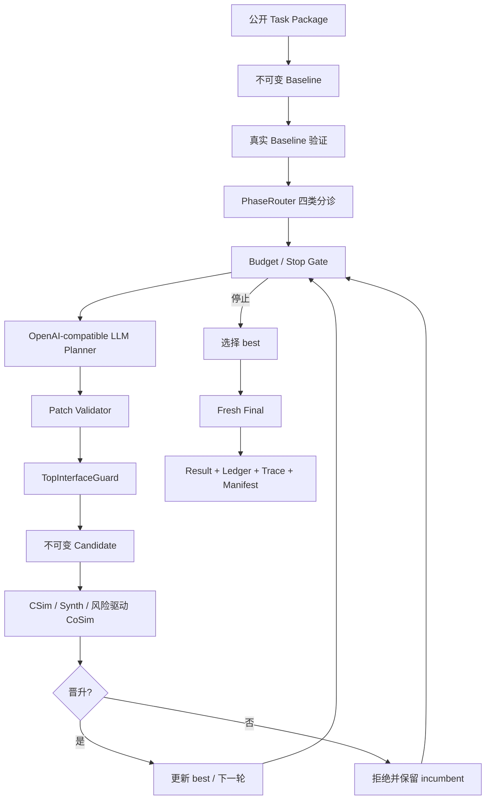

# FPT 2026 Track A 项目完整接手指南

- 首次整理：2026-07-22
- 最近复核：2026-07-23（补充三层框架、轻量工具和 7 天完成计划）
- 当前 Git 分支：`feat/track-a-empty-stub-generation-smoke`
- 当前代码基线：`65ab82c13f28`
- 适用对象：第一次加入项目、准备继续开发或负责实验/提交的组员
- 状态口径：以当前代码、当前公开规则、已保存的真实 run 和本次 fresh 测试为准

## 0. 先看结论

这是一个在有限 Token、Credit、工具次数和时间内，自动生成、修复、验证和优化 HLS C/C++ kernel 的 LLM Agent。比赛不是要求我们手工交一道题的最优代码，而是要求交一个能处理未知任务的自动系统。

当前项目的准确阶段是：

> **V3-F 安全基线 + Track A task-contract / Vitis 2025.2 对齐 + 空 Stub Generation 真实验收。不是 V3-G，也还不是最终提交冻结版。**

核心工程闭环已经基本形成：公开任务加载、不可变 baseline、四类分诊、真实 LLM Planner、安全 Patch、Candidate 树、真实 Vitis、预算账本、checkpoint、fresh final 和审计产物均已实现，并且已有真实 DeepSeek + Vitis 证据。

但项目还不能称为“比赛完成”：Qwen 模型矩阵、当前 28 题回归、V3-F continuation 准入、官方 final CoSim 口径、hidden 泛化、最终 Docker/ZIP、论文和视频都没有完成。按本指南第 10 节的交付口径，当前综合完成度约为 **67%**；核心 Agent 工程约 **90%**，最终竞赛交付约 **45%～55%**。

当前最先要修的不是新架构，而是一个已被 fresh tests 证实的回归：V3-D 的 8 个 OPTIMIZE corpus 任务被新的 `generate → REPAIR` 规则误路由。当前完整快速测试为：

```text
555 tests executed
547 PASS
8 FAIL
0 ERROR
```

失败全部来自 `v3d_fast_021`～`v3d_fast_028` 的 `OPTIMIZE` 预期与实际 `REPAIR` 路由不一致。

接手成员只剩一周时，不应按普通入职节奏推进。具体每天做什么、Strategy Ranker 等轻量工具做到什么程度、何时允许启动 28 题和怎样定义最终完成，统一见[《接手后 7 天完成项目执行手册》](2026-07-23-one-week-project-completion-handbook.md)。

## 1. 比赛到底要做什么

### 1.1 Track A 的任务

官方 Track A 名称是 **Budgeted End-to-End LLM4HLS Agent**。每道题会提供 baseline C/C++、公开 testbench、规格、目标平台/时钟约束和工具预算。初始代码可能：

- 功能正确但性能差；
- 编译或综合失败；
- CSim、CoSim 或 hidden test 失败；
- 存在 stream/Dataflow deadlock、无效流结构或严重资源浪费；
- 是需要补全主要实现的生成任务。

Agent 必须完成下面的闭环：

```text
理解公开任务和初始代码
  → 生成或修改 HLS C/C++
  → 调用 CSim / Synth / CoSim
  → 解析日志和报告
  → 优先修正确性，再优化性能/资源
  → 在预算内停止并返回最好已验证版本
```

### 1.2 当前官方硬要求

2026-07-22 重新核对了比赛官网和官网链接的官方 GitHub DOCX。当前公开要求包括：

| 项目 | 当前官方要求 |
|---|---|
| FPGA | AMD Alveo U55C，用于 CoSim |
| 软件 | Vitis 2025.2 |
| 验证 | `csim`、`cosim`、`synth` 通过并提供实验报告 |
| 频率 | HLS 生成硬件至少 100 MHz，即 period 不大于 10 ns |
| Token | Token consumption 是最终评价的重要因素 |
| Hidden | 最终评测有 hidden benchmarks |
| 环境 | 项目预期在 Docker 中构建和运行，建议附 Dockerfile |
| 复现包 | 源码、testbench 和其他复现材料，例如 ZIP |
| 视频 | 最长 5 分钟，展示在目标平台上真实运行并清楚讲解 |
| 论文 | IEEE 双栏 PDF，正文不超过 2 页，appendix 不限 |

官方推荐报告以下三个模型的结果：

| 模型 | 官方指南中的 ID |
|---|---|
| DeepSeek V4 Pro | `deepseek-ai/DeepSeek-V4-Pro` |
| Qwen3.5 122B A10B AWQ-4bit | `cyankiwi/Qwen3.5-122B-A10B-AWQ-4bit` |
| Qwen3.6 27B FP8 | `Qwen/Qwen3.6-27B-FP8` |

官方当前日期均为 23:59 AoE：

| 事项 | AoE | 北京时间约为 |
|---|---|---|
| 注册截止 | 2026-07-07 | 2026-07-08 19:59，已过 |
| 技术材料截止 | 2026-08-07 | 2026-08-08 19:59 |
| 入围公布 | 2026-08-21 | 2026-08-22 19:59 |

官网还给出总体 judging criteria：Technical merit 40%、Innovation 20%、Practical impact 20%、Clarity of presentation and reproduction 20%。这是一层提交/评审维度，不应和 reference harness 的单题 score 公式混成一件事。

官方来源：

- <https://fpt2026.uark.edu/fpt26-design-competition/>
- <https://github.com/FPT26/Design-Competition-Submission-Guidelines>

### 1.3 官方规则与 reference harness 必须分开

当前公开 reference scorer 的单题 proxy 是：

```text
Acceleration = baseline_latency / candidate_latency
ppa_norm = min(Acceleration, 8) / 8
quality = 0.5 * correct + 0.2 * synthesizable + 0.3 * ppa_norm
score = difficulty * quality
```

hidden functional test 失败时 score 为 0；`requires_cosim=true` 时 hidden CoSim 也属于正确性 gate。grader 在 Agent 计费预算外运行。

这套公式、`8x` cap 和样例工具成本是 **reference harness 行为/本地 proxy**，不是官方已经承诺的最终精确计分公式。官方目前只明确主要维度为 correctness、PPA、problem difficulty，并说明 Token consumption 很重要。

## 2. 三种 HLS 工具怎样理解

当前 reference/local 默认成本为 `CSim=1`、`Synth=4`、`CoSim=20` Credits，均可配置。

| 工具 | 回答什么 | 不能证明什么 |
|---|---|---|
| CSim | C/C++ 在公开 testbench 上是否功能正确 | 看不到 RTL deadlock，不给综合 PPA |
| Synth | 能否综合、latency/II/clock/resource 是多少 | 不等于功能正确，也不保证 RTL 不死锁 |
| CoSim | C 与 RTL 是否一致，是否存在 stream/Dataflow deadlock | 成本高，不适合每个低风险候选都运行 |

核心思想不是“测试越多越好”，而是：每次工具调用都必须能改变下一步决策，同时始终给最终验证保留预算。

## 3. 项目总体思路

项目采用“确定性控制面 + LLM 提案 + 真实工具裁决”：



必须记住的权限边界：

- LLM 只提出 hypothesis、strategy 和 unified diff；
- LLM 不能直接执行 shell 或 Vitis；
- LLM 不能修改 header、testbench、metadata、hidden、reference 或 golden；
- LLM 不能批准预算、晋升 Candidate 或选择未验证 final；
- Python/LangGraph、BudgetLedger、ToolServer 和真实工具结果拥有最终控制权。

### 3.1 三层框架和轻量工具的位置

从接手和交付角度，当前系统应分成三层理解：

| 层 | 负责什么 | 不能做什么 |
|---|---|---|
| 主执行闭环 | baseline、分诊、Planner、Patch、Candidate、真实 Vitis、晋升、fresh final | 不能跳过正确性和预算硬 gate |
| Agent 内轻量工具 | Evidence、Strategy Ranker、CoSim Risk、Continuation、Token Envelope、PA advisory | 不能调用工具、创建/晋升 Candidate 或宣布 final PASS |
| 证据与提交 | Ledger、Trace、Checkpoint、Benchmark、Attribution、Readiness、Manifest、论文/视频 | 不能回写或美化不可变 run 事实 |

Strategy Ranker 也要按成熟度分开：

- 已实现的 `BayesianStrategyRanker` / `BayesianAtomRanker` 是低成本、确定性的排序工具，可做离线和 Shadow；
- 当前 76 条 eligible 经验中 STRUCTURAL_FIX 只有 6 条，Leave-One-Task coverage 为 0%，所以“训练并正式启用 Ranker”仍是 `NOT_READY`；
- 本周正确目标是固定 snapshot、检索/排序、Quality Gate、ABSTAIN、Shadow 和 Attribution 可复核，不是强行产生 Guidance 或降低准入阈值。

完整工具清单、权限矩阵和本周验收见[7 天完成项目执行手册第 2 节](2026-07-23-one-week-project-completion-handbook.md#2-什么叫-agent-内的轻量工具)。

## 4. 一道题在当前系统中的真实路径

当前主图位于 [`v3_prototype.py`](../../llm4hls_harness/llm4hls_agent/v3_prototype.py)，包含 26 个 action-level node。主路径是：

```text
initialize
  → baseline_csim
  → baseline_synth（CSim PASS 时）
  → baseline_cosim（strict 或 requires_cosim 时）
  → phase_router
  → round budget gate
  → plan_candidate
  → materialize_candidate / record_rejected_proposal
  → candidate_csim
  → candidate_synth 或 candidate_cosim
  → score / CoSim budget gate
  → promote / reject / advance_round
  → select_final_attempt
  → final budget gate
  → final_csim
  → final_synth
  → final_cosim 或 NOT_REQUIRED
  → fallback（可选）
  → write_report
```

### 4.1 四种 PhaseMode

| Baseline 事实 | Mode | 目标 | 探索阶段典型验证 |
|---|---|---|---|
| CSim FAIL | `REPAIR` | 修功能、编译或运行错误 | CSim → Synth；题目要求时 CoSim |
| CSim PASS，Synth FAIL | `SYNTH_FIX` | 修不可综合、时钟或资源问题 | CSim → Synth |
| CSim/Synth PASS，required/observed CoSim FAIL | `STRUCTURAL_FIX` | 修 deadlock、stream/FIFO/RTL mismatch | CSim → CoSim |
| 所需 baseline gate 全通过 | `OPTIMIZE` | 在正确前提下降 latency/资源 proxy | CSim → Synth → 风险/收益 CoSim gate |

`task_type=generate` 当前复用 `REPAIR`，没有单独的 GENERATE Graph node；`generation_required=true` 允许更大的、但仍限于 kernel 的 Patch。

### 4.2 strict 与 fast-experiment

| Profile | 特点 | 用途 |
|---|---|---|
| `strict` | baseline/探索更保守，运行更多 CoSim | 回归、兼容旧实验、内部强审计 |
| `fast-experiment` | 普通任务减少探索 CoSim；无严格收益直接拒绝；高风险再 CoSim | 真实多轮搜索和节省 Credit |

无论 profile 如何，Candidate 只有通过当前模式要求的正确性 gate 才能晋升。

### 4.3 当前 final policy 的重要口径冲突

CLI 默认 `--final-validation-policy task_contract`：

```text
requires_cosim=false → fresh CSim + Synth
requires_cosim=true  → fresh CSim + Synth + CoSim
```

另有 `full_internal_audit`，始终跑 fresh CSim+Synth+CoSim。

当前 task-contract 和 reference grader 的按题策略一致，也让公开预算 20/40/80 可以覆盖三道官方样例；但它与以下两条当前文字规则不完全一致：

1. 官方 GitHub 指南写明请通过 csim、cosim、synth；
2. [`AGENTS.md`](../../llm4hls_harness/AGENTS.md) 的硬不变量仍要求 final 三项全部 PASS。

因此，一周收口计划采用明确口径：正式演示、论文表格和提交证据统一显式使用 `full_internal_audit`；`task_contract` 只用于探索、内部预算分析或 reference task-contract 对照，并必须标出 `CoSim NOT_RUN`。当前不能把 `CoSim NOT_RUN` 写成“全部三项已通过”。

## 5. 核心组件与代码地图

### 5.1 入口和主流程

| 文件 | 作用 |
|---|---|
| [`v3_prototype_cli.py`](../../llm4hls_harness/llm4hls_agent/v3_prototype_cli.py) | 当前 V3 CLI 参数、Provider/Vitis/预算配置 |
| [`v3_prototype.py`](../../llm4hls_harness/llm4hls_agent/v3_prototype.py) | 26 节点主图、路由、final、报告和 manifest |
| [`workflow.py`](../../llm4hls_harness/llm4hls_agent/workflow.py) | V0 确定性 baseline 底座与公共运行契约 |
| [`task.py`](../../llm4hls_harness/llm4hls_agent/task.py) | 只加载公开任务；拒绝 hidden/reference/golden 路径 |

### 5.2 分诊、证据和模型

| 文件 | 作用 |
|---|---|
| [`v3_phase_router.py`](../../llm4hls_harness/llm4hls_agent/v3_phase_router.py) | 纯 Python 四模式分诊 |
| [`v3_evidence.py`](../../llm4hls_harness/llm4hls_agent/v3_evidence.py) | Synth latency、transaction interval、loop II/TripCount、资源证据 |
| [`v3_failure_evidence.py`](../../llm4hls_harness/llm4hls_agent/v3_failure_evidence.py) | CSim/Synth/CoSim 失败压缩和脱敏 |
| [`v3_openai_planner.py`](../../llm4hls_harness/llm4hls_agent/v3_openai_planner.py) | 把 mode、代码、Evidence、Budget、有限历史组装成 Planner 输入 |
| [`openai_provider.py`](../../llm4hls_harness/llm4hls_agent/openai_provider.py) | OpenAI-compatible 请求、schema 和 Token usage |
| [`v3_planner_action.py`](../../llm4hls_harness/llm4hls_agent/v3_planner_action.py) | Planner STARTED/COMPLETED action journal 与恢复 |

### 5.3 Patch、Candidate、工具和预算

| 文件 | 作用 |
|---|---|
| [`repair.py`](../../llm4hls_harness/llm4hls_agent/repair.py) | unified diff 规范化、唯一上下文重定位、范围和行数限制 |
| [`top_interface_guard.py`](../../llm4hls_harness/llm4hls_agent/top_interface_guard.py) | 顶层函数名、参数、类型、public symbol 和 interface pragma 保护 |
| [`candidate.py`](../../llm4hls_harness/llm4hls_agent/candidate.py) | baseline/Candidate 物化、父子关系和不可变源码 |
| [`budget.py`](../../llm4hls_harness/llm4hls_agent/budget.py) | Token/Credit/工具次数/时间账本和 Token policy |
| [`tools.py`](../../llm4hls_harness/llm4hls_agent/tools.py) | 工具唯一受审计入口、稳定 action ID、缓存和结果绑定 |
| [`vitis.py`](../../llm4hls_harness/llm4hls_agent/vitis.py) | Vitis 2025.2 `vitis-run --mode hls`、Tcl、超时和报告解析 |
| [`scoring.py`](../../llm4hls_harness/llm4hls_agent/scoring.py) | correctness-first Candidate comparator 和本地 score proxy |

### 5.4 V3-F、Experience、Corpus 和批量实验

| 文件组 | 当前定位 |
|---|---|
| `v3_continuation.py` / `v3_continuation_replay.py` | 判断后续 Planner call 是否值得；默认 shadow，离线准入未通过 |
| `v3_experience*.py` | append-only 经验、检索、质量门控、归因和离线评估；默认 shadow/advisory |
| `v3d_corpus.py` | 生成 28 道开发题 |
| `v3d_oracle_validator.py` | 离线 corpus/golden/hidden-like 准入，不能进入 Planner |
| `v3_batch_benchmark.py` | 模型 × 任务 × repeat 批量运行和失败保留 |

当前项目不是多 Agent 系统，没有 RL、Bandit 或多个 LLM 对话。Experience、Continuation 和所谓 ranker 的安全默认都不改写正式路径。

## 6. 数据、状态和审计产物

### 6.1 三条数据流

```text
代码流：公开 kernel → baseline → Patch → Candidate → final kernel

证据流：Vitis 原始报告 → ToolResult → 有界 Evidence → Planner → Candidate 结果

控制流：Graph State / checkpoint ↔ Ledger / registry / trace / manifest
```

### 6.2 一次 run 应该看什么

| 产物 | 回答的问题 |
|---|---|
| `v3_prototype_result.json` | 终态、mode、best/final、stop reason、预算和 final 验证 |
| `v3_team_report.md` | 人工可读的逐轮复盘 |
| `candidate_registry.json` | baseline/Candidate 树、状态和验证引用 |
| `budget_ledger.jsonl` | Token、Credit、工具次数、STARTED/COMPLETED/AMBIGUOUS |
| `trace.jsonl` | 节点时间线、路由、晋升/拒绝原因 |
| `planner/inputs/` | 模型实际看到的受限上下文 |
| `planner/outputs/` | hypothesis、risk、strategy 和 Patch |
| `actions/*/result.json` | 每次真实 CSim/Synth/CoSim 结构化结果 |
| `evidence/` | 从工具结果提取给 Planner 的证据 |
| `graph_checkpoints.sqlite` | 中断恢复状态，通常不是人工首查 |
| `control/package_manifest.json` | 终态 artifact 的 hash 绑定和防篡改 |

排查顺序建议：

```text
mode → planner input → planner output → Patch/Top guard
→ Candidate tool result → promote/reject trace → final result → ledger
```

## 7. 仓库与工作区结构

外层工作区：

```text
/home/ying/CompetitionTrackA/
  track-A/                    主 Git 仓库，开发从这里开始
  tasks/                      独立 U55C 真实任务样例
  tools/u55c-hls-smoke-test/  Vitis/HLS 冒烟测试工具
  vitis/                      本机 Vitis 2025.2 安装，不属于项目源码
```

主仓库：

```text
track-A/
  doc/docs/                   面向团队的成品文档
  doc/materials/              官方资料快照、设计和学习笔记
  docs/status/                当前阶段短状态
  docs/experiments/           实验报告
  docs/submission/            提交草案、表格、复现和 checklist
  docs/superpowers/           历史设计规范与实施计划
  llm4hls_harness/
    llm4hls_agent/            产品代码
    tests/                    快速自动测试
    task_corpus/              官方公开 3 题、V3-D 28 题、空 Stub 任务
    config/                   安全基线、Token、PPA policy
    releases/                 脱敏、不可变的阶段证据
    runs/                     本机原始 run，不进入提交包
    Dockerfile                Agent-only 镜像，不含专有 Vitis
  build/submission-staging-NOT-FINAL/  非最终提交 staging
```

## 8. 里程碑历史与当前真实阶段

V0～V4 是团队内部里程碑，不是官方比赛阶段。

| 阶段 | 主要内容 | 当前判断 |
|---|---|---|
| V0 | 不用 LLM 的不可变 baseline、真实工具、账本和恢复 | 工程完成 |
| V1 | 失败诊断、受限 Patch、Candidate、验证和回滚 | 工程完成 |
| V2 | Candidate 树、多轮 PPA、best 保留、CoSim gate | 工程完成 |
| V3-A/B | LangGraph action node、checkpoint、真实 OpenAI-compatible Planner | 工程完成 |
| V3-C | 四种 task-aware mode 和 Failure Evidence | 已有真实四模式证据 |
| V3-D | 28 题 corpus、Oracle、Batch、TopInterfaceGuard、Docker/提交底座 | 已实现，但当前 8 个 OPTIMIZE 路由回归 |
| V3-E | Experience/Token policy 工程层 | 工程路径存在，效果结论不足，默认 shadow |
| V3-F | Performance-Area-aware continuation | 实现和 replay 完成，但准入失败，不能 enforce |
| V3-G | 曾开发后回退 | 当前 tree 不包含，不得作为当前能力 |
| Track A 对齐 | task type、generation、大 Patch、`vitis-run`、task-contract final | 已实现并有 5 个最新真实 run |
| V4/提交强化 | 多模型、hidden-like 泛化、Docker/ZIP、论文视频冻结 | 未完成 |

## 9. 已有真实证据

### 9.1 历史 V3-D DeepSeek 重复矩阵

基线 `a796da3` 的历史证据：

- 官方三题 9/9 DONE，9/9 fresh final 全 PASS；
- 加额外 SYNTH_FIX 后共 12/12 DONE；
- 总计 31,258 Tokens、526 Credits；
- LLM/CSim/Synth/CoSim 为 15/38/32/18；
- dotProduct 三次 final latency 为 38、518、1027（第三次安全回退 baseline）。

这是有价值的历史真实证据，但不是当前 `65ab82c` 的 fresh 回归。

### 9.2 当前安全基线的四类真实 Smoke

2026-07-22 的新目录使用真实 `deepseek-v4-pro` 和真实 Vitis 2025.2：

| 任务 | Mode | Token | Credit | 当前 fresh final | 结果 |
|---|---|---:|---:|---|---|
| `projection_bugfix` | REPAIR | 2,040 | 11 | CSim+Synth，CoSim NOT_RUN | PASS |
| `dotProduct_optimize` | OPTIMIZE | 7,529 | 20 | CSim+Synth，CoSim NOT_RUN | 1027→38 cycles |
| `residual_stream_deadlock` | STRUCTURAL_FIX | 2,220 | 71 | CSim+Synth+CoSim | deadlock 修复，135→68 cycles |
| `v3d_fast_004` | generate→REPAIR | 1,761 | 11 | CSim+Synth，CoSim NOT_RUN | 小索引修复 PASS |

这些 run 证明当前主闭环可以真实工作，但前三个非 structural 结果只能称 task-contract PASS，不能称三项全 PASS。

### 9.3 真正空 Stub Generation

开发任务 `track_a_empty_stub_generation` 的 baseline 只有 TODO 和 `(void)` 占位。真实 DeepSeek 一次调用生成完整矩阵乘加、饱和和行和算法：

| 指标 | 结果 |
|---|---:|
| Planner calls | 1 |
| Token | 2,095 |
| Credit | 11 / 80 |
| Candidate / final | CSim+Synth PASS |
| Final latency | 21 cycles |
| Estimated clock | 3.378 ns |
| LUT / FF / DSP | 1580 / 1227 / 24 |

这证明 generation 入口和较大 kernel-body Patch 能工作，但它是 development-only 单题，不代表官方生成题成功率。

### 9.4 Corpus、Oracle 和 V3-F

- V3-D corpus：28 题，REPAIR 8、SYNTH_FIX 6、STRUCTURAL_FIX 6、OPTIMIZE 8；
- 历史 deterministic Oracle：28 accepted / 0 rejected；
- 历史真实 Vitis anchors：12 题，四 mode 各 3；
- 当前 HEAD：8 个 OPTIMIZE 路由测试失败，历史 28/0 不能直接当作当前结论；
- V3-F replay：11 个可绑定真实 follow-up，beneficial retention 60%，waste block 16.7%；未达到 100%/75% 准入线，因此 shadow/enforce pilot 均未启动。

## 10. 当前到底完成了多少

下面是为接手管理而设的内部估算，不是官方得分，也不是按代码行数计算。

| 维度 | 权重 | 完成度 | 依据 |
|---|---:|---:|---|
| 核心 Agent 闭环与安全 | 35% | 90% | 26 节点、Budget、Candidate、ToolServer、checkpoint、Patch/接口保护和真实 run 已有 |
| 真实 Vitis/四模式验证 | 20% | 75% | 官方三题、SYNTH_FIX 历史证据、generation 均有，但当前默认非 required CoSim 不跑 |
| 泛化与模型矩阵 | 20% | 40% | DeepSeek 有证据；Qwen 未跑；28 题当前回归；无 hidden 结论 |
| 复现与提交工程 | 15% | 60% | Agent-only Docker、锁依赖、staging/scan 草案已有；Vitis 外置和最终 ZIP 未冻结 |
| 论文、报告、视频 | 10% | 35% | 表格、失败分析、Demo 脚本有草稿；最终两页 PDF、视频和提交包未完成 |
| **加权综合** | **100%** | **约 67%** | 工程主体可运行，但证据和最终交付明显落后于代码 |

换一种更直观的说法：

- 核心代码：约 90%；
- 能拿来做可靠实验的系统：约 75%；
- 跨模型/泛化证据：约 40%；
- 最终可提交材料：约 45%～55%；
- 整体比赛准备度：约 67%。

如果要按具体功能逐项核对，而不是看百分比，请直接看[7 天执行手册的“一页式阶段清单”](2026-07-23-one-week-project-completion-handbook.md#35-按功能名的一页式阶段清单)。其中已明确区分“工程实现完成”“Shadow 完成但未准入”“本周必须补齐”和“只能等待外部 hidden 评测”。

## 11. 当前缺口和风险优先级

### P0：继续大规模实验前必须解决

1. **8 个 OPTIMIZE corpus 路由回归**
   `TaskSpec.task_type` 历史上统一返回 `generate` 以避免泄漏 mode；新的 PhaseRouter 又把所有 `generate` 强制路由为 REPAIR，导致 `v3d_fast_021`～`028` 失败。需要重新设计公开 task type 与 mode-neutral corpus 元数据的契约，并补防回归测试。

2. **final CoSim 口径冲突**
   当前 CLI 默认 task-contract，但官方指南和 `AGENTS.md` 写的是三项 final。提交实验和 Demo 前必须冻结统一口径。

3. **先恢复 full green tests**
   在 555/555 PASS 前，不应启动“28 tasks × 1”并把结果当作安全基线。

### P1：比赛证据缺口

4. Qwen3.5/Qwen3.6 没有真实 endpoint/key/model alias，尚未运行；
5. DeepSeek 当前安全基线缺少同配置重复矩阵，最新 5 个 run 都是单次 smoke；
6. strict vs fast、Evidence on/off、CoSim gate on/off 消融未完成；
7. V3-F continuation 离线准入失败，只能保持 shadow；
8. Experience guided 尚无可信的同题同配置收益结论；
9. 28 题没有当前代码上的真实 LLM 全覆盖，也没有 hidden grader 结论。

### P2：复现和提交风险

10. Docker 是 Agent-only，专有 Vitis 由宿主/Distrobox 外部提供；正式评测挂载方式仍需确认；
11. 最终 staging、秘密扫描、ZIP 结构、两页论文和 5 分钟真实视频未冻结；
12. Power 没有可信数据，只能标 `UNSUPPORTED`；area proxy 不是物理面积；
13. 多份旧文档仍写 V3-D、382/555 PASS 或“final 总跑 CoSim”，阅读时必须看日期和 commit；
14. 当前工作位于 feature branch，尚未说明最终合并/冻结分支策略。

## 12. 新成员怎样开始运行

### 12.1 环境准备

```bash
cd /home/ying/CompetitionTrackA/track-A
python3 -m venv .venv
.venv/bin/python -m pip install -e 'llm4hls_harness[v3]'
```

真实 Vitis 当前工作区可探测到 `vitis-run v2025.2`。不要在代码中硬编码本机路径，运行时用：

```bash
export LLM4HLS_VITIS_HLS_ROOT='/absolute/path/to/AMD/2025.2/Vitis'
```

真实模型还需要在当前执行终端设置：

```bash
export OPENAI_BASE_URL='https://<provider>/v1'
export OPENAI_API_KEY='<secret>'
export LLM4HLS_MODEL='<actual-server-model-alias>'
```

任何 key、Authorization、license 或账号信息都不能写进 Git、Prompt、报告或命令示例的真实值。

### 12.2 当前完整快速测试命令

必须从仓库根运行，并同时保留源码包与 namespace test package 的 import 路径：

```bash
cd /home/ying/CompetitionTrackA/track-A
PYTHONPATH=llm4hls_harness:. .venv/bin/python \
  -m unittest discover \
  -s llm4hls_harness/tests \
  -t . \
  -q
```

截至本指南创建时，预期看到 555 项、8 个上述路由失败。修复后验收目标是 555/555 PASS。

### 12.3 编排 smoke

```bash
.venv/bin/llm4hls-v3-prototype \
  --task-dir llm4hls_harness/examples/u55c_v2_optimize_task \
  --patch-file llm4hls_harness/examples/u55c_v3_prototype.diff \
  --run-dir /tmp/llm4hls-new-member-demo \
  --backend demo
```

`demo` 只证明 Graph/账本/报告编排，绝不是 LLM 或 HLS 成绩。

### 12.4 真实单题命令模板

```bash
.venv/bin/llm4hls-v3-prototype \
  --task-dir llm4hls_harness/task_corpus/official/fpt26-harness-public/dotProduct_optimize \
  --planner openai-compatible \
  --backend vitis \
  --vitis-root "$LLM4HLS_VITIS_HLS_ROOT" \
  --run-dir llm4hls_harness/runs/<new-unique-run-id> \
  --validation-profile fast-experiment \
  --final-validation-policy full_internal_audit \
  --continuation-policy shadow \
  --experience-mode shadow \
  --max-planner-rounds 3 \
  --cost-csim 1 --cost-synth 4 --cost-cosim 20
```

每次真实实验必须使用新的 run directory。若为了满足公开 task budget 改用 `task_contract`，报告必须明确 CoSim 是否实际运行。

## 13. 接手成员的 7 天完成计划

详细执行表、每天的验收、停止条件、命令、12 个最终 Gate 和风险预案统一放在[《Track A 接手后 7 天完成项目执行手册》](2026-07-23-one-week-project-completion-handbook.md)，本节只保留关键路径：

| 日期 | 当天唯一主目标 | 当日退出条件 |
|---|---|---|
| Day 1 | 修复 8 个 PhaseRouter 回归，冻结 final/batch 契约 | 完整测试全绿，正式证据明确全 CoSim |
| Day 2 | 核对全部轻量工具的输入、输出、权限和 artifact | 工具审计完成，off/shadow 等价 |
| Day 3 | Strategy Ranker 离线 + Shadow 验收 | 可排序、可 ABSTAIN、可归因；训练仍 `NOT_READY` |
| Day 4 | 当前 HEAD 五个真实纵向锚点 | 四 mode + 空 Stub fresh 三工具可追溯 |
| Day 5 | 预算化 28 题和最小模型矩阵 | slot 完整、配置冻结、失败不丢失 |
| Day 6 | 干净复现、staging/scan、论文和视频 | scan 0 findings，每个 claim 可追溯 |
| Day 7 | release candidate 冻结和最终交接 | 12 个 Definition-of-Done Gate 全部结案 |

本周明确不训练 Strategy Ranker/CoSim Risk/Continue Predictor，不把 Experience 切到 `guided`，不把 Continuation 切到 `enforce`，不新增 RL、多 Agent 或主 Graph 节点。它们都不在当前提交关键路径上。

## 14. 开发时不可破坏的规则

1. baseline 只读；每份 Patch 创建新 Candidate；
2. 只允许修改 kernel，不能改 testbench/header/metadata/hidden/reference/golden；
3. 顶层函数名、签名、参数顺序、类型和接口必须保持；
4. correctness 永远高于 PPA；失败 Candidate 不得覆盖 best；
5. 所有 LLM/Vitis 计费动作必须经过唯一 BudgetLedger/ToolServer；
6. 每个 subprocess 有 timeout，缺报告时不能伪造 PASS 或指标；
7. checkpoint 恢复不得重复副作用或重复计费；
8. demo/scripted/deterministic/real LLM/real Vitis 证据必须分级；
9. hidden、golden 和 reference 永远不能进入 Planner；
10. 不提交 `.env`、run 原始目录、Vitis 工作目录、模型 cache 和秘密。

## 15. 术语速查

| 术语 | 含义 |
|---|---|
| baseline | 题目原始 kernel 与其验证事实 |
| Candidate | 从父版本应用一份安全 Patch 后生成的不可变代码版本 |
| incumbent / best | 当前最好、下一轮继续修改的已接受版本 |
| mode | REPAIR、SYNTH_FIX、STRUCTURAL_FIX、OPTIMIZE |
| exploration | final 前的候选搜索阶段 |
| fresh final | 对选中代码重新发起的最终验证，不复用探索缓存 |
| Evidence | 从工具日志/报告提取的有界结构化事实 |
| Credit | 统一工具成本单位，不等于官方得分 |
| task_contract | 只在任务要求时 final CoSim |
| full_internal_audit | final 始终执行 CSim/Synth/CoSim |
| shadow | 只记录建议/决定，不改变正式路径 |
| guided/enforce | 经验或 continuation 真正影响 Prompt/路由；当前不应默认启用 |

## 16. 后续阅读顺序

1. [接手后 7 天完成项目执行手册](2026-07-23-one-week-project-completion-handbook.md)
2. [当前阶段：V3-F](../../docs/status/2026-07-22-current-project-stage.md)
3. [V3-E 经验知识库与 Strategy Ranker](2026-07-21-v3e-experience-kb-hardening.md)
4. [当前组件、模型控制链与参考信息](2026-07-21-current-components-and-model-context.md)
5. [当前系统说明与团队月度进展](2026-07-20-current-system-and-team-progress.md)
6. [Track A 比赛总览](track-a-competition-overview.md)
7. [空 Stub Generation 真实 Smoke](../../docs/experiments/track-a-empty-stub-generation-smoke-report.md)
8. [四类真实 Smoke](../../docs/experiments/track-a-four-real-smokes-report.md)
9. [V3-F Continuation 报告](../../docs/experiments/2026-07-22-value-gated-pa-continuation-report.md)
10. [Budget-Aware LangGraph 设计总规范](../materials/04_agent_basics/2026-07-17-budget-aware-langgraph-llm4hls-agent-design.md)
11. [提交 Checklist](../../docs/submission/submission_checklist.md)

阅读旧文档时先看日期、commit 和 evidence level。历史报告解释项目怎样走到今天，但当前能力只认当前代码和 fresh 结果。
