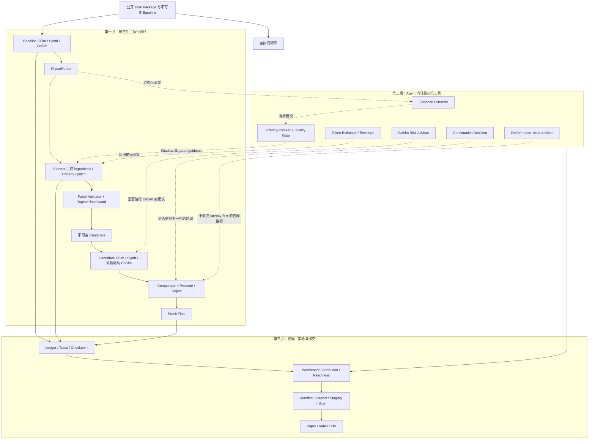

# Track A 接手后 7 天完成项目执行手册

- 制定日期：2026-07-23
- 执行窗口：2026-07-23 ～ 2026-07-29
- 当前分支：`feat/track-a-empty-stub-generation-smoke`
- 当前代码基线：`65ab82c13f28`
- 适用对象：只剩一周、需要在现有项目上继续开发并冻结可提交版本的接手成员
- 总览入口：[FPT 2026 Track A 项目完整接手指南](2026-07-22-new-member-complete-onboarding.md)

## 0. 一周结束时到底要交出什么

这一周的目标不是重构已经基本确定的框架，也不是再启动一个 V3-G 或训练新模型，而是先把现有框架、已完成能力和证据边界理解准确，再把当前约 67% 的项目收敛成一份**可验证、可复现、可说明、可打包的提交候选版本**。

本手册中的“三层”只是帮助接手成员理解现有代码的**观察视图**，不是建议把目录、LangGraph 或类层次按三层重新拆分。除 P0 修复、必要配置透传和交付缺口外，本周不改主架构。

到第 7 天结束，必须同时具备以下六类结果：

1. **代码基线可冻结**：完整测试全绿，没有已知 P0；PhaseRouter、final policy、batch policy 和配置口径一致。
2. **Agent 主闭环真实可用**：四种 mode 与真正空 Stub Generation 都有当前 HEAD 的真实 LLM + Vitis 2025.2 证据。
3. **轻量工具真正被使用**：Strategy Ranker、Experience Quality Gate、CoSim Risk advisory、Continuation decision、Token Envelope 和 Performance–Area advisory 均有清楚的输入、输出、权限边界和 Shadow/离线产物。
4. **实验结论可复核**：至少完成当前安全配置的一次 28 题公开 train/dev 回归；官方推荐模型能访问时，完成最小同配置模型矩阵。
5. **复现包可交付**：Docker/外部 Vitis 边界、环境说明、staging、secret/forbidden scan、artifact manifest 和复现命令完整。
6. **展示材料可提交**：2 页正文初稿、实验表、失败分析、5 分钟视频脚本和演示 run 均冻结。

“代码能跑”不等于“项目完成”。只有代码、真实证据、实验、复现和说明五条链都闭合，才能在完成看板上标记 `DONE`。

### 0.1 本周必须做、条件性做和明确不做

| 级别 | 内容 | 第 7 天口径 |
|---|---|---|
| MUST | 修复当前 8 个路由失败，完整测试全绿 | 不满足则不能进入大矩阵 |
| MUST | 冻结官方结果的 CSim/Synth/CoSim 口径 | 对外结果统一使用 fresh `full_internal_audit` |
| MUST | 当前 HEAD 四 mode + 空 Stub 的真实纵向验收 | 每类至少 1 个 terminal run 和完整 artifact |
| MUST | Strategy Ranker 等轻量工具的 Shadow/离线验收 | 有结果，不要求强行 `INJECT` |
| MUST | DeepSeek 当前安全配置回归、打包、扫描、论文/视频材料 | 可复现、无秘密、事实可追溯 |
| CONDITIONAL | Qwen3.5/Qwen3.6 最小模型矩阵 | 取决于 Day 1 获得 endpoint、key 和正确 model alias |
| CONDITIONAL | 28 题真实矩阵 | 只有 smoke、预算和时间预检都通过才启动 |
| FORBIDDEN THIS WEEK | 训练 Strategy Ranker/CoSim Risk/Continue Predictor | 当前 readiness 为 `NOT_READY` |
| FORBIDDEN THIS WEEK | Experience `guided`、Continuation `enforce` 作为默认 | 当前泛化/回放准入均未通过 |
| FORBIDDEN THIS WEEK | RL、Bandit、多 Agent、新主 Graph、完整 PPA/Power 声明 | 会扩大风险且无可靠数据 |

Qwen 访问缺失不是可以用假数据补齐的 TODO。Day 2 中午仍拿不到访问条件时，必须在完成看板上标为 `EXTERNAL_BLOCKER`，保留 DeepSeek 完整证据，但不能声称三模型矩阵已完成。

## 1. 现有框架的理解视图：不重构



这张图是对已经存在的组件和数据流做归类，代码目前并不需要按图重新搬迁。现有权限顺序不能颠倒：

- 主闭环拥有验证、Candidate、预算和 final 权限；
- 轻量工具只处理小规模结构化数据，输出排序、风险或建议；
- 证据层只从不可变事实生成报告，不能反过来修改 run 结果；
- LLM 和 Strategy Ranker 都不能批准预算、调用工具、晋升 Candidate 或宣布 final PASS。

## 2. 什么叫 Agent 内的“轻量工具”

这里的轻量工具不是外部开发工具，也不是一个新 Agent。它应满足四个条件：

1. 输入是当前时刻已经可见的结构化事实，不读取 future outcome、hidden、golden 或 reference；
2. 计算是确定性、低成本、可单测的，通常是规则、统计、小型评分或纯函数；
3. 输出是有界 JSON/artifact，并且包含版本、原因、支持证据和 fallback；
4. 权限小于主闭环，证据不足时必须 `ABSTAIN`、`UNKNOWN` 或保持 Shadow。

### 2.1 当前轻量工具清单与成熟度

| 工具 | 主要输入 | 主要输出 | 当前权限 | 当前状态 | 本周目标 |
|---|---|---|---|---|---|
| PhaseRouter | baseline CSim/Synth/CoSim 事实、task contract | 四种 `PhaseMode` | 主路由硬决策 | 已实现，但当前有 8 个 OPTIMIZE 回归 | Day 1 修复并全绿 |
| Evidence Extractor | 有界 Vitis 日志/报告 | failure、loop、II、latency、resource 等结构化事实 | 只提供事实 | 已集成 | 保持 schema 与错误边界稳定 |
| TokenEstimator / TokenEnvelope | Prompt 分项、剩余 Token、mode cap | 输入估算、输出 cap、pressure、reserve | 调用前预算硬约束 | 已实现并真实验证 | 冻结安全配置，核对 usage 与 ledger |
| Patch Validator / TopInterfaceGuard | unified diff、kernel/header、top signature | ACCEPT/REJECT 与原因 | Candidate 创建前硬 gate | 已实现 | 不改语义，只补回归 |
| SimilarCaseRetriever | frozen Experience snapshot、当前 query | 相似成功/失败案例与相似度 | 建议层 | 已实现 | 固定 snapshot、复核无 task/family leakage |
| Strategy Ranker | 检索后的真实 eligible 经验、mode/subtype | 推荐/不推荐 strategy bundle 或 atom、置信度和成本 | 离线/Shadow 建议 | 算法已实现；学习 readiness 未通过 | 完成离线 + Shadow 使用，不训练 |
| Guidance Quality Gate | Ranker 输出、独立 run/family、相似度、证据冲突 | `INJECT` 或 `ABSTAIN` | 决定建议能否进入 Prompt | 已实现；当前泛化评估 0 次 INJECT | 保持 fail-closed；ABSTAIN 可视为正确结果 |
| Empirical CoSim Risk Advisor | 历史 CSim/Synth/CoSim/final 状态 | 各阶段失败概率 | advisory only | 已实现；64 个 CoSim 全为 PASS，缺负例 | 只记录，不训练、不替代硬 CoSim policy |
| Continuation Decision | pre-state Evidence delta、策略新颖性、预算、PA 指标 | `ALLOW/BLOCK/DEFER_TO_FINAL` | 默认 Shadow | 已实现；回放准入失败 | 保持 Shadow，修文档与 artifact，不 enforce |
| Performance–Area Advisor | latency/interval/clock/LUT/FF/DSP/BRAM/URAM | area proxy、Pareto relation、delta class | advisory only | 已实现；无 Power | 只报告 PA proxy，不宣称完整 PPA |
| Attribution / Readiness | recommendation、Planner 行为、真实 outcome | FOLLOWED 等归因和 READY/NOT_READY | 证据层 | 已实现 | 每次 terminal run 后生成并汇总 |

### 2.2 Strategy Ranker 的准确实现边界

当前代码里有两个互补的贝叶斯轻量排序器：

1. `BayesianStrategyRanker` 位于 `v3_experience_guidance.py`，按 `context + strategy_bundle` 聚合。它使用 Beta(1,1) 平滑成功率，并把期望收益、平均 Token、Credit 和失败概率组合成 utility，最多给出 3 个推荐和 3 个不推荐 bundle。
2. `BayesianAtomRanker` 位于 `v3_experience_kb_quality.py`，按 `mode + subtype + observed strategy atom` 聚合。默认 posterior 不低于 0.55 才推荐，不高于 0.40 或无收益证据过多时列为 discouraged；algorithm family 至少有 5 条支持才按 family 条件化，否则回退到更宽的 eligible 样本。

Ranker 使用的是 Patch/diff 观察到的 canonical strategy，不把 Planner 自报策略直接当成事实。它只接受 public train/dev、`REAL_LLM_VITIS`、`eligible_for_ranking=true` 的记录；完整源码、完整 Prompt、task ID、hidden-like 和 golden 不得进入排序特征。

正确的数据流是：

```text
冻结 Experience snapshot
  → 构造不含 task identity 的 query
  → SimilarCaseRetriever 硬过滤和相似度排序
  → Bayesian Strategy/Atom Ranker
  → Guidance Quality Gate
  → shadow 记录，或证据充分时才可能 guided INJECT
  → terminal run 后 Attribution
```

Ranker 当前“能运行”不等于“已经具备训练和正式接管能力”。当前学习准备度为：

| 学习方向 | 当前观测 | 硬门槛缺口 | 状态 |
|---|---|---|---|
| Strategy Ranker | 76 个 eligible Candidate；OPTIMIZE 26、REPAIR 25、SYNTH_FIX 19、STRUCTURAL_FIX 6；Leave-One-Task coverage 0% | 每 mode 至少 10、coverage 至少 40% | `NOT_READY` |
| CoSim Risk | 64 个真实 CoSim，全部 PASS | 必须同时有 PASS 与 FAIL/TIMEOUT | `NOT_READY` |
| Continue Predictor | 12 个可归因决策，4 个改善、8 个未改善 | 至少 50 个决策 | `NOT_READY` |
| Evidence Selector | 76 个可归因 Planner round | 至少 100 个 round | `NOT_READY` |

因此本周建设 Strategy Ranker 的正确目标是：**让已有轻量 Ranker 的输入、排序、ABSTAIN、Shadow 和归因全部可复核**，不是为了展示“智能”而降低 Gate 或训练复杂模型。

### 2.3 Strategy Ranker 本周验收标准

必须同时满足：

- 同一 frozen snapshot 和 query 重复执行，输出 JSON 与 digest 稳定；
- hidden-like、task ID、golden/reference、当前 Candidate future outcome 不进入特征或支持集；
- Leave-One-Run/Task/Family/Algorithm-Family-Out 中被留出的组不回流；
- 支持不足、family 过度集中、证据冲突或建议超 600 Token 时稳定 `ABSTAIN`；
- `shadow` 下 Planner 实际请求与 `off` 等价，Ranker 结果只写 artifact；
- 推荐项带 posterior、support、expected gain/cost 和 evidence IDs；
- Ranker 不调用 LLM/Vitis，不创建/晋升 Candidate，不改变 BudgetLedger；
- readiness 仍不满足时，最终报告必须明确写 `NOT_READY`，不能以“实现完成”替代“数据可训练”。

## 3. 现有工作到底完成了什么、还差什么

### 3.1 已经稳定完成：本周原则上不改

| 组件/能力 | 已完成内容 | 现有证据 | 接手原则 |
|---|---|---|---|
| 不可变 baseline 与 Candidate | baseline 只读；每个有效 Patch 生成新 Candidate；失败不覆盖 best | Candidate registry、source digest、相关单测与真实 run | 不重构存储和晋升模型 |
| 四类主流程 | REPAIR、SYNTH_FIX、STRUCTURAL_FIX、OPTIMIZE 均已进入同一 V3 闭环 | 历史四 mode 真实 DeepSeek + Vitis、当前四类 smoke | 只修路由契约回归，不新增 mode/node |
| Planner 权限边界 | LLM 只输出 hypothesis、strategy、unified diff | Planner schema、Provider/adapter、Patch artifacts | 不给 LLM shell、Vitis、budget 或 promote 权限 |
| Patch 与接口安全 | 只允许 kernel，禁止 header/testbench/metadata；top 签名受保护 | Patch Validator、TopInterfaceGuard 和安全测试 | 只补回归，不放宽策略 |
| 真实工具闭环 | CSim/Synth/CoSim 有统一 ToolServer、timeout、解析与 Credit | tool actions、reports、ledger、真实 Vitis run | 不旁路调用和计费 |
| Budget 与 Token | Token/Credit/tool/time 统一记账；调用前有 Estimator/Envelope/reserve | BudgetLedger、Token Envelope、真实 Provider usage | 不合并 Token 与 Credit，不用估算冒充 usage |
| Checkpoint 与审计 | 断点恢复、幂等副作用、Trace、Manifest 和 terminal report 已形成 | checkpoint、trace、action、manifest 测试和 run | 不重写历史 artifact |
| fresh final | 会对选中代码重新验证，不复用探索缓存 | final action/artifact、真实 smoke | 保留机制，只统一 CoSim policy |
| 空 Stub Generation | 无独立 GENERATE node，在现有 REPAIR 能力内完成真正空 Stub smoke | 2026-07-22 空 Stub 真实报告 | 不新增第五种 mode |
| Batch/Corpus 基础 | 28 题 public corpus、Oracle、可恢复/隔离失败的 batch runner 已有 | corpus manifest、benchmark plan/results/summary 测试 | 不重写 runner，只补提交配置可追溯性 |
| Experience 数据工程 | append-only store、snapshot、normalizer、retriever、quality gate、attribution、readiness 已实现 | 103 条 v1/v2、76 条 eligible、泛化/质量报告 | 不改主 Graph，保持旁路 |

这些是项目当前最有价值的资产。一周接手的第一原则是读懂、复现和保护它们，不以“统一风格”为理由重写。

### 3.2 已实现但只允许离线/Shadow：不要误写成正式能力

| 能力 | 已经有的部分 | 尚未通过的准入 | 当前正确状态 |
|---|---|---|---|
| Strategy Ranker | bundle/atom 两类贝叶斯排序、成本/收益统计、Quality Gate、测试和离线 CLI | STRUCTURAL_FIX 仅 6 条；Leave-One-Task coverage 0%；复杂训练 readiness 未过 | `IMPLEMENTED / SHADOW / TRAINING_NOT_READY` |
| Experience Guidance | off/shadow/guided 接口、最多 600 Token、ABSTAIN 和 attribution | 泛化 76 个 query 全部 ABSTAIN，没有高置信 INJECT | 默认 `shadow`，不得声称 guidance 提升 |
| Empirical CoSim Risk | 各阶段 Beta 平滑失败概率和 advisory artifact | 64 个 CoSim 全 PASS，没有 FAIL/TIMEOUT 负例 | advisory only，不训练、不替代 CoSim policy |
| Continuation | Evidence delta、strategy novelty、ALLOW/BLOCK/DEFER、PA-aware shadow artifact | beneficial retention 60%、waste block 16.7%，未达 100%/75% 门槛 | 默认 `shadow`，不得 `enforce` |
| Performance–Area | latency/interval/clock/resource、area proxy、Pareto advisory | 无可靠 Power；Comparator 正式规则仍是 latency-first | 只称 PA-aware/area proxy，不称完整 PPA |
| 未来 ML 数据 | Strategy/CoSim/Continue/Evidence 四类 family split 数据集和 readiness | 四类全部 `NOT_READY` | 可审计数据，不启动训练 |

“已有代码”与“可改变正式决策”是两回事。本周要做的是补齐 Shadow 使用和说明，不是升级权限。

### 3.3 当前必须改进：直接影响提交

| 优先级 | 缺口 | 为什么必须改 | 最小改进，不扩架构 |
|---|---|---|---|
| P0 | 8 个 OPTIMIZE corpus 被误路由到 REPAIR | 完整测试不全绿，会污染 28 题结果 | 修正 `generate` 元数据与验证后 mode 的契约，补聚焦测试 |
| P0 | `task_contract` 与官方三工具文字要求口径冲突 | 当前部分 smoke 的 final CoSim 是 `NOT_RUN` | 正式证据显式 `full_internal_audit`；探索结果单独标注 |
| P0 | batch 未公开绑定 final/continuation policy | 批量结果可能无法证明用了哪套 final 策略 | 只补参数透传、fingerprint 和测试，不重写 batch |
| P1 | 当前 HEAD 缺冻结配置的五类纵向验收 | 历史 commit 不能完全替代当前代码 | 四 mode + 空 Stub 各跑 1 个当前真实 anchor |
| P1 | 当前 HEAD 缺一次 28 题真实回归 | 无法说明整体稳定性和 failure distribution | 小 smoke 通过后跑一次可恢复、限时、1 repeat 矩阵 |
| P1 | 两个官方推荐 Qwen 未验证 | 模型横向实验不完整 | Day 1 预检访问；可用则跑最小矩阵，不可用则记录 blocker |
| P1 | 轻量工具状态分散在多份报告 | 新成员容易把 Shadow/NOT_READY 当作启用 | 生成统一 audit/看板，不改工具算法 |
| P2 | Docker/Vitis 2025.2 外部边界和 clean-room 未最终复核 | 影响复现和 20% 表达/复现评审维度 | 干净环境复现、staging、scan、manifest |
| P2 | 最终论文、视频、ZIP 尚未冻结 | 技术完成仍不能提交 | 用现有 artifact 生成材料，不再增加功能 |

### 3.4 可以继续研究，但不在这一周改进

- 扩充 STRUCTURAL_FIX、多 family 正负 Candidate，使 Ranker 真正满足泛化门槛；
- 采集真实 CoSim FAIL/TIMEOUT 负例后再研究 CoSim Risk；
- 增加可归因 continuation/evidence 样本后再训练 Predictor/Selector；
- 在独立 calibration/held-out 上改进 Continuation，准入后才考虑 enforce；
- 有可信工具输出后再讨论 Power 和完整 PPA；
- RL、Bandit、多 Agent 或新的 Graph 拓扑。

这些方向并非无价值，只是不会解除当前提交阻塞，不能挤占一周收口时间。

### 3.5 按功能名的一页式阶段清单

下面保留接手时最容易核对的功能名，但对“完成”增加准确限定。

#### 已完成的工程能力

- ✅ LangGraph 主骨架：当前 26 个 action-level node 的主闭环已经形成；
- ✅ BudgetLedger：Token、Credit、工具次数和时间的唯一记账入口已经形成；
- ✅ Candidate 生命周期：创建、验证、晋升、拒绝、fallback 和 digest 可追溯；
- ✅ Checkpoint 和恢复：恢复不应重复已提交副作用或重复计费；
- ✅ OpenAI-compatible Planner：Provider、schema、usage 和超时边界已经接通；
- ✅ Vitis 2025.2 `vitis-run`：CSim/Synth/CoSim 真实 backend 已接通；
- ✅ REPAIR 真实闭环；
- ✅ SYNTH_FIX 框架和历史真实 anchor；
- ✅ STRUCTURAL_FIX 真实 CoSim 闭环；
- ✅ OPTIMIZE 真实性能闭环和安全 baseline fallback；
- ✅ `generate` 入口：复用现有 REPAIR 主流程，不新增第五个 mode；
- ✅ 真正空 Stub Generation：已有当前真实 DeepSeek + Vitis smoke；
- ✅ `task_contract` fresh final：按 `requires_cosim` 执行的实现已经完成；
- ✅ Search / Internal Final / External Grader 分账：由 ledger 和 `validation_scope` 推导，Agent 未运行的 grader 固定为 `0 / NOT_RUN_BY_AGENT`；
- ✅ 8× acceleration stop：只在 OPTIMIZE、正确性/时钟/资源条件满足后停止后续纯 latency round，仍继续 fresh final；
- ✅ Performance–Area-aware Evidence：有 latency、interval、clock、resource、area proxy 和 Pareto advisory，不包含 Power；
- ✅ Continuation Shadow 工程；
- ✅ Experience Shadow 工程；
- ✅ Bayesian Strategy Ranker Shadow 工程；
- ✅ hidden / reference / golden 隔离；
- ✅ 550+ 单元测试资产：当前共执行 555 项，测试体系本身已建立。

这里后三项的“完成”只表示 Shadow/工程接口、artifact 和测试已经存在，不表示已经通过正式启用准入。

#### 一周内必须补齐的未完成项

- ❌ 当前完整测试尚未 555/555 全绿：现为 547 PASS、8 FAIL；
- ❌ 当前 HEAD 下完整 28 题统一单次真实评测；
- ❌ 当前 HEAD 下五类冻结配置的 fresh full-audit anchor；
- ❌ 当前 HEAD 多次重复统计；
- ❌ DeepSeek/Qwen 的多模型正式矩阵；
- ❌ 正式结果的 CSim/Synth/CoSim 统一口径和 batch 可追溯配置；
- ❌ 最终 Docker/Vitis 复现、staging/scan、ZIP、论文和视频冻结。

#### 尚未准入、但不是本周提交前必须开启的研究能力

- ⚠️ Continuation 正式 `enforce`；
- ⚠️ Experience 正式 `guided`；
- ⚠️ 学习型 Strategy Ranker 正式训练与准入；
- ⚠️ 学习型 CoSim Risk、Continue Predictor 和 Evidence Selector。

这些能力保持 Shadow/`NOT_READY` 不妨碍冻结安全提交基线；反而在准入失败时强行开启，才会使项目退化。

#### 只能等待外部评测的未知项

- ⏳ hidden 最终成绩：当前不能获得、不能模拟成官方结果，也不能写成开发失败；提交前只能证明 hidden/reference/golden 隔离和 public train/dev 泛化流程正确。

## 4. Day 0 真实基线与关键路径

截至 2026-07-23：

| 维度 | 当前事实 | 完成判断 |
|---|---|---|
| 完整快速测试 | 555 项执行，547 PASS、8 FAIL、0 ERROR | 未完成 |
| P0 根因 | `TaskSpec.task_type=generate` 被 `PhaseRouter` 无条件映射为 REPAIR，误伤 `v3d_fast_021～028` | 已定位，未修复 |
| 主闭环 | 四 mode、Candidate、Budget、Vitis、fresh final 已实现 | 约 90% |
| 当前 HEAD 真实 smoke | 四 mode 与空 Stub 均已有 fresh evidence | 已有锚点，仍需冻结配置复跑 |
| final 验证 | CLI/安全配置默认 `task_contract`，官方材料要求 csim/cosim/synth | 口径未冻结 |
| Strategy Ranker | 轻量算法和测试存在；泛化 coverage 0，学习 readiness 未通过 | Shadow 可用，训练不可用 |
| Continuation | replay beneficial retention 60%、waste block 16.7% | 不得 enforce |
| 三模型矩阵 | DeepSeek 有历史证据，两个 Qwen 未跑 | 未完成 |
| 当前 28 题真实回归 | 当前 HEAD 未跑 | 未完成 |
| Docker/ZIP/论文/视频 | 有基线和清单，最终版本未冻结 | 未完成 |
| 综合完成度 | 核心工程强，竞赛交付缺口大 | 约 67% |

关键路径只有一条：

```text
红测试与契约冻结
  → 轻量工具 Shadow 验收
  → 小规模真实 smoke
  → 预算化真实矩阵
  → 复现/打包/论文/视频
  → 最终冻结
```

前一关未通过时，后一关不得用“先跑起来再说”的方式绕过。

## 5. 七天逐日执行计划

以下计划按一名接手成员独立负责设计；若有其他成员，可以并行做论文/视频和环境复现，但同一 Vitis 运行目录与同一证据表仍必须单写者维护。

### Day 1：冻结正确性契约，消灭 P0

**上午：建立不可争议的起点**

- 记录 commit、branch、dirty worktree、Python/Vitis/model endpoint 指纹；
- 运行完整 555 项测试并保存原始输出；
- 单独运行 V3-D corpus/router 测试，确认 8 个失败边界；
- 检查 Qwen endpoint、key、model alias 和调用额度是否真实可用，不把 key 写入仓库。

**下午：最小修复和契约测试**

- 修正 generation 与四种预期 mode 的契约：空/不完整 Stub 可进入 REPAIR，但功能正确、Synth PASS 的 OPTIMIZE 任务不能因元数据写作 `generate` 被降级；
- 为 `v3d_fast_021～028`、空 Stub、普通 functional mismatch 增加聚焦回归；
- 冻结两种 final profile：探索/内部调试可用 `task_contract`；所有论文、视频和正式报告证据必须显式用 `full_internal_audit`；
- 若批量 runner 无法显式绑定并哈希 final/continuation policy，先补该配置契约和测试，再跑正式 batch。

**验收**

- 555/555 或修复后新增测试全部 PASS；
- `git diff --check`、`compileall` PASS；
- 路由事实表和 final policy 决策写入完成看板；
- Qwen 是 `AVAILABLE` 或带负责人/时间的 `EXTERNAL_BLOCKER`，不能保持含糊 TODO。

**停止条件**：完整测试仍红，或 final policy 不能从 run artifact 追溯时，不进入 Day 4/5 的付费矩阵。

### Day 2：完成现有轻量工具的状态审计

**上午：工具契约**

- 按本手册第 2.1 节为每个轻量工具核对输入 schema、输出 schema、版本、authority、fallback 和 artifact path；
- 聚焦检查 Strategy Ranker、Guidance Quality Gate、Empirical CoSim Risk、Continuation 和 Token Envelope；
- 保证这些工具没有隐式读取未来 Candidate/final、hidden-like 或 task identity。

**下午：单测与离线产物**

- 运行 Experience/Ranker/Quality/Continuation/Token 的聚焦测试；
- 对固定 Experience snapshot 执行 `coverage`、`rank`、四种 leave-one-group-out `evaluate` 和 `readiness`；
- 生成一份本周新的 `lightweight_tools_audit.json/.md`，明确哪些是 hard gate、哪些是 advisory、哪些只允许 shadow；
- 比较 `experience-mode=off` 与 `shadow` 的 Planner request hash，Shadow 不得改 Prompt。

**验收**

- 所有轻量工具有 owner、状态、输入、输出、权限和 fallback；
- Strategy Ranker 输出确定、证据 ID 可追溯；
- 当前 readiness 如实保持 `NOT_READY`；
- off/shadow 主路径等价测试 PASS。

### Day 3：Strategy Ranker Shadow 使用与准入结论

**上午：离线泛化和失败分析**

- 复核当前 76 条 eligible 经验的 mode/subtype/family 分布；
- 检查 0% coverage 是由 `NO_RECOMMENDED_STRATEGY`、`INSUFFICIENT_SUPPORT` 还是 family concentration 导致；
- 对推荐、discouraged、ABSTAIN 各人工抽查至少 3 个案例；
- 检查 observed strategy 与 declared strategy 冲突处理。

**下午：小规模真实 Shadow pilot**

- 只选择四 mode 各 1 个公开任务，固定 snapshot、模型、温度、预算和工具链；
- 使用 `experience-mode=shadow`，不得 guided；
- 检查 recommendation、quality decision、Planner request、attribution、Candidate 和 final artifact 的绑定；
- 若 Ranker 全部 ABSTAIN，只要原因正确、Prompt 不变、结果可追溯，即验收通过。

**验收**

- 形成 `Strategy Ranker = IMPLEMENTED + SHADOW_VALIDATED + TRAINING_NOT_READY` 的三段式结论；
- 不以 injection 数量作为成功指标；
- 没有建议导致额外预算、工具调用或 final 权限变化；
- 不启动真实经验扩充，除非它直接服务 Day 4/5 的主实验且已批准 Credit/Token。

### Day 4：当前 HEAD 的真实纵向验收

用同一冻结 commit、DeepSeek、Vitis 2025.2 和显式 `full_internal_audit`，完成：

| 锚点 | 要证明的能力 |
|---|---|
| REPAIR | baseline 功能/编译失败可以修复 |
| SYNTH_FIX | CSim PASS、Synth 失败可以修复 |
| STRUCTURAL_FIX | stream/Dataflow/CoSim 风险可以闭环 |
| OPTIMIZE | correctness 不下降且 latency 有可验证改善或安全 baseline fallback |
| 真正空 Stub | 不依赖黄金答案，从空实现产生可综合、可验证 kernel |

每个 run 必须检查：

- baseline、phase、Planner、Patch、Candidate、ledger、trace、checkpoint；
- fresh final CSim、Synth、CoSim 全部是新调用，不复用 exploration cache；
- Token、Credit、工具次数和 wall time 都来自 ledger；
- final source digest 与被选择 Candidate/baseline 一致；
- 失败 run 不覆盖，下一次使用新目录。

**验收**：5 个锚点均产生 terminal artifact；正确性失败为 0；OPTIMIZE 无改善可以 baseline fallback，但不能用未验证 Candidate 冒充改进。

**停止条件**：任何 interface mutation、账本不一致、fresh final 缺失或 Vitis 报告解析不可信，都先修根因，不启动 28 题。

### Day 5：最小充分矩阵，不做无限实验

按下面顺序执行，前一级不过就不扩大：

1. 每个 mode 1 题、DeepSeek、1 repeat；
2. 公开 28 题、DeepSeek、当前安全配置、1 repeat；
3. 官方三个代表题 × 可用模型 × 1 repeat；
4. 只做一组最小消融，用来回答明确问题，不重新跑历史上已有结论。

推荐的最小消融问题是：`off` 与 `shadow` 是否保持相同 Planner 输入和主路径，同时 Shadow 能否产出完整 recommendation/attribution。不要在当前数据条件下做 `shadow` 对 `guided` 或 `shadow` 对 `enforce` 的成绩比较。

矩阵启动前必须冻结：commit SHA、corpus SHA、模型 alias、temperature/top_p、token/credit/time limit、validation/final/experience/continuation policy、Vitis toolchain 和 output root。批量运行必须可 resume、failure-isolating，并写 `benchmark_plan/results/summary/report`。

**验收**

- 所有计划 slot 都是 terminal、明确失败或明确未运行，不能静默缺行；
- 真实、deterministic、demo 三类证据严格分开；
- 按 task/mode/model 汇总 correctness、fresh final、latency、acceleration、Token、Credit、wall time；
- Qwen 不可用时保留预检失败证据，不复制 DeepSeek 结果或改模型标签；
- 矩阵结论只覆盖 public train/dev，不声称 hidden 泛化已经通过。

### Day 6：复现、提交包和展示材料

**上午：复现和打包**

- 在干净环境复现安装、完整测试、deterministic smoke 和至少一个真实 Vitis anchor；
- 明确 Docker 负责 Agent/runtime，Vitis 2025.2/license/设备如何外部提供；
- 用 `submission_tools` 生成新的 `NOT FINAL` staging；
- 扫描秘密、本机绝对路径、`.env`、run/cache/checkpoint、hidden/golden/reference 和大文件；
- 为保留的 path-free 证据生成 manifest 和 SHA-256。

**下午：论文与视频**

- 论文只写已经由 artifact 支持的能力和数字；
- 主图采用本手册第 1 节的三层框架；
- 实验表至少包含模型、任务/mode、final 三工具、latency、Token、Credit 和 evidence class；
- 单列负结果：Ranker training `NOT_READY`、Continuation 不准入、Power unsupported；
- 视频固定一个稳定演示任务，展示输入、Agent 决策、Patch、Vitis、ledger 和 final，不现场冒险跑长矩阵。

**验收**：staging scan 0 findings；全新读者按 README 能完成无秘密复现；论文表中每个数字能反查 artifact；视频脚本控制在 5 分钟内。

### Day 7：最终冻结和交接

只做收口，不再新增功能：

1. 冻结 release candidate commit 和配置 SHA；
2. 在冻结 commit 上重新运行完整测试、`compileall`、`git diff --check`；
3. 重跑最重要的 1 个 DeepSeek + Vitis `full_internal_audit` 演示 run；
4. 生成最终 evidence register、完成度看板、已知问题和复现记录；
5. 对 staging 再做一次 secret/forbidden scan；
6. 审查论文、视频、README、ZIP 和 run 表之间的模型名、数字与口径；
7. 由第二人做只读复核；没有第二人时，至少换干净目录按文档完整复现一次。

**Go/No-Go**：本手册第 6 节任一红项没有负责人、证据或明确外部 blocker，则状态必须是 `NO-GO`，不能用“基本完成”替代。

## 6. 第 7 天 Definition of Done

| Gate | 必须看到的证据 | PASS 条件 |
|---|---|---|
| G1 代码 | 完整 unittest、compileall、diff check | 全绿，无已知 P0 |
| G2 路由 | 四 mode + 空 Stub 聚焦测试和真实 phase artifact | 预期与实际一致 |
| G3 安全 | Patch/interface/hidden/golden/budget 回归 | 没有越权或泄漏 |
| G4 轻量工具 | `lightweight_tools_audit`、Ranker/Quality/Continuation artifacts | 权限清楚，Shadow 可复核 |
| G5 Ranker | frozen snapshot、rank/evaluate/readiness、Shadow pilot | 实现可用；训练状态如实报告 |
| G6 真实 HLS | 当前 HEAD 五个纵向锚点 | fresh CSim/Synth/CoSim 全部可追溯 |
| G7 矩阵 | 计划、results、summary、失败清单 | slot 完整、配置冻结、证据分级 |
| G8 模型 | DeepSeek + 可用 Qwen 预检/结果 | 不冒充、不改标签 |
| G9 预算 | BudgetLedger 与 Provider/tool action 对账 | Token/Credit/次数一致 |
| G10 复现 | 干净环境记录、Docker/Vitis 边界 | 新成员按文档可复现 |
| G11 打包 | staging manifest 和两次 scan | 0 findings，无禁入材料 |
| G12 表达 | 2 页正文、appendix、5 分钟脚本 | 所有 claim 有证据引用 |

最终完成度不再用主观百分比，而按 12 个 Gate 报告：

- `12/12`：可冻结提交候选；
- `10～11/12`：技术候选基本可用，但仍有明确提交阻塞；
- `<10/12`：项目未完成，不应冻结。

## 7. 每天都要维护的完成看板

每天 12:00 和 22:00 更新一次，格式固定：

| 项目 | 状态 | 证据路径/命令 | 阻塞 | 下一动作 | 截止时间 |
|---|---|---|---|---|---|
| P0 Router | TODO/DOING/DONE/BLOCKED | test log / commit | 无或具体阻塞 | 单一下一步 | 日期时间 |
| Final policy |  |  |  |  |  |
| Lightweight tools audit |  |  |  |  |  |
| Strategy Ranker shadow |  |  |  |  |  |
| Five real anchors |  |  |  |  |  |
| 28-task matrix |  |  |  |  |  |
| Model matrix |  |  |  |  |  |
| Reproduction/staging |  |  |  |  |  |
| Paper/video |  |  |  |  |  |

状态只能使用：

- `TODO`：尚未开始；
- `DOING`：正在执行且有具体下一步；
- `DONE`：验收证据已存在；
- `BLOCKED`：缺外部权限/资源，并写清谁能解除；
- `DROPPED`：经范围决策明确取消，并保留原因。

`跑过了`、`应该没问题`、`差不多` 都不是状态。

## 8. 核心命令模板

从仓库根目录执行。

### 8.1 完整测试

```bash
PYTHONPATH=llm4hls_harness:. .venv/bin/python \
  -m unittest discover \
  -s llm4hls_harness/tests \
  -t . \
  -q
```

### 8.2 Strategy Ranker / Experience 离线检查

```bash
PYTHONPATH=llm4hls_harness .venv/bin/python \
  -m llm4hls_agent.v3_experience_kb_cli coverage \
  --kb-root llm4hls_harness/experiments/v3e/kb_v2/experience

PYTHONPATH=llm4hls_harness .venv/bin/python \
  -m llm4hls_agent.v3_experience_kb_cli rank \
  --kb-root llm4hls_harness/experiments/v3e/kb_v2/experience \
  --snapshot <snapshot.json> \
  --query-json <public-query.json>

PYTHONPATH=llm4hls_harness .venv/bin/python \
  -m llm4hls_agent.v3_experience_kb_cli evaluate \
  --records llm4hls_harness/experiments/v3e/kb_v2/experience_v2_backfill.jsonl \
  --audit-groups llm4hls_harness/experiments/v3e/kb_v2/experience_v2_audit_groups.json

PYTHONPATH=llm4hls_harness .venv/bin/python \
  -m llm4hls_agent.v3_experience_kb_cli readiness \
  --records llm4hls_harness/experiments/v3e/kb_v2/experience_v2_backfill.jsonl \
  --generalization llm4hls_harness/experiments/v3e/kb_v2/experience_generalized_evaluation.json
```

这些命令本身不调用 LLM 或 Vitis。`rank` 的 query 必须由公开事实构造，不能包含 task identity 或未来 outcome。

### 8.3 正式纵向 run 模板

```bash
.venv/bin/llm4hls-v3-prototype \
  --task-dir <public-task-dir> \
  --planner openai-compatible \
  --backend vitis \
  --vitis-root "$LLM4HLS_VITIS_HLS_ROOT" \
  --model "$LLM4HLS_MODEL" \
  --run-dir <new-unique-run-dir> \
  --validation-profile fast-experiment \
  --final-validation-policy full_internal_audit \
  --continuation-policy shadow \
  --experience-mode shadow \
  --max-planner-rounds 3 \
  --cost-csim 1 --cost-synth 4 --cost-cosim 20
```

正式对外证据必须保留命令 artifact；模型 endpoint/key 只通过环境提供，绝不写入命令记录或仓库。

### 8.4 批量回归模板

```bash
PYTHONPATH=llm4hls_harness .venv/bin/python \
  -m llm4hls_agent.v3_batch_benchmark \
  --corpus llm4hls_harness/task_corpus/v3d-fast \
  --output-dir <new-batch-output> \
  --models "$LLM4HLS_MODEL" \
  --repeats 1 \
  --backend vitis \
  --validation-profile fast-experiment \
  --experience-mode shadow \
  --max-runtime <approved-seconds>
```

当前 batch CLI 没有公开 `--final-validation-policy`/`--continuation-policy` 选项；在它们被显式绑定并写入 fingerprint 前，batch 默认行为必须从每个 `benchmark_executor_command.json` 复核，不能把 `task_contract` 结果描述成全 CoSim 审计。

### 8.5 Staging 与扫描

```bash
PYTHONPATH=llm4hls_harness .venv/bin/python -m submission_tools.cli stage \
  --source-root . \
  --output-root <new-staging-dir> \
  --spec <reviewed-staging-spec.json>

PYTHONPATH=llm4hls_harness .venv/bin/python -m submission_tools.cli scan \
  --root <new-staging-dir> \
  --json-output <scan-result.json>
```

## 9. 风险与预案

| 风险 | 最晚发现时间 | 预案 |
|---|---|---|
| 8 个 Router 测试修复引出新回归 | Day 1 下午 | 缩小修改，只修“初始代码形态”和“验证后 mode”契约，不重构 Router |
| 官方 CoSim 与默认 `task_contract` 冲突 | Day 1 | 正式证据显式 `full_internal_audit`；batch 增加可哈希配置后再用于官方表 |
| Qwen endpoint/key/model alias 不可用 | Day 1 | Day 2 中午升级为外部 blocker；DeepSeek 主矩阵继续，报告保持缺失而非伪造 |
| Vitis/XSIM 超时或 deadlock | Day 4 | 保留 partial artifact，按任务重试一次；不删除、不改成 FAIL/PASS 猜测值 |
| 28 题超出时间/预算 | Day 5 启动前 | 先 4-mode smoke；设置全局 runtime 和 per-run timeout，可 resume，超限后保留未运行 slot |
| Ranker 仍然 0% injection | Day 3 | 只要 ABSTAIN 正确即通过；不降低 Gate，不训练复杂模型 |
| Continuation 误杀有益 follow-up | 已知 | 保持 Shadow；本周不 enforce |
| 论文数字与 artifact 不一致 | Day 6 | 所有表格由 evidence register 生成或逐项引用 digest，禁止手填无法追溯数字 |
| staging 泄漏秘密/hidden/golden | Day 6 | scan 非 0 立即 NO-GO，修 spec 后重新生成全新 staging |

## 10. 接手成员的工作原则

1. 先修红测试和事实口径，再跑付费实验；
2. 每个真实 run 使用新目录，失败证据也保留；
3. 轻量工具默认 advisory/shadow，只有硬准入通过后才提升权限；
4. correctness、interface 和预算硬 gate 永远高于 Ranker、PA 或速度建议；
5. current HEAD 结果与历史 commit 结果分表，不混写；
6. public train/dev 结果不外推成 hidden 成绩；
7. 没有 Power 数据就写 `UNSUPPORTED`，没有 Qwen 就写 `BLOCKED/NOT_RUN`；
8. 一周内不做不影响 12 个 Done Gate 的重构；
9. 每个结论都能回答“证据在哪、由哪个 commit/config 产生”；
10. 第 7 天只冻结和复核，不再临时增加新能力。

## 11. 建议阅读顺序

1. [FPT 2026 Track A 项目完整接手指南](2026-07-22-new-member-complete-onboarding.md)
2. [V3-E 经验知识库与 Token Policy 真实架构](2026-07-21-v3e-experience-kb-hardening.md)
3. [V3-F 当前阶段](../../docs/status/2026-07-22-current-project-stage.md)
4. [V3-F Continuation 报告](../../docs/experiments/2026-07-22-value-gated-pa-continuation-report.md)
5. [Experience Guidance Quality Gate 报告](../../docs/experiments/v3e-guidance-quality-gate-report-20260721.md)
6. [Track A 四类真实 Smoke](../../docs/experiments/track-a-four-real-smokes-report.md)
7. [空 Stub Generation 真实 Smoke](../../docs/experiments/track-a-empty-stub-generation-smoke-report.md)
8. [提交 Checklist](../../docs/submission/submission_checklist.md)

本手册是未来七天的执行入口；旧报告用于理解历史，不自动代表当前冻结版本的能力。
