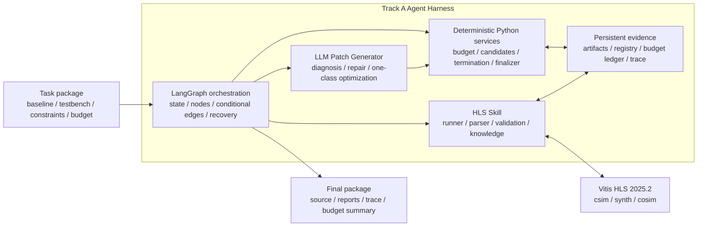
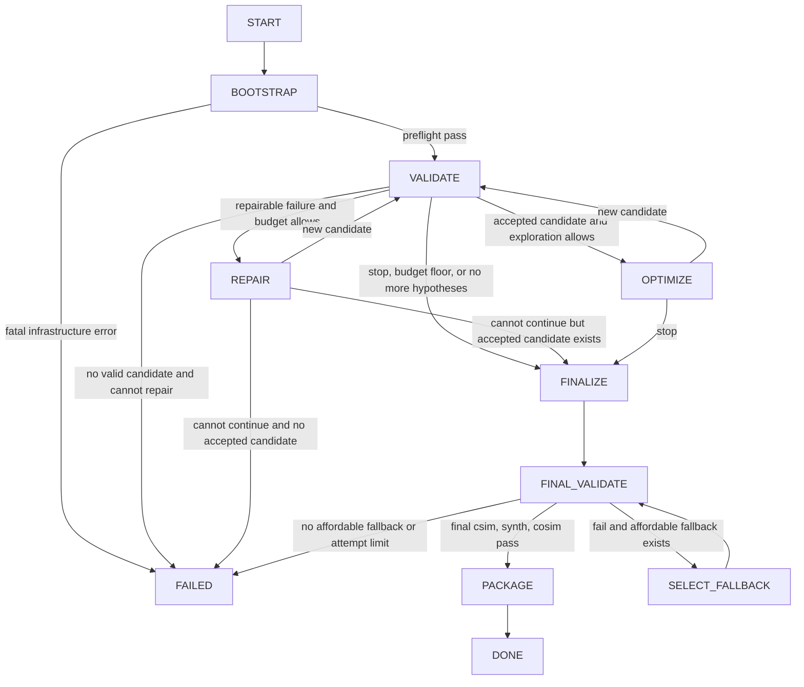
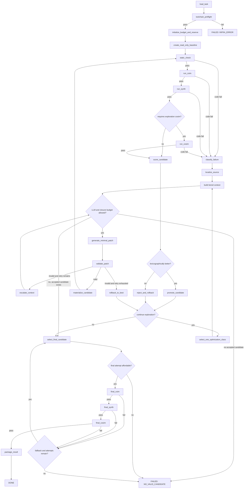

# Budget-Aware LangGraph LLM4HLS Agent 设计总规范

Status: team design + implementation contract
Owner: team
Checked: 2026-07-14
Scope: FPT 2026 Track A Agent Harness

## 0. 文档定位

本文合并并修订以下两份组内材料：

- 31 页内部方案 `Budget-Aware LangGraph LLM4HLS Agent`；
- [LangGraph 状态编排契约](2026-07-14-langgraph-state-orchestration-contract.md)。

相关背景资料：

- [LangGraph 与 Track A 混合 Agent 架构](2026-07-10-langgraph-track-a-architecture.md)；
- [预算感知工具策略与最优停止](2026-07-10-budget-aware-tool-policy-and-optimal-stopping.md)；
- [Reference Harness 分析](../02_harness/2026-07-10-reference-harness-analysis.md)；
- [Track A Submission Guidelines 中文翻译与执行清单](../01_official/2026-07-10-track-a-submission-guidelines-zh.md)。

本文是团队内部的**设计总规范**：说明 Agent 应如何编排、计费、验证、回滚和停止。它不是比赛正式规则。正式要求始终以比赛官网和最新 FAQ 为准；reference harness 中的 credits、评分权重和样例预算只能作为开发配置。

### 0.1 可行性结论

整体方案可行，且与当前 LangGraph Graph API 一致：

- `StateGraph` 用 State、Nodes 和 Edges 表达有状态循环；
- `add_conditional_edges` 适合实现纯路由函数；
- `context_schema` 适合向节点注入 Vitis、LLM 和各类 Manager；
- checkpointer 配合 `thread_id` 可以保存线程级 checkpoint；
- 子图可以继承父图 checkpointer；
- 节点可能在恢复时重新执行，因此所有外部副作用必须幂等。

官方参考：

- [LangGraph Graph API](https://docs.langchain.com/oss/python/langgraph/graph-api)
- [LangGraph Persistence](https://docs.langchain.com/oss/python/langgraph/persistence)
- [LangGraph Subgraphs](https://docs.langchain.com/oss/python/langgraph/use-subgraphs)

原始方案需要修正的四个关键点，已经在本文中处理：

1. 嵌套 `validation` 必须定义 reducer，否则部分更新会覆盖整个验证字典。
2. `action_id` 必须使用稳定摘要，不能使用跨进程不稳定的 Python `hash()`。
3. 预算必须同时支持统一 credits、单工具上限、Token 和运行时间。
4. 最终 fallback 必须受预算、候选数量和最大尝试次数约束。

## 1. 项目目标

系统接收官方提供的：

- HLS C/C++ baseline；
- testbench；
- 构建脚本；
- 顶层接口、数据类型和数值语义约束；
- FPGA、时钟和资源约束；
- Token、工具调用、credits 和运行时间预算。

当前提交目标是 Alveo U55C、Vitis 2025.2，生成硬件至少达到 100 MHz；这些值仍必须通过任务或比赛配置注入，不能散落在实现代码中。

Agent 在预算内自动完成：

```text
读取任务
  -> 运行 baseline
  -> 定位错误
  -> 生成最小 Patch
  -> 创建新候选
  -> 重新验证
  -> 优化 PPA
  -> 比较候选
  -> 失败回滚
  -> 最终 csim/synth/cosim
  -> 提交最佳正确版本
```

优先级为：

```text
功能正确性
  > 可综合性
  > C/RTL 一致性
  > 时钟与资源硬约束
  > PPA
  > Token 与工具效率
```

低 Token 不等于单纯压缩输出，而是减少：

- 没有必要的 LLM 调用；
- 重复发送完整工程和完整日志；
- 无限制 Reflection；
- 重新输出完整源文件；
- 多 Agent 之间重复传递上下文。

粗略地说：

```text
Token 消耗
  = 模型调用次数
  * 每次输入上下文大小
  + 总输出大小
```

## 2. 范围与非目标

### 2.1 本阶段必须实现

- 可恢复的确定性验证闭环；
- 最小 Patch 修复闭环；
- 候选注册、比较和回滚；
- 统一预算总账和最终验证预留；
- 有限 PPA 优化循环；
- 可复现实验 trace、Token 和工具统计；
- Docker 内可运行的最终入口。

### 2.2 一个月内不优先

- 多 Agent 辩论；
- 长期记忆或通用 RAG；
- 人工审批工作流；
- 无限制自我反思；
- LangSmith 云服务硬依赖；
- 与比赛无关的通用 Agent 平台。

## 3. 硬不变量

文中的 `MUST` 表示实现必须满足，`SHOULD` 表示默认策略。

1. Baseline `MUST` 只读。
2. 新 Patch `MUST` 生成新候选，不得原地覆盖 baseline 或最佳候选。
3. 每条验证结果 `MUST` 与 `code_hash + tool_config_hash` 绑定。
4. 失败候选 `MUST NOT` 覆盖 `best_candidate_id`。
5. LLM 或 Vitis 调用前 `MUST` 先经过预算门控并预留费用。
6. 探索动作 `MUST NOT` 消耗最终验证预留。
7. 所有循环 `MUST` 同时受重试次数、预算和停止条件约束。
8. 所有路径 `MUST` 终止于 `DONE` 或 `FAILED`。
9. `DONE` 时的最终候选 `MUST` 通过最终 csim、synth 和 cosim。
10. 最终硬件 `MUST` 满足当前正式要求中的最低时钟约束，例如至少 100 MHz。
11. Graph State `MUST NOT` 保存完整源码、完整日志、完整 Prompt 或聊天历史。
12. 路由函数 `MUST` 只读取 State，不得调用 LLM、Vitis 或修改文件。
13. Vitis 结果 `MUST` 是正确性和 PPA 的事实来源，LLM 自评不能替代工具结果。
14. 恢复执行 `MUST NOT` 重复计费、重复覆盖候选或产生非幂等副作用。
15. 每个节点 `MUST` 只使用一种路由方式；本文统一采用“部分 State 更新 + conditional edges”。

## 4. 总体架构



核心关系：

```text
Track A Agent = Harness + LLM + Vitis HLS
Harness = LangGraph + deterministic Python services + persistence + budget control
```

### 4.1 LangGraph 编排层

负责：

- 当前阶段；
- 节点顺序和条件分支；
- 修复、优化、回滚和最终化循环；
- checkpoint 和恢复入口；
- `DONE` / `FAILED` 终止。

不负责：

- 直接实现预算算法；
- 保存完整源码和日志；
- 解析 Vitis 报告；
- 直接应用 Patch；
- 自己决定 PPA 是否真实改善。

### 4.2 Competition Services

包括：

- `TaskAdapter`；
- `BudgetManager`；
- `CandidateManager`；
- `CandidateComparator`；
- `TerminationPolicy`；
- `RollbackManager`；
- `Finalizer`。

这些服务用普通 Python 实现，负责硬约束和可测试决策。

### 4.3 HLS Skill

包括：

- Vitis 工具链预检查；
- csim、synth、cosim 调用；
- timeout 和进程错误处理；
- XML、JSON、报告和日志解析；
- HLS 错误规则与优化知识；
- 结构化验证结果。

### 4.4 LLM Patch Generator

LLM 只负责：

- 低置信错误诊断；
- 功能修复 Patch；
- 单一类别的 PPA 优化 Patch。

LLM 不负责：

- 自主批准工具费用；
- 直接选择最终提交版本；
- 覆盖 baseline 或 best；
- 把主观判断当作验证结果；
- 无限反思。

## 5. LangGraph 主状态机

这张图是实现 `builder.py` 和 `routes.py` 时的权威编排图。



建议实现为五个子图：

1. `bootstrap_subgraph`；
2. `validation_subgraph`；
3. `repair_subgraph`；
4. `optimization_subgraph`；
5. `finalization_subgraph`。

每次 LLM、csim、synth 或 cosim 调用 `SHOULD` 是独立节点，便于 checkpoint、计费、恢复和单元测试。

## 6. 详细执行闭环



图中省略了 `TOOL_ERROR` 分支。所有工具节点遇到基础设施错误时，允许一次幂等重试；仍失败则进入 `FAILED(INFRA_ERROR)`，不能直接让 LLM 修改源码。

### 6.1 节点分组

| 分组 | 典型节点 | 是否允许 LLM | 主要副作用 |
| --- | --- | --- | --- |
| 初始化 | `load_task`、`toolchain_preflight`、`initialize_budget`、`create_baseline` | 否 | 读取任务、创建只读 baseline 和初始账本 |
| 验证 | `static_check`、`run_csim`、`run_synth`、`run_cosim` | 否 | 调用工具、保存报告、更新验证状态 |
| 诊断 | `classify_failure`、`localize_source`、`build_context` | 仅规则低置信时 | 保存结构化证据和局部上下文 |
| Patch | `generate_patch`、`validate_patch`、`materialize_candidate` | 仅 `generate_patch` | 记录 LLM 请求、校验 diff、创建新候选 |
| 候选 | `score_candidate`、`promote_candidate`、`reject_and_rollback` | 否 | 更新 Candidate Registry |
| 优化 | `analyze_metrics`、`select_optimization` | 可选，但默认确定性优先 | 选择一个优化类别和构造证据 |
| 最终化 | `select_final_candidate`、`final_*`、`package_result` | 否 | 最终验证、fallback 和打包 |

同一个节点不要同时完成“调用 LLM、应用 Patch、运行 Vitis、比较结果”四件事。拆开后，计费点、checkpoint 和失败边界才清晰。

## 7. 路由契约

| 当前事件 | 条件 | 下一节点 |
| --- | --- | --- |
| preflight 完成 | pass | `initialize_budget_and_reserve` |
| preflight 完成 | fail | `fail_run(INFRA_ERROR)` |
| static 完成 | pass | `run_csim` |
| static 完成 | code fail，且可修复、预算允许 | `classify_failure` |
| csim 完成 | pass | `run_synth` |
| csim 完成 | code fail，且可修复、预算允许 | `classify_failure` |
| synth 完成 | pass，且处于最终验证 | `run_cosim` |
| synth 完成 | pass，且 `requires_cosim=true` | `run_cosim` |
| synth 完成 | pass，其他探索情况 | `score_candidate` |
| synth 完成 | code fail，且可修复、预算允许 | `classify_failure` |
| cosim 完成 | pass，且处于最终验证 | `package_result` |
| cosim 完成 | pass，探索阶段 | `score_candidate` |
| 任一最终工具失败 | fallback、预算和次数均允许 | `select_fallback` |
| 任一最终工具失败 | 无可承担 fallback | `fail_run(NO_VALID_CANDIDATE)` |
| Patch 校验完成 | valid | `materialize_candidate` |
| Patch 校验完成 | invalid，且 `patch_retry_count < 2` | `escalate_context` |
| Patch 校验完成 | invalid，且不可重试 | `rollback_to_best` |
| 候选评分完成 | 更优 | `promote_candidate` |
| 候选评分完成 | 非更优 | `reject_and_rollback` |
| 候选决策完成 | 可继续优化 | `select_optimization` |
| 候选决策完成 | 应停止 | `select_final_candidate` |
| 任一工具节点 | `TOOL_ERROR`，首次 | 幂等重试当前工具 |
| 任一工具节点 | `TOOL_ERROR`，重试后仍失败 | `fail_run(INFRA_ERROR)` |

多个条件同时成立时，按以下优先级：

```text
1. 基础设施致命错误
2. 当前没有可提交候选时的正确性修复
3. 最终验证预算保护
4. 最终验证或 fallback
5. 正确性等级提升
6. PPA 改善
7. 无改进停止
8. 继续探索
```

路由函数返回值 `SHOULD` 使用 `Literal[...]`，保证每个结果只映射到一个节点。

## 8. 权威数据边界

| 数据 | 权威位置 | State 中保存什么 |
| --- | --- | --- |
| 源码、Patch、日志、报告、Prompt | Artifact Store | 路径、ID、hash |
| 候选关系、验证和指标 | Candidate Registry | current/best/final/fallback ID |
| Token、credits 和工具费用 | append-only Budget Ledger | 最新 Budget Snapshot |
| 路由所需控制状态 | LangGraph State | 小型结构化字段 |
| Vitis、LLM、Parser 和 Manager 实例 | Runtime Context | 不写入 State |

State 中的预算快照 `MUST` 与 Budget Ledger 最后一条已提交记录一致。路由只能读预算快照，不得读取未持久化的进程内计数器。

## 9. 最小 Agent State

```python
from typing import Annotated, Literal, cast
from typing_extensions import NotRequired, TypedDict

Phase = Literal[
    "BOOTSTRAP",
    "VALIDATE",
    "REPAIR",
    "OPTIMIZE",
    "FINALIZE",
    "DONE",
    "FAILED",
]

Objective = Literal[
    "NONE",
    "FIX_STATIC",
    "FIX_CSIM",
    "FIX_SYNTH",
    "FIX_COSIM",
    "IMPROVE_PPA",
]

CheckStatus = Literal[
    "NOT_RUN",
    "PASS",
    "FAIL",
    "TIMEOUT",
    "TOOL_ERROR",
]

ContextTier = Literal["COMPACT", "FOCUSED", "EXPANDED"]


class StageResult(TypedDict, total=False):
    status: CheckStatus
    action_id: str
    result_ref: str
    code_hash: str
    tool_config_hash: str


class ValidationState(TypedDict, total=False):
    static: StageResult
    csim: StageResult
    synth: StageResult
    cosim: StageResult


def merge_validation(
    left: ValidationState | None,
    right: ValidationState | None,
) -> ValidationState:
    merged = dict(left or {})
    merged.update(right or {})
    return cast(ValidationState, merged)


class BudgetSnapshot(TypedDict):
    credit_limit: int | None
    credits_used: int
    pending_credits_reserved: int
    tool_costs: dict[str, int]
    tool_limits: dict[str, int | None]
    tool_used: dict[str, int]

    llm_call_limit: int
    llm_calls_used: int
    input_token_limit: int
    output_token_limit: int
    input_tokens_used: int
    output_tokens_used: int

    final_credit_reserve: int
    final_token_reserve: int
    final_tool_reserve: dict[str, int]

    runtime_limit_seconds: float
    runtime_used_seconds: float


class AgentState(TypedDict):
    task_id: str
    run_id: str
    phase: Phase
    objective: Objective

    baseline_candidate_id: NotRequired[str]
    current_candidate_id: NotRequired[str]
    best_candidate_id: str | None
    best_cosim_candidate_id: str | None
    final_candidate_id: str | None
    fallback_candidate_ids: list[str]

    validation: Annotated[ValidationState, merge_validation]
    failure_ref: str | None
    metrics_ref: str | None
    current_score: float | None
    best_score: float | None

    context_tier: ContextTier
    repair_attempts: int
    optimize_attempts: int
    patch_retry_count: int
    tool_retry_count: int
    no_improvement_count: int
    final_attempts: int
    max_final_attempts: int
    requires_cosim: bool

    budget: BudgetSnapshot
    pending_action_id: str | None
    stop_reason: str | None
    final_result_ref: str | None
```

### 9.1 Reducer 规则

LangGraph 默认会用新值替换旧值。若节点返回：

```python
{"validation": {"csim": csim_result}}
```

而 `validation` 没有 reducer，之前的 `static`、`synth` 和 `cosim` 字段可能被整块覆盖。因此本文为 `validation` 定义浅合并 reducer；每个单独的 `StageResult` 仍应一次返回完整值。

`budget` 不使用 reducer。BudgetManager 每次完成账本事务后，节点必须返回完整、权威的新快照。

### 9.2 字段语义

- `best_candidate_id`：已经通过 static、csim 和 synth，且满足当前探索阶段必要验证的最佳候选。
- `best_cosim_candidate_id`：已经通过 cosim 的最佳候选，可为空。
- `fallback_candidate_ids`：按候选比较器排序的可最终验证候选，不保证已经通过 cosim。
- `final_attempts`：已经进入最终验证的候选数量，不是单个工具调用次数。
- `tool_retry_count`：当前工具动作的重试次数；动作成功或切换动作时必须重置。
- `requires_cosim`：当前任务或候选是否存在需要探索期 cosim 的结构风险。

以下值由其他字段推导，不重复存入 State：

- `current_stage`；
- `status`；
- `budget_exhausted`；
- `remaining_budget`；
- `verification_level`。

## 10. Runtime Context

Runtime Context 保存不可序列化的服务对象。实现中应使用具体类型或 `Protocol`，不要长期保留 `object`。

```python
from dataclasses import dataclass


@dataclass(frozen=True)
class RuntimeContext:
    vitis_runner: VitisRunner
    budget_manager: BudgetManager
    candidate_manager: CandidateManager
    error_classifier: ErrorClassifier
    source_localizer: SourceLocalizer
    context_builder: ContextBuilder
    patch_generator: PatchGenerator
    patch_validator: PatchValidator
    patch_applier: PatchApplier
    comparator: CandidateComparator
    termination_policy: TerminationPolicy
    trace_writer: TraceWriter
    llm_provider: LLMProvider
```

节点只组织一次明确动作并返回部分 State 更新。预算、候选、日志解析和文件操作必须委托给对应服务。

## 11. BudgetManager

### 11.1 支持的预算维度

预算必须配置化，并同时支持：

- 统一 credit budget；
- 每种工具最大调用次数；
- 输入和输出 Token；
- LLM 最大调用次数；
- 总运行时间；
- 最终验证预留。

reference harness 当前样例可以写成：

```yaml
credits:
  enabled: true
  total: 80
  costs:
    csim: 1
    synth: 4
    cosim: 20
```

这些值 `MUST NOT` 写死在代码中。正式配置变化时，只替换配置，不改路由逻辑。

### 11.2 预算准入

探索动作只有在以下条件成立时才能执行：

```text
spendable_credits
  = credit_limit
  - credits_used
  - pending_credits_reserved
  - final_credit_reserve

estimated_action_credits <= spendable_credits
```

credits、各工具次数、Token 和运行时间分别检查，任一维度不足都拒绝动作。

一个 LLM Patch 不能只检查 LLM 调用费用，还要检查完成最小闭环所需的后续验证费用。例如优化 Patch 至少需要预留 `csim + synth`，高结构风险 Patch 还可能需要 cosim。

### 11.3 计费事务

每个计费动作执行：

```text
estimate cost
  -> reserve cost
  -> append STARTED ledger event
  -> execute action
  -> persist result by action_id
  -> reconcile actual cost
  -> append COMPLETED ledger event
  -> return complete Budget Snapshot
```

超时、异常或进程中断不能绕过计费。若只看到 `STARTED` 而没有可靠结果，恢复时标记为 `AMBIGUOUS`，按比赛规则采取保守核销策略。

### 11.4 最终验证预留

至少预留一套：

```text
final csim + final synth + final cosim
```

若希望保证一次 fallback，则必须预留第二套，或只在第一次最终验证提前失败后、剩余预算足够时尝试 fallback。`max_final_attempts` 和可承担预算必须同时成立，不能让 fallback 形成无界循环。

原方案中的 `10% / 40% / 35% / 15%` 只能作为初始实验启发式：

- baseline 与任务理解：约 10%；
- 正确性修复：约 40%；
- PPA 优化：约 35%；
- 最终审查和验证：约 15%。

真正执行时应使用动态预算和明确 reserve，而不是硬切百分比。

## 12. HLS 验证策略

### 12.1 普通验证顺序

```text
static -> csim -> synth -> optional cosim
```

逐级门控：

- static fail：不运行 csim；
- csim fail：不运行 synth；
- synth fail：不运行 cosim；
- 相同 `code_hash + tool_config_hash`：优先复用缓存结果。

### 12.2 工具职责

| 工具 | 主要回答的问题 | 不能证明什么 |
| --- | --- | --- |
| static | Patch、语法、接口和文件是否基本合法 | 功能和硬件行为正确 |
| csim | C/C++ 在 testbench 下是否功能正确 | 可综合、RTL 行为一致 |
| synth | 是否可综合，latency、II、clock、LUT/FF/DSP/BRAM 如何 | RTL 与 C 行为完全一致 |
| cosim | 生成 RTL 与 C/testbench 是否一致，是否死锁 | hidden benchmark 一定通过 |

探索阶段仅在以下情况运行高成本 cosim：

1. 当前目标是 `FIX_COSIM`；
2. 使用 DATAFLOW、stream、FIFO、接口或高风险数值变换；
3. 候选即将成为重要 checkpoint，且预算允许；
4. 任务本身标记 `requires_cosim=true`。

最终阶段必须执行：

```text
final csim -> final synth -> final cosim
```

HLS 优化遵循报告驱动原则：

- baseline 正确性没有建立前，不进行大规模 PPA 优化；
- 一轮只尝试一个主要优化类别；
- 根据 latency、II、slack、资源、接口和 memory-port 证据选择动作；
- pragma 没有生效或指标变差时撤销候选；
- 不盲目叠加 `PIPELINE`、`UNROLL`、`DATAFLOW` 和 `ARRAY_PARTITION`；
- 任何功能相关的源码变化都必须重新从 csim 开始验证。

### 12.3 TOOL_ERROR 与代码错误

以下问题默认属于基础设施错误：

- Vitis 不存在或版本不匹配；
- license、环境变量或设备文件异常；
- runner 自身崩溃；
- 报告文件缺失且无法解释；
- Docker 文件系统或权限异常。

这些错误不能直接交给 LLM 修改 HLS 源码。允许一次确定性重试，之后终止并记录 `INFRA_ERROR`。

## 13. 错误分类与证据压缩

### 13.1 一级分类

```text
TOOLCHAIN
COMPILE
CSIM
SYNTH
COSIM
INTERFACE
NUMERICAL
PERFORMANCE
UNKNOWN
```

### 13.2 二级分类示例

```text
COMPILE
  missing_header / type_error / undefined_symbol / top_function_missing
CSIM
  output_mismatch / out_of_bounds / segmentation_fault / timeout
SYNTH
  unsupported_construct / dynamic_allocation / recursion / interface_violation
COSIM
  rtl_mismatch / stream_deadlock / stream_empty_read / axi_depth_error
PERFORMANCE
  ii_violation / memory_port_conflict / latency_high / timing_failure
  lut_overuse / dsp_overuse / bram_overuse
```

结构化输出：

```json
{
  "category": "PERFORMANCE",
  "subtype": "MEMORY_PORT_CONFLICT",
  "confidence": 0.96,
  "locations": [
    {"file": "kernel.cpp", "start": 45, "end": 63, "symbol": "LOOP_M"}
  ],
  "evidence": [
    "Target II=1",
    "Achieved II=4",
    "Array A has insufficient memory ports"
  ],
  "recommended_context": [
    "LOOP_M",
    "array A declaration",
    "A interface pragmas"
  ],
  "allowed_actions": [
    "ARRAY_PARTITION",
    "ARRAY_RESHAPE",
    "LOCAL_BUFFER"
  ]
}
```

### 13.3 日志解析优先级

```text
结构化 XML/JSON
  > Vitis 报告文件
  > 确定性正则提取
  > LLM 阅读局部日志
```

完整日志保存在 Artifact Store；发给模型的只有错误摘要、关键证据和相关位置。

### 13.4 SourceLocalizer

根据错误行、函数名、循环标签、数组名和调用栈提取：

- 错误附近有限行数；
- 所在函数签名；
- 相关变量和数据类型；
- 顶层接口 pragma；
- 必要 testbench 断言。

默认不发送整个仓库、所有头文件、完整 testbench、完整日志和无关函数。

## 14. LLM 调用契约

### 14.1 调用门控

只有以下情况调用模型：

- 规则无法高置信诊断；
- 必须修改 HLS C/C++；
- 需要根据报告选择具体代码重构。

以下工作不调用模型：

- 运行工具和检查返回码；
- 解析 XML、JSON 和报告；
- 统计资源和比较候选；
- 保存、复制和回滚候选；
- 预算和停止判断。

### 14.2 三档上下文

| Tier | 适用情况 | 建议输入规模 |
| --- | --- | --- |
| `COMPACT` | 单点、明确错误 | 1000-3000 tokens |
| `FOCUSED` | 跨 2-3 个函数或一次修复失败 | 3000-6000 tokens |
| `EXPANDED` | cosim mismatch、DATAFLOW deadlock、多函数接口或两次失败 | 6000-10000 tokens |

默认从 `COMPACT` 开始，只有失败且预算允许时升级。

### 14.3 LLM 输入

每次调用必须包含：

```text
objective
structured failure or metrics
localized source context
interface, numeric and clock constraints
failed-action summary
remaining exploration budget
allowed optimization class
```

使用结构化记忆，不传完整聊天历史：

```json
{
  "accepted_facts": [
    "top function interface must not change",
    "candidate_003 is current best"
  ],
  "failed_actions": [
    {
      "action": "PIPELINE outer loop",
      "result": "resource overflow"
    }
  ]
}
```

### 14.4 LLM 输出

推荐输出为严格 JSON，其中 Patch 字段保存 unified diff：

```json
{
  "hypothesis": "LOOP_M is limited by memory ports on A",
  "change_class": "MEMORY_LAYOUT",
  "expected_effect": "reduce achieved II",
  "risk": "medium",
  "required_validation": ["csim", "synth"],
  "patch": "--- a/src/kernel.cpp\n+++ b/src/kernel.cpp\n@@ ..."
}
```

输出不得包含完整工程，不得修改 testbench，不得直接修改 best，不得自行批准费用。结构化输出解析失败时，只允许一次格式修复重试；之后回滚，避免把预算耗在格式循环上。

### 14.5 模型路由

默认使用单一固定开放权重模型建立可复现 baseline。只有形成稳定实验后，才配置：

```text
deterministic rules
  -> default model
  -> strong model only for bounded complex failures
```

每次调用必须记录模型名、provider、参数、Token、缓存 Token、耗时和请求 ID。Prompt 前缀缓存只能作为 provider 支持时的可选优化，不能成为正确性依赖。

### 14.6 Prompt 模板

Repair Prompt 的稳定骨架：

```text
ROLE
You are a Vitis HLS C/C++ repair agent.

OBJECTIVE
Repair the current failure while preserving functionality, top-level interface,
data types, numeric semantics, and clock constraints.

STAGE
{stage}

STRUCTURED FAILURE
{failure_json}

RELEVANT SOURCE
{localized_source}

CONSTRAINTS
{interface_numeric_clock_constraints}

FAILED ACTIONS
{failed_action_summary}

BUDGET
{remaining_exploration_budget}

OUTPUT
Return exactly one schema-compliant response containing one minimal unified diff.
Do not modify tests. Do not output the full project. Do not approve tool calls.
```

Optimize Prompt 的稳定骨架：

```text
ROLE
You are a Vitis HLS PPA optimization agent.

OBJECTIVE
Improve the stated bottleneck without changing functionality or interface.

VERIFIED BASE
csim={csim_status}
synth={synth_status}
cosim={cosim_status}

TARGET BOTTLENECK
{structured_metrics_and_report_evidence}

ALLOWED CHANGE CLASS
{one_optimization_class}

RELEVANT SOURCE
{localized_source}

CONSTRAINTS
{interface_resource_clock_constraints}

FAILED ACTIONS
{failed_action_summary}

BUDGET
{remaining_exploration_budget}

OUTPUT
Return exactly one schema-compliant response containing one minimal unified diff.
Do not combine unrelated optimization classes.
```

建议输出上限作为可配置初值：

```text
repair:        500-1000 tokens
optimize:      500-1200 tokens
format_retry:  200-400 tokens
```

## 15. Patch 安全与候选物化

Patch 应用前必须检查：

- unified diff 格式；
- 修改路径白名单；
- 是否修改 testbench、隐藏测试或官方脚本；
- 顶层函数名称、参数、类型和顺序；
- 是否删除断言或约束；
- 最大修改行数；
- dry-run 能否应用；
- 变更后源码是否可解析。

```python
from dataclasses import dataclass


@dataclass(frozen=True)
class PatchPolicy:
    allowed_extensions: tuple[str, ...] = (".cpp", ".h", ".hpp", ".cfg")
    forbidden_paths: tuple[str, ...] = ("hidden_tests/", "official_tests/")
    max_changed_lines: int = 80
    allow_interface_change: bool = False
```

安全顺序：

```text
parse patch
  -> validate policy
  -> clone parent into new candidate
  -> dry-run
  -> apply patch to new candidate only
  -> calculate code_hash
  -> reset all validation to NOT_RUN
  -> register candidate
```

## 16. Candidate 管理与回滚

候选关系形成树：

```text
candidate_000 baseline
  |-- candidate_001 compile fix
  |     `-- candidate_003 csim fix
  |           |-- candidate_005 pipeline
  |           `-- candidate_006 partition
  `-- candidate_002 rejected
```

候选最小记录：

```python
from dataclasses import dataclass


@dataclass(frozen=True)
class Candidate:
    candidate_id: str
    parent_id: str | None
    code_hash: str
    patch_ref: str | None
    validation_ref: str
    metrics_ref: str | None
    score: float | None
    input_tokens: int
    output_tokens: int
    credits_used: int
    status: str
```

回滚原则：

```text
best candidate
  -> clone to new candidate
  -> apply one patch
  -> validate
  -> promote if better
  -> otherwise reject new candidate
  -> best remains unchanged
```

默认不在失败候选上继续叠加修改。唯一例外是同一 Patch 的格式修复尚未物化候选，此时可以在有限重试内继续处理输出。

## 17. 候选比较与 PPA

候选采用字典序，而不是把正确性和 PPA 混成一个加权总分：

```text
verification tier
  > hard constraints, including clock >= 100 MHz
  > official score, when available
  > development PPA metric
  > lower token/tool cost as tie-breaker
```

验证等级：

```text
cosim pass
  > synth + csim pass
  > csim pass
  > static pass
  > failed
```

若官方评分尚未确定，可以使用开发期 PPA cost：

```text
ppa_cost =
    w_latency * latency / baseline_latency
  + w_ii      * ii      / baseline_ii
  + w_lut     * lut     / baseline_lut
  + w_ff      * ff      / baseline_ff
  + w_dsp     * dsp     / baseline_dsp
  + w_bram    * bram    / baseline_bram
```

这里 `ppa_cost` 越低越好。权重必须来自 `scoring.yaml`，并明确标注为团队启发式，不能冒充比赛最终评分。

Token 效率可以作为实验指标或平分项：

```text
efficiency = ppa_improvement / (tokens + alpha * tool_credits)
```

## 18. 停止策略

停止是 Agent 的正常动作，不是预算异常后的补救。

### 18.1 硬停止

满足任一条件即停止探索：

- 无法承担下一个“Patch + 必要验证”闭环；
- 继续会侵占最终验证预留；
- Token 或运行时间达到安全阈值；
- 所有工具达到正式次数限制；
- 没有不同且合法的新动作；
- 已达到明确的性能上界；
- 最大 repair、optimization 或 final attempt 次数已到。

### 18.2 软停止

可以组合以下信号：

- 连续 2-3 个不同假设没有改善；
- 模型重复同一 pragma、Patch 或失败原因；
- 报告中的主要瓶颈未变化；
- 预计收益很小但 hidden correctness、资源或 timing 风险上升；
- 剩余预算更适合一次高价值验证。

若尚无有效候选，停止结果是 `FAILED(NO_VALID_CANDIDATE)`；若已有有效候选，则进入 `FINALIZE`。

## 19. Checkpoint、动作 ID 与幂等

图编译时必须配置持久化 checkpointer，并使用：

```python
config = {"configurable": {"thread_id": run_id}}
```

开发期可以使用文件型持久化 checkpointer；`InMemorySaver` 不能用于需要跨进程恢复的正式运行。

每个有副作用的动作使用稳定 ID：

```python
import hashlib
import json


def stable_action_id(
    *,
    run_id: str,
    node_name: str,
    candidate_id: str,
    attempt_index: int,
    tool_config_hash: str,
) -> str:
    payload = {
        "run_id": run_id,
        "node_name": node_name,
        "candidate_id": candidate_id,
        "attempt_index": attempt_index,
        "tool_config_hash": tool_config_hash,
    }
    raw = json.dumps(payload, sort_keys=True, separators=(",", ":")).encode()
    return hashlib.sha256(raw).hexdigest()[:24]
```

不要使用 Python 内置 `hash()` 生成跨进程 ID，因为默认哈希种子可能在进程间变化。

恢复规则：

- `COMPLETED` 且结果存在：直接复用，不重复调用和计费；
- `STARTED` 且结果存在：校验结果后完成账本对账；
- `STARTED` 且结果不存在：标记 `AMBIGUOUS`，保守核销后决定是否重试；
- route 函数是纯函数，replay 不产生副作用；
- 源码写入、候选注册、账本写入使用临时文件加原子替换或数据库事务。

子图默认采用 per-invocation persistence 并继承父图 checkpointer；当前任务不需要子图跨多次独立运行积累对话记忆。

## 20. 最小 Builder 形状

```python
from langgraph.graph import END, START, StateGraph


builder = StateGraph(AgentState, context_schema=RuntimeContext)

builder.add_node("bootstrap", bootstrap_subgraph)
builder.add_node("validate", validation_subgraph)
builder.add_node("repair", repair_subgraph)
builder.add_node("optimize", optimization_subgraph)
builder.add_node("finalize", finalization_subgraph)
builder.add_node("package", package_result)
builder.add_node("fail", fail_run)

builder.add_edge(START, "bootstrap")
builder.add_conditional_edges("bootstrap", route_after_bootstrap)
builder.add_conditional_edges("validate", route_after_validation)
builder.add_conditional_edges("repair", route_after_repair)
builder.add_conditional_edges("optimize", route_after_optimization)
builder.add_conditional_edges("finalize", route_after_finalization)
builder.add_edge("package", END)
builder.add_edge("fail", END)

graph = builder.compile(checkpointer=checkpointer)
```

子图内部仍须把 csim、synth、cosim 和 LLM 调用拆成独立节点。代码实现时必须为每个 conditional edge 提供完整的返回类型或显式 path map，保证图可视化和静态检查能够发现所有目标节点。

## 21. 推荐目录

这是目标结构，不要求 V0 一次创建所有空文件。模块应随开发阶段逐步拆分。

```text
llm4hls_harness/
|-- main.py
|-- pyproject.toml
|-- Dockerfile
|-- README.md
|
|-- graph/
|   |-- state.py
|   |-- context.py
|   |-- builder.py
|   |-- routes.py
|   |-- constants.py
|   |-- nodes/
|   |   |-- task_nodes.py
|   |   |-- validation_nodes.py
|   |   |-- diagnosis_nodes.py
|   |   |-- patch_nodes.py
|   |   |-- candidate_nodes.py
|   |   |-- optimization_nodes.py
|   |   `-- finalization_nodes.py
|   `-- persistence/
|       |-- checkpointer.py
|       `-- thread_manager.py
|
|-- competition/
|   |-- task_adapter.py
|   |-- constraints.py
|   |-- termination_policy.py
|   `-- finalizer.py
|
|-- hls_skill/
|   |-- skill.py
|   |-- toolchain/
|   |   |-- command_runner.py
|   |   |-- vitis_runner.py
|   |   |-- tcl_renderer.py
|   |   `-- tool_preflight.py
|   |-- validation/
|   |   |-- static_validator.py
|   |   |-- csim_validator.py
|   |   |-- synth_validator.py
|   |   `-- cosim_validator.py
|   |-- reports/
|   |   |-- log_parser.py
|   |   |-- error_extractor.py
|   |   |-- synthesis_parser.py
|   |   |-- cosim_parser.py
|   |   `-- metrics.py
|   `-- knowledge/
|       |-- error_rules.yaml
|       |-- optimization_rules.yaml
|       `-- interface_rules.yaml
|
|-- repair/
|   |-- error_classifier.py
|   |-- source_localizer.py
|   |-- context_builder.py
|   |-- patch_generator.py
|   |-- patch_parser.py
|   |-- patch_validator.py
|   `-- patch_applier.py
|
|-- candidates/
|   |-- models.py
|   |-- candidate_manager.py
|   |-- candidate_registry.py
|   |-- comparator.py
|   `-- rollback.py
|
|-- budget/
|   |-- models.py
|   |-- budget_manager.py
|   |-- budget_policy.py
|   |-- budget_ledger.py
|   |-- token_tracker.py
|   `-- tool_cost.py
|
|-- llm/
|   |-- provider.py
|   |-- model_router.py
|   |-- response_schema.py
|   `-- prompts/
|       |-- repair_prompt.md
|       `-- optimize_prompt.md
|
|-- telemetry/
|   |-- trace_writer.py
|   |-- event_schema.py
|   `-- summary_writer.py
|
|-- config/
|   |-- agent.yaml
|   |-- budget.yaml
|   |-- scoring.yaml
|   |-- toolchain.yaml
|   `-- optimization.yaml
|
|-- tests/
`-- runs/
```

## 22. 运行产物

```text
runs/
`-- task_001/
    `-- run_001/
        |-- task_spec.json
        |-- run_config.json
        |-- workflow_state.json
        |-- workflow_result.json
        |-- trace.jsonl
        |-- budget_ledger.jsonl
        |-- budget_state.json
        |-- token_usage.jsonl
        |-- candidate_registry.json
        |-- best_candidate.json
        |-- baseline/
        |-- candidates/
        |-- contexts/
        |-- prompts/
        |-- reports/
        `-- final_submission/
```

每个 candidate 保存：

```text
candidate_002/
|-- source/
|-- patch.diff
|-- candidate.json
|-- validation/
|-- logs/
|-- reports/
`-- llm/
```

所有结果都通过 ID、路径和 hash 进入 State，不把大文件内容塞进 checkpoint。

## 23. Telemetry 与 Token 统计

每次模型调用至少记录：

```json
{
  "request_id": "llm_005",
  "purpose": "synth_optimization",
  "candidate_id": "candidate_004",
  "model": "model_x",
  "provider": "provider_y",
  "input_tokens": 2310,
  "output_tokens": 274,
  "cached_input_tokens": 1600,
  "duration_seconds": 4.8,
  "status": "completed"
}
```

按阶段统计：

- task understanding；
- compile repair；
- csim repair；
- synth repair；
- cosim repair；
- PPA optimization；
- final audit。

最终报告至少展示：

- 总输入、输出和缓存 Token；
- 各阶段 Token；
- 模型和工具调用次数；
- credits 构成；
- 每次成功修复平均 Token；
- 单位 PPA 改善的 Token/credit 成本；
- 最终 stop reason；
- 最终代码是否来自 best verified candidate。

## 24. 一次完整运行示例

```text
1. bootstrap 创建只读 candidate_000 baseline
2. csim 发现 output mismatch
3. ErrorClassifier 分类为 LOOP_BOUND_ERROR
4. SourceLocalizer 提取 35 行相关代码
5. ContextBuilder 生成 1800-token COMPACT 上下文
6. BudgetManager 为 LLM 和后续 csim/synth 预留预算
7. LLM 输出 9 行 unified diff
8. PatchValidator 检查通过
9. CandidateManager 从 baseline 物化 candidate_001
10. static pass
11. csim pass
12. synth pass
13. ReportParser 发现 II=8
14. OptimizationSelector 选择 memory-layout
15. LLM 输出单一 ARRAY_PARTITION Patch
16. candidate_002 的 csim 和 synth pass
17. CandidateComparator 判断 candidate_002 更优
18. promote candidate_002
19. 剩余预算达到 final reserve floor
20. final csim -> final synth -> final cosim
21. package_result
```

该示例中 LLM 只调用两次，所有结论由工具验证。

## 25. 开发顺序

### V0：无 LLM 的确定性闭环

```text
读取任务 -> baseline -> csim -> synth -> cosim -> 解析报告 -> 保存结果
```

验收重点：工具调用、结构化结果、预算账本、trace 和 Docker。

### V1：最小修复闭环

```text
错误分类 -> SourceLocalizer -> LLM Patch -> Patch 校验
  -> 新候选 -> 验证 -> promote/reject -> 回滚
```

### V2：候选与 PPA

```text
候选树 -> 报告指标 -> 字典序比较 -> best candidate -> 单类优化循环
```

### V3：预算感知

```text
Token 统计 -> credits ledger -> 上下文分档 -> 最终验证预留
  -> 动态停止 -> checkpoint 恢复
```

### V4：比赛强化

- hidden-test 风险检查；
- 复杂 cosim/deadlock 修复；
- Docker 复现；
- 多 benchmark、多模型评估；
- 技术报告和 5 分钟 demo 数据。

### 一个月建议安排

| 周 | 核心目标 | 必须产生的证据 |
| --- | --- | --- |
| 第 1 周 | V0 确定性 Harness | 一个 benchmark 的 csim/synth/cosim、结构化报告和 ledger |
| 第 2 周 | V1 修复闭环 | 至少三类错误能修复或安全回滚 |
| 第 3 周 | V2 + V3 | 候选比较、预算 reserve、停止策略和恢复测试 |
| 第 4 周 | V4 | Docker、模型对比、消融实验、报告和 demo |

不要先搭完整目录再补功能。每个版本都应形成可运行的纵向闭环。

## 26. 必测场景

1. Baseline 全部通过，进入 PPA 优化。
2. Baseline 编译失败，修复后通过。
3. csim mismatch 连续失败，升级上下文后成功。
4. synth 失败但 csim 通过，回到 synth repair。
5. cosim deadlock，修复后重新完成三级验证。
6. Patch 非法两次，回滚且不污染 best candidate。
7. PPA 连续无改善，提前停止。
8. 预算刚好只够最终验证，禁止继续探索。
9. 最终候选在 csim、synth 或 cosim 任一级失败，自动尝试可承担 fallback。
10. fallback 达到预算或次数上限，明确失败而不是无限循环。
11. 进程在 LLM/Vitis 调用后崩溃，恢复时不重复执行已完成动作、不重复计费。
12. 同一候选在不同工具配置下不能错误复用缓存。
13. `validation` 部分更新不会覆盖其他阶段结果。
14. 所有候选失败，返回 `FAILED(NO_VALID_CANDIDATE)`。
15. 任意终止路径都能生成 trace、预算摘要和停止原因。
16. 最终候选满足 csim、synth、cosim 和最低时钟要求。

## 27. 实验设计

至少比较：

1. reference stop-on-first-no-improvement；
2. 固定轮数 workflow；
3. LLM 完全自由选择工具；
4. 本文的 model proposal + deterministic gate；
5. 纯 Python loop 与 LangGraph 编排的等价实现。

记录：

- public/hidden correctness rate；
- csim、synth、cosim pass rate；
- final latency、II、clock 和资源；
- 最终 score；
- credits、Token 和 wall time；
- 无效重复调用数；
- rollback 次数；
- final candidate 是否等于 best verified；
- stop reason 分布。

这组消融用于证明收益来自预算策略、工具反馈和候选安全，而不只是换了更强模型。

## 28. 完成标准

只有同时满足以下条件，Agent 编排才算完成：

- 每个节点结果都有唯一下一节点或终止状态；
- 每条循环都有重试上限、预算边界和 stop reason；
- route 单元测试覆盖全部条件分支；
- 最终验证失败存在可承担 fallback 或明确失败路径；
- checkpoint 恢复不会覆盖 best candidate 或重复计费；
- 预算 ledger、Candidate Registry 和 Graph State 能相互对账；
- 最终输出始终来自已通过 csim、synth 和 cosim 的候选；
- Docker 中可以复现运行和生成报告；
- 实验报告能给出 correctness、PPA、credits、Token 和停止原因。

## 29. 待配置而非硬编码的项目

以下项目在比赛更新后只修改配置：

- 正式 credit 总额和工具价格；
- 每类工具调用上限；
- Token 和运行时间限制；
- FPGA 型号、part、Vitis 版本和 clock；
- 正式评分函数与资源约束；
- 推荐或允许的开放权重模型；
- 最大 repair、optimization、Patch retry 和 final attempt 次数；
- 上下文 Token 档位和最大修改行数。

## 30. 最终原则

```text
LangGraph 管流程和恢复。
普通 Python 管预算、候选、计费和停止。
HLS Skill 管 Vitis、报告和专业知识。
LLM 只提出诊断和最小 Patch。
Vitis 结果决定事实。
失败立即隔离，best 永不被污染。
先预留最终验证，再使用剩余预算探索。
```

低 Token 的核心不是少做验证，而是：

```text
少调用 + 小上下文 + 小输出 + 真实工具反馈 + 幂等计费 + 失败回滚
```
