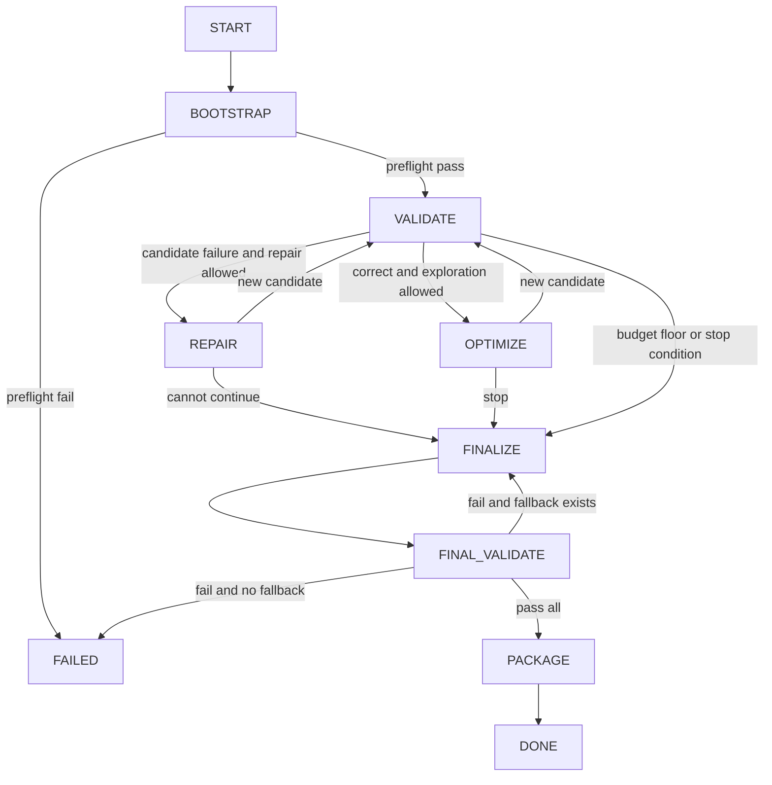

# LangGraph 状态编排契约

Status: team design<br>
Owner: team<br>
Checked: 2026-07-14

Sources:

- https://docs.langchain.com/oss/python/langgraph/graph-api
- https://docs.langchain.com/oss/python/langgraph/persistence
- https://docs.langchain.com/oss/python/langgraph/interrupts
- 组内文档 `Budget-Aware LangGraph LLM4HLS Agent`

Expires/Risk: medium，LangGraph API 可能变化；比赛预算和评分参数必须配置化。

## 1. 目标

本章定义 Track A Agent 的可执行状态机，不定义具体 HLS 优化算法。

核心原则：

```text
LangGraph 管状态转移。
普通 Python 管预算、候选和工具执行。
LLM 只提出诊断或最小 Patch。
Vitis 结果是正确性和 PPA 的事实来源。
```

文中的 `MUST` 表示实现必须满足，`SHOULD` 表示默认策略。

## 2. 硬不变量

1. Baseline `MUST` 保持只读。
2. 新 Patch `MUST` 生成新候选，不得原地覆盖最佳候选。
3. 验证结果 `MUST` 与候选的 `code_hash` 绑定。
4. 失败候选 `MUST NOT` 覆盖 `best_candidate_id`。
5. LLM 或 Vitis 调用前 `MUST` 先通过预算门控并预留费用。
6. 探索动作 `MUST NOT` 消耗最终验证预留。
7. 所有路径 `MUST` 终止于 `DONE` 或 `FAILED`。
8. `DONE` 时的最终候选 `MUST` 通过 csim、synth 和 cosim。
9. Graph State `MUST NOT` 保存完整源码、完整日志、完整 Prompt 或聊天历史。
10. 路由函数 `MUST` 只读取 State，不得调用 LLM、Vitis 或修改文件。

## 3. 权威数据边界

| 数据 | 权威位置 | State 中保存什么 |
| --- | --- | --- |
| 源码、Patch、日志、报告 | Artifact Store | 路径、ID、hash |
| 候选关系和指标 | Candidate Registry | current/best/final candidate ID |
| Token 和工具费用 | append-only Budget Ledger | 最新 Budget Snapshot |
| 路由所需控制状态 | LangGraph State | 小型结构化字段 |
| Vitis、LLM、Parser 实例 | Runtime Context | 不写入 State |

State 中的预算快照必须与 Budget Ledger 的最后一条已提交记录一致。路由只能读取快照，不能读取未持久化的进程内计数器。

## 4. 最小 State

以下代码是字段契约。实现可以使用 `TypedDict`、dataclass 或 Pydantic，但字段语义不得改变。

```python
from typing import Literal
from typing_extensions import NotRequired, TypedDict

Phase = Literal[
    "BOOTSTRAP", "VALIDATE", "REPAIR", "OPTIMIZE",
    "FINALIZE", "DONE", "FAILED",
]

Objective = Literal[
    "NONE", "FIX_STATIC", "FIX_CSIM", "FIX_SYNTH",
    "FIX_COSIM", "IMPROVE_PPA",
]

CheckStatus = Literal[
    "NOT_RUN", "PASS", "FAIL", "TIMEOUT", "TOOL_ERROR",
]

ContextTier = Literal["COMPACT", "FOCUSED", "EXPANDED"]


class StageResult(TypedDict):
    status: CheckStatus
    action_id: NotRequired[str]
    result_ref: NotRequired[str]
    code_hash: NotRequired[str]


class ValidationState(TypedDict):
    static: StageResult
    csim: StageResult
    synth: StageResult
    cosim: StageResult


class BudgetSnapshot(TypedDict):
    token_limit: int
    input_tokens_used: int
    output_tokens_used: int
    tool_limits: dict[str, int]
    tool_used: dict[str, int]
    final_token_reserve: int
    final_tool_reserve: dict[str, int]
    runtime_limit_seconds: float
    runtime_used_seconds: float


class AgentState(TypedDict):
    task_id: str
    run_id: str
    phase: Phase
    objective: Objective

    baseline_candidate_id: str
    current_candidate_id: str
    best_candidate_id: str | None
    best_cosim_candidate_id: str | None
    final_candidate_id: str | None
    fallback_candidate_ids: list[str]

    validation: ValidationState
    failure_ref: str | None
    metrics_ref: str | None
    current_score: float | None
    best_score: float | None

    context_tier: ContextTier
    repair_attempts: int
    optimize_attempts: int
    patch_retry_count: int
    no_improvement_count: int
    requires_cosim: bool

    budget: BudgetSnapshot
    pending_action_id: str | None
    stop_reason: str | None
    final_result_ref: str | None
```

以下值由其他字段推导，不应重复存入 State：

- `current_stage`
- `status`
- `budget_exhausted`
- `remaining_budget`
- `verification_level`

避免同时保存原值和推导值，否则 checkpoint 恢复后容易不一致。

## 5. 主状态机



建议拆成五个子图：

1. `bootstrap_subgraph`
2. `validation_subgraph`
3. `repair_subgraph`
4. `optimization_subgraph`
5. `finalization_subgraph`

每次 LLM 或 Vitis 调用应是独立节点，以便 checkpoint、计费和失败恢复。

## 6. 路由契约

| 当前事件 | 条件 | 下一节点 |
| --- | --- | --- |
| preflight 完成 | pass | `create_baseline` |
| preflight 完成 | fail | `fail_run(INFRA_ERROR)` |
| static 完成 | pass | `run_csim` |
| static 完成 | fail 且可修复、预算允许 | `classify_failure` |
| csim 完成 | pass | `run_synth` |
| csim 完成 | fail 且可修复、预算允许 | `classify_failure` |
| synth 完成 | pass 且处于最终验证 | `run_cosim` |
| synth 完成 | pass 且 `requires_cosim=true` | `run_cosim` |
| synth 完成 | pass，其他情况 | `score_candidate` |
| synth 完成 | fail 且可修复、预算允许 | `classify_failure` |
| cosim 完成 | pass 且处于最终验证 | `package_result` |
| cosim 完成 | pass，探索阶段 | `score_candidate` |
| cosim 完成 | fail，探索阶段且预算允许 | `classify_failure` |
| cosim 完成 | fail，最终阶段且有 fallback | `select_fallback` |
| cosim 完成 | fail，最终阶段且无 fallback | `fail_run(NO_VALID_CANDIDATE)` |
| Patch 校验完成 | valid | `materialize_candidate` |
| Patch 校验完成 | invalid 且 retry < 2 | `escalate_context` |
| Patch 校验完成 | invalid 且不可重试 | `rollback_to_best` |
| 候选评分完成 | 更优 | `promote_candidate` |
| 候选评分完成 | 非更优 | `reject_and_rollback` |
| 候选决策完成 | 可继续优化 | `select_optimization` |
| 候选决策完成 | 应停止 | `select_final_candidate` |

`TOOL_ERROR` 默认视为基础设施错误，不直接交给 LLM 修改源码。允许一次确定性重试；仍失败则进入 `FAILED`。

## 7. 路由优先级

多个条件同时成立时，必须按以下顺序决策：

```text
1. 基础设施致命错误
2. 当前没有可提交候选时的正确性修复
3. 最终验证预算保护
4. 最终验证或 fallback
5. 正确性等级提升
6. PPA 改善
7. 无改进停止
8. 继续探索
```

路由函数返回值应使用 `Literal[...]`，确保每个结果都能映射到唯一节点。

## 8. 预算状态机

工具价格和 Token 上限必须从比赛配置读取，不得硬编码 reference harness 的样例值。

探索动作的准入条件：

```text
remaining_after_action >= final_reserve
```

Token、csim、synth、cosim 和运行时间分别检查，任一维度不满足都拒绝动作。

每次计费动作执行以下事务：

```text
estimate cost
  -> reserve cost
  -> write STARTED ledger event
  -> execute action
  -> save result by action_id
  -> reconcile actual cost
  -> write COMPLETED ledger event
  -> return State update
```

预算不足时：

- 有可提交候选：进入 `FINALIZE`。
- 无可提交候选：进入 `FAILED(NO_VALID_CANDIDATE)`。
- 不得通过减少最终验证步骤来继续探索。

## 9. 验证与候选策略

普通验证顺序：

```text
static -> csim -> synth -> optional cosim
```

探索阶段仅在以下情况运行高成本 cosim：

1. 当前目标是 `FIX_COSIM`。
2. DATAFLOW、stream、接口或数值语义风险较高。
3. 候选即将成为重要 checkpoint，且预算允许。

最终阶段必须执行：

```text
final csim -> final synth -> final cosim
```

候选比较采用字典序，而不是单一加权分数：

```text
verification tier
  > hard constraints, including clock
  > PPA score
  > lower token/tool cost as tie-breaker
```

源码改变后，当前候选的全部验证状态必须重置为 `NOT_RUN`。缓存结果只能在 `code_hash + tool + tool_config` 完全相同时复用。

## 10. LLM 节点契约

LLM 默认只用于：

- 低置信错误诊断；
- 生成 repair Patch；
- 生成单一类别的 PPA optimization Patch。

输入必须包含：

```text
objective
structured failure or metrics
localized source context
interface and clock constraints
failed-action summary
remaining exploration budget
```

输出必须是结构化决策或 unified diff。不得返回完整工程，不得自主批准工具费用，不得直接修改 best candidate。

## 11. Checkpoint 与幂等

Graph 编译时必须配置持久化 checkpointer，并使用：

```text
thread_id = run_id
```

每个有副作用的动作必须拥有稳定 ID：

```text
action_id = hash(run_id, node_name, candidate_id, attempt_index)
```

恢复规则：

- `COMPLETED` 且结果存在：直接复用，不重复调用、不重复计费。
- `STARTED` 但结果不存在：标记为 ambiguous，保守核销一次后再决定是否重试。
- route 函数必须纯函数，因此 replay 不产生外部副作用。

本设计统一使用“节点返回部分 State 更新 + conditional edges 路由”。同一节点不得再混用静态出口或 `Command(goto=...)`。

## 12. 最小 Builder 形状

```python
builder = StateGraph(AgentState, context_schema=RuntimeContext)

builder.add_node("bootstrap", bootstrap_subgraph)
builder.add_node("validate", validation_subgraph)
builder.add_node("repair", repair_subgraph)
builder.add_node("optimize", optimization_subgraph)
builder.add_node("finalize", finalization_subgraph)
builder.add_node("package", package_result)
builder.add_node("fail", fail_run)

builder.add_edge(START, "bootstrap")
builder.add_conditional_edges("bootstrap", route_after_bootstrap)
builder.add_conditional_edges("validate", route_after_validation)
builder.add_conditional_edges("repair", route_after_repair)
builder.add_conditional_edges("optimize", route_after_optimization)
builder.add_conditional_edges("finalize", route_after_finalization)
builder.add_edge("package", END)
builder.add_edge("fail", END)

graph = builder.compile(checkpointer=checkpointer)
```

子图内部仍应把 csim、synth、cosim 和 LLM 调用拆成独立节点。

## 13. 必测场景

1. Baseline 全部通过，进入 PPA 优化。
2. Baseline 编译失败，修复后通过。
3. csim mismatch 连续失败，升级上下文后成功。
4. synth 失败但 csim 通过，回到 synth repair。
5. cosim deadlock，修复后重新完成三级验证。
6. Patch 非法两次，回滚且不污染 best candidate。
7. PPA 连续无改善，提前停止。
8. 预算刚好只够最终验证，禁止继续探索。
9. 最终候选 cosim 失败，自动尝试 fallback。
10. 进程在 LLM/Vitis 调用后崩溃，恢复时不重复计费。
11. 所有候选失败，明确返回 `FAILED(NO_VALID_CANDIDATE)`。
12. 任意终止路径都能生成 trace、预算摘要和停止原因。

## 14. 完成标准

只有同时满足以下条件，状态编排才算完成：

- 每个节点结果都有唯一下一节点或终止状态。
- 每条循环都有重试上限、预算边界和停止原因。
- 最终验证失败存在 fallback 或明确失败路径。
- route 单元测试覆盖全部条件分支。
- checkpoint 恢复不会覆盖 best candidate 或重复计费。
- 最终输出始终来自已通过 csim、synth、cosim 的候选。
