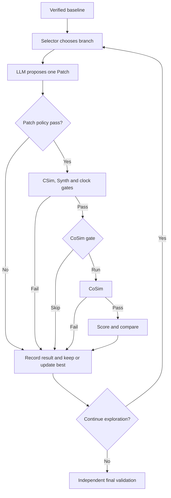

# V2 逐轮团队复盘报告设计

Status: pending written-spec review
Owner: team
Date: 2026-07-18
Scope: `llm4hls_harness` 单次 V2 optimize run 的自动报告

## 1. 背景

当前 V2 在运行目录中生成 `experimental_report.md`，但它主要汇总最终状态、调用总数、
Candidate 决策和最终 PPA。团队无法直接从报告回答以下问题：

- 本轮为什么选择某个优化类；
- LLM 看到了什么、声明要做什么、实际 Patch 做了什么；
- CSim、Synth、CoSim 分别为何调用或跳过；
- CoSim gate 比较了什么，临时分数与最终分数有何区别；
- 每轮花费多少 input/output/cached Token、Credits 和时间；
- Candidate 如何从 parent 产生，为什么晋升、拒绝或未生成；
- best 如何随轮次变化，停止探索的真实原因是什么；
- LLM 预测与 Vitis 实测是否一致；
- 根据本次实验，下一轮 Agent/Prompt/策略应优先改什么。

本设计把 run-local `experimental_report.md` 改造成中文优先的团队复盘报告。它不是官方
验收报告，也不尝试模仿 hidden grader。机器 Acceptance、Manifest、Ledger、Trace 和
JSON 仍保留原职责。

术语必须准确：当前 V2 的 LLM Provider 只接收上下文并返回优化声明与 Patch，它没有直接
调用 CSim、Synth 或 CoSim。Vitis 工具由 Harness 编排器根据 Patch policy、前序结果、
CoSim gate 和 final closure 规则调用。报告要把“LLM 做了什么”和“系统随后调用了什么、
为什么调用”并排展示，不能写成“LLM 调用了 CoSim”。

## 2. 目标

1. V2 每次终止后自动生成单次运行报告；
2. 报告按真实数据流还原 baseline、每轮探索和 final closure；
3. 每轮明确区分规则判断、LLM 声明、Vitis 实测、机器决策和报告建议；
4. Provider/Patch rejection 即使没有 Candidate，也必须出现在时间线；
5. 明确区分 CoSim `EXECUTED`、`SKIPPED_BY_GATE` 和 `NOT_REACHED`；
6. Token、Credits、工具次数和耗时可与 Ledger 对账；
7. Candidate lineage、best-before/best-after 和 reject 后继续流程清晰；
8. 报告首屏能快速判断结果，正文又保留完整团队复盘信息；
9. 完整 Prompt、diff 和原始证据放在附录，不阻挡结论；
10. 支持对既有 run 离线重建报告，不重新调用 LLM 或 Vitis；
11. 同一份证据重复生成字节一致的报告；
12. 使用一个小型 Mermaid 图，不使用 HTML 标签、嵌套大图或自定义颜色，并提供纯文本
    阶段序列作为渲染失败时的后备说明。
13. 每轮展示进入该分支的原因、Selector 已知的历史、选中的优化类、退出分支和下一轮
    将基于哪个 best 继续。

## 3. 非目标

- 不实现 V0、V1、V2 自动编排；
- 不让 V2 自动修复 baseline；
- 不修改 Candidate promotion、CoSim gate 或评分逻辑；
- 不新增一次“报告总结 LLM”调用；
- 不把 LLM hypothesis 当作真实根因；
- 不声称 public proxy 是官方最终分；
- 不把 run-local 报告改成官方提交材料；
- 不在本次实现中改变正式 task budget 或隐藏测试边界。

## 4. 职责边界

```text
V0: 验证原始代码
V1: 修复编译、功能、综合或结构问题
V2: 只在 baseline 完整验证通过后做性能优化
```

当前 `run_v2` 如果 baseline 未验证，记录 `BASELINE_NOT_VERIFIED` 并停止。报告必须明确
展示这一边界，不能画成已经存在的 V1 -> V2 自动跳转。

V2 每个合法 Candidate 的基本控制流为：

```text
selector -> LLM -> Patch policy -> CSim -> Synth/clock
         -> official-proxy CoSim gate -> conditional CoSim
         -> score/comparison -> promote or reject -> next round
         -> independent final CSim/Synth/CoSim -> fallback or DONE
```

## 5. 方案选择

采用“单次 run、时间线优先、Candidate tree 辅助”的统一证据模型。

不采用：

- 只扩展现有汇总表：无法解释每一步的原因和数据来源；
- Candidate tree 优先：Provider/Patch rejection 没有 Candidate，时间和成本顺序会丢失；
- 再生成一份 official-style Markdown：不服务当前团队复盘目标，且易与 hidden grading
  混淆；
- renderer 直接在多个位置重复读取 JSON：容易让摘要、轮次和附录数字漂移。

架构：

```text
immutable run evidence
  -> TeamReportCollector
  -> V2TeamReportData
  -> TeamReportAnalyzer
  -> TeamMarkdownRenderer
  -> automatic mode: run_dir/experimental_report.md
  -> offline mode: external review output outside run_dir
```

Collector 负责事实；Analyzer 只做确定性派生；Renderer 不再自行判断状态。

自动模式与离线模式共享同一 Collector/Analyzer/Renderer，但完整性处理不同：

- 自动终态模式在 Manifest 生成前读取已经落盘的机器证据，原子写入
  `run_dir/experimental_report.md`，随后由现有流程最后生成 Manifest；最终 Manifest 覆盖
  报告本身。报告内只能写“Manifest 将在本报告之后封存”，不能声称已经验证了一个尚未
  生成的 Manifest，也不能嵌入 Manifest digest 形成循环依赖。自动报告中的状态固定为
  `GENERATED_PRE_MANIFEST`；最终是否封存成功只由随后生成且可验证的 Manifest 证明；
- 离线模式先验证既有 `artifact_manifest.json`，再把新报告写到 run 目录之外。它绝不覆盖
  Manifest 已覆盖的 `experimental_report.md`，因此不会破坏原始 run；
- 报告生成不把既有 `experimental_report.md` 当作输入证据，避免自引用。

“自动终态”指已经写出 `v2_result.json` 的正常终止，包括
`BASELINE_NOT_VERIFIED`；参数校验失败、目录不可读或进程被强杀等尚未形成 durable V2
结果的异常不伪造一份完整报告。为使 baseline failure 也能封存为 V2 run，
`optimization_config.json` 必须在 baseline 执行前落盘，该失败分支写完 `v2_result.json` 后
也进入统一 report -> Manifest finalizer。该失败结果至少补齐 `task_id`、baseline/best/final
ID、`rounds=[]`、budget、baseline evidence 和 artifact refs，不能只保存一个 stop reason。

## 6. 输入证据

### 6.1 运行级

- `task_spec.json`：task type、difficulty、`requires_cosim`、part、clock、public hashes；
- `run_config.json`：成本、预算、超时、工具链和最低频率；
- `optimization_config.json`：评分、gate、轮数、连续无提升、final reserve 和 Patch 限制；
- `workflow_result.json`：baseline validation、clock、metrics ref 和 budget；
- `v2_result.json`：rounds、best、final、stop、fallback 和 final validation；
- `candidate_registry.json`：最终 Candidate 动态状态和谱系；
- `budget_ledger.jsonl`：action STARTED/COMPLETED、Token、Credit、耗时和 result ref；
- `trace.jsonl`：执行时间线和状态转移；
- `artifact_manifest.json`：证据文件 size/hash。

自动终态模式读取前八项并在报告生成后构建第九项；离线模式先验证第九项，再读取其覆盖
的证据。旧 run 缺少新版本的可选报告字段时，应显示 `LEGACY_EVIDENCE_LIMITATION` 和
`N/A`，不能臆造；但 Manifest 校验失败、核心 round/result/Registry 绑定损坏时必须失败。

离线 Collector 不能在 verifier 通过后任意读取 run 目录。它必须取得 Manifest entry path
集合，只从该白名单读取，并验证 `v2_result`、round、Registry、Ledger 中每个声明的 ref 都
被 Manifest 覆盖且路径仍在 run 内。Manifest 未列出的额外文件一律忽略，不能被当作证据。
历史 baseline-failure run 若从未生成 V2 Manifest，离线命令返回
`UNSEALED_LEGACY_RUN`；本次不提供绕过完整性检查的兼容开关。

### 6.2 每轮

- `optimization_rounds/round_NNN.json`：本轮总索引、selector、decision 和 evidence refs；
- `llm_actions/*/request.json`：模型输入、上下文、发送文件、代码范围、规则和预算；
- `llm_actions/*/result.json`：hypothesis、expected effect、risk、Patch 和 Token；
- `candidates/*/patch.diff`：实际应用 Patch；
- `actions/*/result.json`：CSim/Synth/CoSim 实测状态、诊断、耗时和报告；
- `scores/*.pre_cosim.json`：门控用临时分数；
- `cosim_gates/*.json`：是否调用 CoSim 的精确原因；
- `scores/*.json`：Candidate 完整/不完整验证分数；
- `comparisons/*.json`：winner、严格改善和比较理由。

`candidates/*/candidate.json` 只是物化快照，不作为最终 status 来源；最终状态必须读取
Registry。

新生成的 round 记录增加一个不影响策略的可选 `selection_context` 审计字段，保存选择时
的 `attempted_same_metrics`、`failed_same_metrics` 和 `available_classes`。这样报告可以准确
解释“为什么这轮还有这个分支”。旧 run 没有该字段时，只展示从已持久化轮次可证明的历史，
并标记“完整备选集合不可用”。

该字段由 Selector 与报告共用的纯函数产生，resume 时按此前 durable rounds 和当前 metrics
重新计算并校验，避免报告逻辑复制一套会漂移的优先级。未被选中的 available class 只能写成
“本轮规则优先级较低”，不能写成“已经证明无效”。

### 6.3 历史 gate 能力识别

Collector 直接读取原始 snapshot/round 字段，不用当前 `OptimizationConfig` 的默认值回填
历史策略。每个 run 只可归入下列一种能力：

| capability | 判定证据 | 报告语义 |
|---|---|---|
| `legacy_ungated` | snapshot/round 没有 gate policy/ref | 合法 Candidate 的 CoSim 是逐轮固定验证；gate 显示 `LEGACY_UNGATED`，gate savings 为 0 |
| `ppa_gate_v1` | snapshot 明确声明 PPA gate | 按持久化 PPA gate/ref 解释执行或跳过 |
| `official_proxy_gate_v1` | snapshot 明确声明 official/public proxy gate | 按持久化 official proxy、PPA tie-break 和 gate/ref 解释 |

“字段不存在”和“字段声明存在但 ref 缺失/未被 Manifest 覆盖”语义不同：前者是可兼容的
legacy limitation，后者是损坏证据并失败。

## 7. 统一数据模型

### 7.1 顶层 `V2TeamReportData`

```text
schema_version
task
policy
run_outcome
baseline
rounds[]
candidate_tree
final_validation
fallback
accounting
cosim_summary
findings[]
next_actions[]
evidence_index
integrity
```

### 7.2 `RoundReview`

每轮至少包含：

```text
round_index
parent_candidate_id
candidate_id | null
best_before
best_after
branch:
  entry_reason
  attempted_same_metrics
  failed_same_metrics
  available_classes
  selected_class
  selector_reason
  exit_branch
  next_parent
  next_round_reason
selector:
  optimization_class
  bottleneck
  evidence
  metrics_digest
model_claim:
  provider / model / revision
  hypothesis
  expected_effect
  risk
  declared_change_class
  required_validation
patch:
  status
  changed_files
  changed_lines / hunks
  added_pragmas / removed_pragmas
  observations[]
  full_diff
tools[]:
  stage
  invocation_reason
  execution_state
  status / phase
  diagnostic
  elapsed_s
  credit_cost
  metrics_before / metrics_after
cosim_gate:
  state
  policy / reason
  candidate_proxy / incumbent_proxy
  candidate_ppa / incumbent_ppa
score_and_comparison
decision
rejection_reason
no_improvement_after
tokens:
  input / output / cached / total
cost:
  llm_credits / tool_credits / total_credits
timing:
  model_elapsed / tool_elapsed / action_elapsed_sum
lesson
next_action
evidence_refs
```

`exit_branch` 至少区分：`PROVIDER_REJECTED`、`PATCH_REJECTED`、
`REJECTED_VALIDATION`、`SKIPPED_COSIM_NOT_BETTER`、`COSIM_REJECTED`、
`REJECTED_NOT_BETTER` 和 `PROMOTED`。没有物化 Candidate 的 Provider/Patch failure 仍是
父 Candidate 下的“尝试分支”，不能从树或时间线消失。

### 7.3 事实等级

报告中每条解释带稳定语义：

| 类型 | 来源 | 可用措辞 |
|---|---|---|
| `RULE_DECISION` | selector/policy | “规则选择器因为 max II=16 选择 LOOP_PIPELINE” |
| `MODEL_CLAIM` | LLM result | “LLM 预测该 Patch 会降低 II” |
| `PATCH_FACT` | applied diff | “实际 Patch 新增 UNROLL pragma” |
| `TOOL_MEASUREMENT` | Vitis action | “Synth 实测 latency=...” |
| `MACHINE_DECISION` | gate/comparison | “代理分未改善，因此跳过 CoSim” |
| `REPORT_INFERENCE` | deterministic analyzer | “建议下一轮更换优化类” |

禁止把 `MODEL_CLAIM` 或 selector 的 `bottleneck` 写成已证明的物理根因。

## 8. 编排器工具调用原因

报告不能只写工具状态，还要写编排器的调用原因；这些不是 LLM tool calls：

| 工具/阶段 | 调用原因 |
|---|---|
| Baseline CSim | 建立 public 功能基线 |
| Baseline Synth | 建立 latency/II/clock/resource 基线 |
| Baseline CoSim | 本地严格 baseline 验证 |
| Candidate CSim | 合法 Patch 后最便宜的功能回归门 |
| Candidate Synth | CSim PASS 后检查可综合、时钟和性能 |
| CoSim gate | Synth/clock PASS 后判断 20-credit CoSim 是否值得 |
| Candidate CoSim | gate eligible；用 RTL 实测确认可晋升资格 |
| Final CSim/Synth/CoSim | 探索缓存之外的独立 final closure |
| Fallback validation | 当前 best final 失败后验证下一个已验证候选 |

短路原因必须显式：CSim FAIL 后 Synth/CoSim 为 `NOT_REACHED`；Synth/clock FAIL 后 gate
和 CoSim 为 `NOT_REACHED`。

## 9. CoSim 状态模型

报告使用以下状态，禁止全部显示成 `NOT_RUN`：

```text
EXECUTED_PASS
EXECUTED_FAIL
EXECUTED_TIMEOUT
SKIPPED_BY_GATE
NOT_REACHED_CSIM_FAILED
NOT_REACHED_SYNTH_FAILED
NOT_REACHED_CLOCK_FAILED
NOT_APPLICABLE_NO_CANDIDATE
```

只有 `SKIPPED_BY_GATE` 计入“门控节省的 CoSim 次数/credits”。其他未调用状态可节省实际
支出，但不是 CoSim gate 的优化收益。

`legacy_ungated` 中实际执行的 CoSim 正常计入次数与成本，但不计算 gate savings；报告也不
反推一个当年不存在的 eligible/reason。

pre-CoSim proxy 必须标注：

```text
provisional gate-only estimate;
for requires_cosim tasks it assumes CoSim PASS solely to decide whether to run CoSim
```

如果实际 CoSim FAIL，临时分数不得展示为 Candidate 最终成绩。

## 10. Patch 观察

报告不再只复述 declared change class。Analyzer 从实际 applied diff 提取：

- 新增/删除的 `#pragma HLS`；
- 修改的非 pragma 代码行；
- 修改文件、hunk 和 changed-line 数；
- 声明优化类与明显 pragma 类型是否一致。

首版只生成复盘 warning，不改变运行期 Patch acceptance。例如：

```text
declared class: LOOP_PIPELINE
observed added directive: HLS UNROLL
warning: DECLARED_CLASS_MAY_NOT_MATCH_PATCH
```

这不是完整语义证明；无法确定时写 `SEMANTIC_MATCH_UNKNOWN`，不得猜测。

## 11. Token、Credit 与时间对账

### 11.1 Token

```text
total_tokens = input_tokens + output_tokens
cached_input_tokens is a subset of input_tokens
```

Cached Token 单列，不重复加入 Total。Provider/Patch rejection 仍必须统计 LLM Token。

### 11.2 Credits

每轮通过 action ID 把 Ledger STARTED 与 COMPLETED 配对：

```text
round credits = LLM actual_cost
              + Candidate CSim actual_cost
              + Candidate Synth actual_cost
              + Candidate CoSim actual_cost
```

不得使用 Trace 中的累计 `credits_used` 充当本轮增量。报告执行守恒检查：

```text
baseline + all rounds + final + fallback = ledger total
```

不相等时标记 `ACCOUNTING_MISMATCH`，不能用预期值填补。

### 11.3 时间

分别显示：

- LLM duration；
- 每个 Vitis action elapsed；
- 本轮 action elapsed sum；
- 整个 run 的 wall-clock range（从 Ledger 首个 STARTED 到最后 COMPLETED）。

不得把 action sum 称为 wall time。

## 12. 报告布局

自动 `run_dir/experimental_report.md` 与外置离线报告都使用以下顺序：

1. **30 秒结论**：status、best/final、轮数、stop、baseline->final proxy/latency/speedup、
   Token、Credits、CoSim 调用/节省、三个关键发现和下一步；
2. **职责与任务预判**：当前是 V2 optimize、进入条件、`requires_cosim`、预算和由公开字段
   派生的本地策略；
3. **小型 V2 Mermaid**：不超过约 12 个节点，无 HTML/颜色；同时给纯文本阶段序列；
4. **Baseline 数据流**：三个工具、原因、结果、耗时、成本和指标；
5. **全局轮次时间线**：每轮一行，包含 parent->candidate、原因、工具状态、gate、decision、
   Tokens、Credits 和 best-after；
6. **逐轮详细卡片**：结论优先，按“Why -> model -> Patch -> tools -> gate -> measurement
   -> comparison -> transition -> lesson -> next”排列；
7. **Candidate/attempt tree**：使用纯文本树；物化 Candidate 显示状态，未物化的
   Provider/Patch rejection 显示为带 round 编号的 attempt stub，避免分支丢失；
8. **CoSim 专项复盘**：执行、跳过、未到达、节省和 final 调用原因；
9. **预算与数据流守恒**：baseline/round/final/fallback 分解；
10. **预测与实测偏差**：按影响排序；
11. **团队下一步建议**：确定性规则生成；
12. **当前 V2 与官方参考的简短差异**；
13. **审计附录**：完整 Prompt、完整/明确截断 diff、action/score/gate/comparison、Ledger、
    Trace、Manifest 相对链接。

报告使用中文说明，保留 Candidate ID、状态码、工具名和公式字段的英文原值。

### 12.1 报告内固定流程图

只画主控制流，不把每个 JSON、Token 字段或 fallback 塞进图里：



图下固定放一行纯文本：

```text
baseline -> selector -> LLM -> Patch -> CSim -> Synth/clock -> CoSim gate
         -> optional CoSim -> compare -> promote/reject -> repeat -> final closure
```

### 12.2 单轮卡片模板

```text
Round 2 — REJECTED_VALIDATION — best 保持 candidate_001

Why / branch
  entry: Round 1 promoted candidate_001
  selector: LOOP_PIPELINE; persisted reason: max II=16
  prior same-metrics failures: MEMORY_LAYOUT

LLM claim
  hypothesis / expected effect / risk / declared class
  tokens: input, output, cached-subset; model duration

Actual Patch
  files / hunks / lines / added and removed pragmas
  declared-vs-observed warning; full diff ref

Harness tools
  CSim PASS -> reason, duration, credits
  Synth FAIL -> diagnostic, duration, credits
  CoSim NOT_REACHED_SYNTH_FAILED -> why no call and zero credits

Decision and transition
  no score/comparison was produced because Synth failed
  candidate rejected; incumbent unchanged; no-improvement 1/2
  next: choose another available class on the same best

Evidence
  request/result/round/action/gate/score/comparison refs, with N/A explained
```

模板中的自然语言全部来自事实等级或确定性规则；不存在的 gate/score 不显示成 `0`，而是
显示 `N/A — NOT_REACHED_*`。

## 13. 下一步建议规则

Analyzer 不调用 LLM，按证据生成建议：

| 观察状态 | 建议 |
|---|---|
| `PROMOTED` | 用新 best 重新识别瓶颈，不能沿用旧 metrics 假设 |
| `PROVIDER_REJECTED` | 检查 schema/response；预算允许时换类或重试 Provider |
| `PATCH_REJECTED` | 根据 policy error 缩小 Patch 或修正目标文件/hunk |
| CSim FAIL | 回滚并针对 public 功能回归；不进入性能结论 |
| Synth FAIL | 根据结构化 HLS diagnostic 修正 pragma/结构冲突 |
| Clock FAIL | 优先处理组合路径/流水结构，不运行 CoSim |
| Gate reject | 保留 incumbent，换优化类；明确已节省一次 CoSim |
| CoSim FAIL | 优先调查 RTL/stream/FIFO/interface，不信任 pre-score |
| `REJECTED_NOT_BETTER` | 保留 incumbent，换未尝试类 |
| `NO_IMPROVEMENT_LIMIT` | 停止探索并保护 final reserve；复盘 selector/评分粒度 |
| `FINAL_RESERVE_REACHED` | 这是主动预算保护，不是模型失败 |
| Final FAIL | 展示 fallback 过程；无 fallback 时要求人工检查 |

建议必须标记为 `REPORT_INFERENCE`。

## 14. 简短官方差异

正文只用一个小节说明：

- Agent 只看 public 输入，官方 hidden grader 在运行后独立执行；
- `public_proxy_v1` 是搜索信号，不是最终官方分；
- 官方 grader 仅在 `requires_cosim=true` 时做 hidden CoSim；本地 V2 对所有 final 都做
  public CoSim；
- 本地 baseline/final 各自完整验证并计入 Ledger，官方 hidden grading 在 agent 预算外；
- 现有历史真实 demo 若使用旧 `ppa_gate`、10ns/160 credits，必须如实标注，不能说成当前
  official-proxy/5ns/官方预算实证。
- 更早的 `legacy_ungated` demo 必须明确写“逐 Candidate CoSim、无 gate”，不能用当前配置
  默认值补成 official proxy gate。

## 15. 组件与文件改动

新增 `llm4hls_agent/v2_team_report.py`：

```text
collect_v2_team_report_data(...)
analyze_v2_team_report_data(...)
render_v2_team_report(...)
write_v2_team_report(...)
```

修改：

- `optimization.py`：终态时调用统一 writer；为新 round 持久化只读
  `selection_context` 并在 resume 时重算校验；把 `optimization_config.json` 前移到 baseline
  之前；让 `BASELINE_NOT_VERIFIED` 也进入统一 finalizer；删除/委托旧的内联 report
  renderer；
- `cli.py`：增加离线
  `report-v2-run --run-dir ... --output ...`，不调用 LLM/Vitis；`--output` 必填且解析后
  必须位于 `run_dir` 之外；
- `artifacts.py` 或现有 manifest 流程：继续覆盖自动报告；
- `tests/test_v2_team_report.py`：新增结构化证据和渲染测试；
- `tests/test_optimization.py`、`tests/test_cli.py`：自动生成与离线命令集成测试。

现有 `v2_acceptance.py` 和 `v2_review.py` 保持机器验收/旧汇总职责，不作为本报告主入口。

## 16. 错误处理

- 自动模式：在 final machine JSON/JSONL 已落盘后收集证据、写报告，最后构建 Manifest；
  报告完整性栏写 `GENERATED_PRE_MANIFEST`；
- 离线模式：首先调用 Manifest verifier。文件不存在、size/hash 不一致或路径越界时返回
  非零，不生成新的复盘报告，并保持原 run 完全不变；
- 离线 verifier 通过后仍须检查所有声明 ref 的 Manifest 覆盖闭包；未覆盖、缺失、越界或
  类型不符均返回非零，不能读取目录中的同名未覆盖文件；
- Manifest 有效但旧 schema 没有新可选审计字段：正常生成并标记
  `LEGACY_EVIDENCE_LIMITATION`，不把兼容性缺项误报成篡改；
- round 数与 `v2_result.json` 不一致：失败并列出缺失 round；
- 已声明的 Ledger action 无终态、或已声明的 score/gate/comparison ref 缺失：视为损坏
  evidence 并使 finalizer/离线命令失败；某阶段按控制流从未到达、legacy schema 根本没有
  该字段时，分别显示 `NOT_REACHED_*` 或 `LEGACY_EVIDENCE_LIMITATION`；
- 无 Candidate 的 Provider/Patch failure 仍正常渲染；
- 报告生成不得读取 hidden/reference，也不得输出 API key、Authorization 或绝对路径；
- 自动生成失败不得改写既有机器 JSON/JSONL；离线命令返回非零并保留原 run 及其原报告；
- 自动报告已写入但 Manifest build 失败时，命令返回非零，机器 JSON/JSONL 仍是算法结果，
  整个 run 标记为外部可观察的 `UNSEALED_POSTPROCESSING_FAILURE`；不能仅凭
  `v2_result.status=DONE` 宣称证据包完整；
- 写报告使用临时文件、`fsync` 和 `os.replace`。离线 verify/collect/render 任一步失败时，
  不替换已有 `--output`，并清理临时文件。

## 17. 测试与验收

### 17.1 场景覆盖

至少覆盖：

- baseline PASS 与 baseline failure；
- Provider rejection；
- Patch rejection；
- CSim、Synth、Clock、CoSim failure；
- gate pass、gate reject、gate not reached；
- promotion、not-better、reject 后继续；
- max round、no improvement、reserve stop；
- final PASS、fallback PASS、无 fallback FAIL；
- official proxy improvement 与 official tie/PPA tie-break。

### 17.2 数据不变量

- `v2_result.rounds` 每轮在时间线和详细区各出现一次；
- parent/candidate/best-before/best-after 与 durable rounds/Registry 一致；
- 新 run 的 `selection_context` 可由历史 rounds 与相同 metrics 重算；旧 run 明确降级显示；
- 仅对有 gate capability/evidence 的轮次：eligible 必须有 CoSim action，ineligible 必须无
  CoSim action；`legacy_ungated` 不套用该不变量；
- Token 和 Credits 与 Ledger 完全一致；
- gate skip 的 saved credits 等于配置中的 CoSim cost；
- summary、timeline、round card 使用同一数据对象；
- 中间不存在硬编码某个 fixture 的分数或 Candidate ID；
- 同一模式、同一输出位置和同一证据重复生成报告字节相同；
- 报告不修改机器证据；
- 自动报告写入后由最终 Manifest 覆盖，且 Manifest verifier 通过；
- 离线重建输出不位于 run 目录，命令前后原 Manifest digest 与所有 run 文件不变；
- 旧 `ppa_gate` run 可生成带 `LEGACY_EVIDENCE_LIMITATION` 的报告，不伪造缺失的官方代理
  字段；
- 旧 `legacy_ungated` run 显示 `LEGACY_UNGATED`，其 CoSim 不计 gate savings；未封存的旧
  baseline-failure run 被离线命令拒绝；
- 注入 Manifest build failure 后，命令非零、机器结果保留、run 不被误判为 sealed；
- 所有相对 evidence link 存在；
- 无绝对路径、secret、hidden/reference 内容。

### 17.3 展示验收

- 前 40 行内看到 status、best/final、停止原因、轮数、Token、Credits 和核心结论；
- 每轮可在一个章节回答 Why/What/Tools/CoSim/Cost/Decision/Lesson/Next；
- `SKIPPED_BY_GATE` 与 validation failure 不混淆；
- LLM prediction 与 Vitis measurement 并列展示；
- 完整 Prompt/diff 只在附录；
- Mermaid 不使用 `<br>`、自定义主题或超过约 12 个节点；
- Candidate tree 使用纯文本。

## 18. 官方公开题目试跑

实现和单元测试通过后，优先使用 corpus 中的 `dotProduct_optimize` 做 V2 smoke，因为它是
`task_type=optimize`。测试分两层：

1. 使用可控 Provider/Backend 运行完整 V2，并校验报告所有分支和对账；
2. 在真实 Vitis/OpenAI-compatible 环境可用时，新建独立 run 目录进行一次真实 smoke。

官方 task budget 为 40，而当前本地严格 baseline+final 至少需要 50，一轮最坏完整探索
需要 75。因此真实 smoke 不改 `task.toml`，而是显式使用至少 75 credits 的本地测试覆盖，
并在报告中写明 `LOCAL_STRICT_BUDGET_OVERRIDE`。该实验只能证明当前 V2+报告在官方公开
题目上的本地闭环，不能声称在官方 40-credit 协议下完成。

`projection_bugfix` 属于 V1 repair，`residual_stream_deadlock` 属于 structural，均不直接
送入当前 `run_v2`。

## 19. 完成标准

本工作在以下条件同时满足时完成：

1. V2 optimize 所有已持久化 `v2_result.json` 的终止路径均自动生成详细团队报告；安全拒绝
   工作流保持原报告职责；
2. 离线命令可以从已有 run 生成外置复盘报告，且不会修改 run；
3. 每轮 LLM、Patch、工具、gate、score、Candidate 和成本数据流完整；
4. 报告建议可追溯、确定性、不调用 LLM；
5. 全量单元测试通过；
6. 官方公开 `dotProduct_optimize` 的可控 smoke 通过；
7. 如果真实环境可用，真实 smoke 明确使用本地 budget override 并如实标注；
8. 给团队展示一份生成后的报告样例和简洁 V2 Mermaid。
