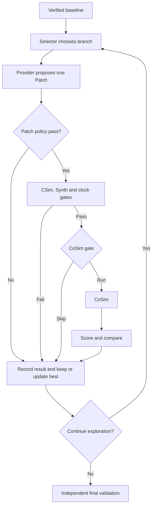

# V2 逐轮团队复盘报告

> 发布说明：这是用于团队复盘的核心 Markdown 副本。`runs/`、Vitis/XSIM 工程、原始 JSON 和日志未提交；文中的 Evidence 链接仅在本地保留对应运行目录时可打开，不代表 GitHub 已包含生产运行环境。
>
> 本报告由持久化证据确定性生成；Proposal Provider（LLM 或明确标注的本地规则）只提出 Patch，CSim/Synth/CoSim 均由 Harness 编排。
> 信任边界：本文件是 run 外部复盘产物，不在源 run Manifest 内；源证据已先验验签，报告自身需单独保存哈希。

## 30 秒结论

- 状态 / 停止原因：`DONE` / `MAX_OPTIMIZATION_ROUNDS`
- Baseline / Best / Final：`candidate_000` → `candidate_001` → `candidate_001`
- 探索轮数 / 连续无改善：`1` / `0`
- Synth worst-case latency（cycles）baseline → final closure / speedup：`513` → `258` / `1.98837`
- CoSim max latency（cycles）baseline → final closure / speedup：`511` → `256` / `1.99609`
- official public proxy baseline → final：`1.475` → `1.5491`（公开评分代理仅是搜索信号，不是官方最终分）
- 排序角色：official public proxy 为第一排序键，`PPA tie-break` 仅在代理分相同；本地信号都不替代官方 hidden scorer。
- Token input / output / cached-subset / total：`0` / `0` / `0` / `0`
- Credits：`75`；阶段守恒：`true`
- CoSim：Ledger 调用 `3` 次；gate 跳过 `0` 次；节省 `0` credits
- Gate 能力：`official_proxy_gate_v1`；证据完整性：`MANIFEST_VERIFIED`

### 三个关键发现

- [RULE_DECISION] 本 run 是 V2 optimize：baseline 必须先验证，V2 不负责自动修复。
- [TOOL_MEASUREMENT] Round 1: Provider 预期已与 Vitis 实测并列；存在 Synth metrics。
- [MACHINE_DECISION] 1 轮探索中 1 轮晋升；其余分支保留 incumbent。

### 下一步

- P2：已达到本次配置的探索轮数；根据剩余分支与预算决定是否继续。
- P3：从 final best 的新 metrics 重新识别下一瓶颈。

## 职责与任务预判

- 当前阶段：`V2 optimize`；进入条件是 baseline 已通过本地严格验证。
- Task：`u55c_vector_add_optimize`；type=`optimize`；difficulty=`2`；requires_cosim=`true`
- Task provenance：`NOT_PERSISTED_IN_RUN`。若为 `NOT_PERSISTED_IN_RUN`，仅凭 task_id 不能证明它是官方题，需在 run 外核对题库哈希。
- Target：part=`xcu55c-fsvh2892-2L-e`；clock=`10` ns。
- 预算：task=`160`；local=`75`；label=`LOCAL_STRICT_BUDGET_OVERRIDE`。
- Workflow identity：v2_result=`V2_CANDIDATE_PPA`；run_config=`V0_DETERMINISTIC`。`V0_DETERMINISTIC` 在这里表示复用的 baseline executor，不是整体 V2 终态身份。
- 完整性：既有 Manifest 已在读取任何 run-local 证据前验证

## V2 主控制流



纯文本：`baseline -> selector -> Provider -> Patch -> CSim -> Synth/clock -> CoSim gate -> optional CoSim -> compare -> promote/reject -> repeat -> final closure`

## Baseline 数据流

| 工具 | Harness 调用原因 | 状态 | 耗时(s) | Credits | 指标/诊断 |
|---|---|---|---:|---:|---|
| csim | 建立 public 功能基线 | EXECUTED_PASS | 2.84258 | 1 | pass |
| synth | 建立 latency、II、clock 和 resource 基线 | EXECUTED_PASS | 9.49125 | 4 | pass |
| cosim | 执行本地严格 baseline RTL 验证 | EXECUTED_PASS | 22.2661 | 20 | {"latency":{"average":511,"max":511,"min":511},"status":"Pass"} |

Baseline metrics：`{"available_resources":{"BRAM_18K":4032,"DSP":9024,"FF":2607360,"LUT":1303680,"URAM":960},"estimated_clock_period_ns":1.479,"interval":{"max":512,"min":512},"latency":{"average":513,"best":513,"worst":513},"resources":{"BRAM_18K":0,"DSP":0,"FF":20,"LUT":110,"URAM":0},"utilization_percent":{"BRAM_18K":0.0,"DSP":0.0,"FF":0.001,"LUT":0.008,"URAM":0.0}}`

说明：这里的 `latency` 与 `interval.max` 来自 Synth；`interval.max` 是 top-level transaction interval，不等于某个循环的 `PipelineII`。CoSim latency 单独来自 RTL 仿真结果。

## 全局轮次时间线

| Round | Parent → Candidate | Why/Class | CSim / Synth / CoSim | Gate | Decision | Token | Credits | Best after |
|---:|---|---|---|---|---|---:|---:|---|
| 1 | candidate_000 → candidate_001 | maximum interval is 512 / LOOP_PIPELINE | EXECUTED_PASS / EXECUTED_PASS / EXECUTED_PASS | STRICT_OFFICIAL_SCORE_IMPROVEMENT | PROMOTED | 0 | 25 | candidate_001 |

## 逐轮详细卡片

### Round 1 — PROMOTED — best `candidate_000` → `candidate_001`

#### Why / branch

- 进入原因：verified baseline starts exploration
- Selector：class=`LOOP_PIPELINE`；bottleneck=`maximum interval is 512`。这是规则判断，不是已证明的物理根因。
- 同 metrics 已尝试 / 失败 / 可选：`[]` / `[]` / `["LOOP_PIPELINE","LOOP_UNROLL","MEMORY_LAYOUT","LOOP_RESTRUCTURE"]`
- 分支出口 / 下一 parent：`PROMOTED` / `candidate_001`

#### Provider claim（若 Provider 是 LLM，则为模型声明；不是 Vitis 实测）

- Provider / model / revision：`deterministic-local-smoke` / `offline-rule` / `v1`
- Hypothesis：The explicit II=16 limits vector-add throughput.
- Expected effect：Request II=1 without changing C/C++ semantics.
- Risk / declared class：Vitis may report an II greater than 1 if dependencies prevent it. / `LOOP_PIPELINE`
- Token input/output/cached-subset/total：`0`/`0`/`0`/`0`；Provider 耗时 `0` s。

#### Actual Patch

- 状态 / 文件 / hunks / changed lines：`APPLIED` / `["kernel.cpp"]` / `1` / `2`
- 新增/删除 pragma：`["#pragma HLS PIPELINE II=1"]` / `["#pragma HLS PIPELINE II=16"]`
- 声明与观察：`DECLARED_CLASS_MATCHES_OBSERVED_DIRECTIVE`

#### Harness tools（由 Harness 编排，不是 Provider 直接调用）

| Stage | 调用/跳过原因 | 状态 | Diagnostic | 耗时(s) | Credits |
|---|---|---|---|---:|---:|
| csim | 合法 Patch 后执行成本最低的 public 功能回归门 | EXECUTED_PASS | pass | 2.78344 | 1 |
| synth | CSim PASS 后检查可综合性、时钟和性能指标 | EXECUTED_PASS | pass | 9.40697 | 4 |
| cosim | CoSim gate 判定 eligible 后执行 RTL 实测，确认晋升资格 | EXECUTED_PASS | {"latency":{"average":256,"max":256,"min":256},"status":"Pass"} | 22.7738 | 20 |

#### Gate、实测、比较与转移

- CoSim：state=`EXECUTED_PASS`；capability=`official_proxy_gate_v1`；eligible=`true`；reason=`STRICT_OFFICIAL_SCORE_IMPROVEMENT`。
- Gate proxy Candidate/Best：`1.5491` / `1.475`；PPA Candidate/Best：`0.601316` / `1`。
- Gate 注记：provisional gate-only estimate; for requires_cosim tasks it assumes CoSim PASS solely to decide whether to run CoSim
- Vitis Synth measured delta（其中 interval_max 是 top-level transaction interval，不是 loop PipelineII）：`{"clock_period_ns":{"after":1.479,"before":1.479,"delta":0.0},"interval_max":{"after":256.0,"before":512.0,"delta":-256.0},"latency_worst":{"after":258.0,"before":513.0,"delta":-255.0}}`
- Score / comparison：`{"cached_input_tokens":0,"candidate_id":"candidate_001","components":{"bram":1.0,"dsp":1.0,"ff":1.0,"ii":0.5,"latency":0.5029239766081871,"lut":0.9999992329405988,"uram":1.0},"credits_used":25,"hard_constraints_passed":true,"hard_failures":[],"input_tokens":0,"official_score":1.5491,"official_score_source":"PUBLIC_VALIDATION_PROXY_V1","output_tokens":0,"ppa_cost":0.6013157434501201,"tokens_used":0,"verification_tier":4}` / `{"candidate_key":[-4,0,[0,-1.5491],[0,0.6013157434501201],0,25,"candidate_001"],"incumbent_key":[-4,0,[0,-1.475],[0,1.0],0,25,"candidate_000"],"reason":"OFFICIAL_SCORE","strictly_better":true,"winner":"candidate_001"}`
- Decision / rejection / no-improvement：`PROMOTED` / `N/A` / `0`
- 本轮 Credits / action elapsed sum：`25` / `34.9642` s（action sum 不是 wall time）。
- Lesson：Candidate 通过验证且严格改善，best 已更新。
- Next：用新 best 的实测 metrics 重新识别瓶颈，不沿用旧 metrics 假设。

Evidence：[actions/1ca34c8293af83f93bf53785e5438603c92f895904aad68e51e0e1733edddbd5/result.json](../../runs/v2-real-local-vector-add-20260718/actions/1ca34c8293af83f93bf53785e5438603c92f895904aad68e51e0e1733edddbd5/result.json), [actions/49a082216307124938ed3804fbcb27305e79dbfa4756dadaa2d891471afbcd52/result.json](../../runs/v2-real-local-vector-add-20260718/actions/49a082216307124938ed3804fbcb27305e79dbfa4756dadaa2d891471afbcd52/result.json), [actions/771ec0a14c72e60b425bf3eec1449a7d9efc124bbdbe238278f93151a757cc8d/result.json](../../runs/v2-real-local-vector-add-20260718/actions/771ec0a14c72e60b425bf3eec1449a7d9efc124bbdbe238278f93151a757cc8d/result.json), [candidates/candidate_001/patch.diff](../../runs/v2-real-local-vector-add-20260718/candidates/candidate_001/patch.diff), [comparisons/candidate_001.json](../../runs/v2-real-local-vector-add-20260718/comparisons/candidate_001.json), [cosim_gates/candidate_001.json](../../runs/v2-real-local-vector-add-20260718/cosim_gates/candidate_001.json), [llm_actions/85ac4f0fe01508668d40293e8dd1c705376f9742ac1d1f8d1039f28932657004/request.json](../../runs/v2-real-local-vector-add-20260718/llm_actions/85ac4f0fe01508668d40293e8dd1c705376f9742ac1d1f8d1039f28932657004/request.json), [llm_actions/85ac4f0fe01508668d40293e8dd1c705376f9742ac1d1f8d1039f28932657004/result.json](../../runs/v2-real-local-vector-add-20260718/llm_actions/85ac4f0fe01508668d40293e8dd1c705376f9742ac1d1f8d1039f28932657004/result.json), [optimization_rounds/round_001.json](../../runs/v2-real-local-vector-add-20260718/optimization_rounds/round_001.json), [scores/candidate_001.json](../../runs/v2-real-local-vector-add-20260718/scores/candidate_001.json), [scores/candidate_001.pre_cosim.json](../../runs/v2-real-local-vector-add-20260718/scores/candidate_001.pre_cosim.json)

## Candidate / attempt tree

```text
└─ candidate_000 [VERIFIED]
   └─ candidate_001 [FINAL]
```

Registry 是 Candidate 最终动态状态的权威来源；`candidate.json` 仅是物化快照。没有 Candidate 的 Provider/Patch failure 仍显示为 attempt stub。

## CoSim 专项复盘

- 能力：`official_proxy_gate_v1`
- 每轮状态：`["EXECUTED_PASS"]`
- 探索执行 / gate 跳过 / 未到达：`1` / `0` / `0`
- 只有 `SKIPPED_BY_GATE` 计 gate savings：`0` credits。

## Final closure 与 fallback

| Attempt | Scope | Candidate | Status | Stop | CSim / Synth / CoSim | CoSim measurement | Credits |
|---:|---|---|---|---|---|---|---:|
| 1 | final | candidate_001 | DONE | CANDIDATE_VERIFIED | EXECUTED_PASS / EXECUTED_PASS / EXECUTED_PASS | {"latency":{"average":256,"max":256,"min":256},"status":"Pass"} | 25 |

- Final closure Synth metrics：`{"available_resources":{"BRAM_18K":4032,"DSP":9024,"FF":2607360,"LUT":1303680,"URAM":960},"estimated_clock_period_ns":1.479,"interval":{"max":256,"min":256},"latency":{"average":258,"best":258,"worst":258},"resources":{"BRAM_18K":0,"DSP":0,"FF":20,"LUT":109,"URAM":0},"utilization_percent":{"BRAM_18K":0.0,"DSP":0.0,"FF":0.001,"LUT":0.008,"URAM":0.0}}`
- Final closure CoSim measurement：`{"latency":{"average":256,"max":256,"min":256},"status":"Pass"}`
- Selected Candidate exploration metrics（用于当时选择）：`{"available_resources":{"BRAM_18K":4032,"DSP":9024,"FF":2607360,"LUT":1303680,"URAM":960},"estimated_clock_period_ns":1.479,"interval":{"max":256,"min":256},"latency":{"average":258,"best":258,"worst":258},"resources":{"BRAM_18K":0,"DSP":0,"FF":20,"LUT":109,"URAM":0},"utilization_percent":{"BRAM_18K":0.0,"DSP":0.0,"FF":0.001,"LUT":0.008,"URAM":0.0}}`
- Selected Candidate score（探索阶段持久化证据）：`{"cached_input_tokens":0,"candidate_id":"candidate_001","components":{"bram":1.0,"dsp":1.0,"ff":1.0,"ii":0.5,"latency":0.5029239766081871,"lut":0.9999992329405988,"uram":1.0},"credits_used":25,"hard_constraints_passed":true,"hard_failures":[],"input_tokens":0,"official_score":1.5491,"official_score_source":"PUBLIC_VALIDATION_PROXY_V1","output_tokens":0,"ppa_cost":0.6013157434501201,"tokens_used":0,"verification_tier":4}`
- Final closure 是独立重验；上面的 final latency 取 closure Synth，不能用探索期缓存指标冒充。

Fallback：`N/A`

## 预算与数据流守恒

| Phase | Credits |
|---|---:|
| Baseline | 25 |
| Rounds | 25 |
| Final | 25 |
| Fallback | 0 |
| **分解合计** | **75** |
| **Ledger** | **75** |

- 守恒：`true`；mismatches=`[]`。
- Action elapsed sum / run wall-clock range：`103.963` / `104.238` s。

## 预测与实测偏差

| Round | Provider expected effect | Vitis Synth measured delta | 是否有实测 |
|---:|---|---|---|
| 1 | Request II=1 without changing C/C++ semantics. | {"clock_period_ns":{"after":1.479,"before":1.479,"delta":0.0},"interval_max":{"after":256.0,"before":512.0,"delta":-256.0},"latency_worst":{"after":258.0,"before":513.0,"delta":-255.0}} | true |

## 团队下一步建议

- [REPORT_INFERENCE] P2：已达到本次配置的探索轮数；根据剩余分支与预算决定是否继续。
- [REPORT_INFERENCE] P3：从 final best 的新 metrics 重新识别下一瓶颈。

## 当前 V2 与官方参考的简短差异

- Agent 只看 public 输入；官方 hidden grader 在 Agent 运行后独立执行。
- `public_proxy_v1` 只是搜索信号，不是官方最终分。
- 官方 grader 仅在 `requires_cosim=true` 时执行 hidden CoSim；本地 V2 对所有 final 执行 public CoSim。
- 本地 baseline/final 完整验证计入 Ledger；官方 hidden grading 在 Agent 预算外。
- 历史 `ppa_gate_v1` 或 `legacy_ungated` run 按持久化能力显示，不用当前默认配置改写历史。
- 当前 run 未持久化题目来源标签；official/local 身份需在 run 外以题库文件哈希核验。
- `run_config.workflow=V0_DETERMINISTIC` 是共享 baseline executor 的历史命名；终态以 `v2_result.workflow=V2_CANDIDATE_PPA` 为准。
- Manifest 顶层 provider/model 可能跟随 final Candidate；逐轮 Provider 身份以绑定到 Ledger 的 request/result 为准。
- run 外离线报告不属于源 Manifest；源证据完整性与报告文件自身哈希是两条独立信任链。

## 审计附录：Prompt、Patch 与证据

### Round 1 Prompt（已脱敏）

````json
{
  "action_id": "85ac4f0fe01508668d40293e8dd1c705376f9742ac1d1f8d1039f28932657004",
  "code_ranges": [
    {
      "end_line": 15,
      "file": "kernel.cpp",
      "start_line": 1
    }
  ],
  "context": {
    "allowed_optimization_class": "LOOP_PIPELINE",
    "baseline_metrics": {
      "available_resources": {
        "BRAM_18K": 4032,
        "DSP": 9024,
        "FF": 2607360,
        "LUT": 1303680,
        "URAM": 960
      },
      "estimated_clock_period_ns": 1.479,
      "interval": {
        "max": 512,
        "min": 512
      },
      "latency": {
        "average": 513,
        "best": 513,
        "worst": 513
      },
      "resources": {
        "BRAM_18K": 0,
        "DSP": 0,
        "FF": 20,
        "LUT": 110,
        "URAM": 0
      },
      "utilization_percent": {
        "BRAM_18K": 0.0,
        "DSP": 0.0,
        "FF": 0.001,
        "LUT": 0.008,
        "URAM": 0.0
      }
    },
    "bottleneck": "maximum interval is 512",
    "clock_ns": 10.0,
    "current_clock_constraint": {
      "estimated_period_ns": 1.479,
      "maximum_period_ns": 10.0,
      "minimum_frequency_mhz": 100.0,
      "passed": true
    },
    "current_metrics": {
      "available_resources": {
        "BRAM_18K": 4032,
        "DSP": 9024,
        "FF": 2607360,
        "LUT": 1303680,
        "URAM": 960
      },
      "estimated_clock_period_ns": 1.479,
      "interval": {
        "max": 512,
        "min": 512
      },
      "latency": {
        "average": 513,
        "best": 513,
        "worst": 513
      },
      "resources": {
        "BRAM_18K": 0,
        "DSP": 0,
        "FF": 20,
        "LUT": 110,
        "URAM": 0
      },
      "utilization_percent": {
        "BRAM_18K": 0.0,
        "DSP": 0.0,
        "FF": 0.001,
        "LUT": 0.008,
        "URAM": 0.0
      }
    },
    "current_official_score": 1.475,
    "current_validation": {
      "cosim": {
        "action_id": "270c1bde9440c8332bed802e9d00826e17686027a46784f613a9e3583de35b54",
        "backend_fingerprint": "llm4hls_agent.vitis.VitisBackend:v0.4",
        "cached": false,
        "code_hash": "a7fa1b859c98466925bfcc35c1f4aa7bf6e90cad230a0e558d3e89b26fdddb05",
        "effective_timeout_seconds": 1800.0,
        "ok": true,
        "phase": "pass",
        "result_ref": "actions/270c1bde9440c8332bed802e9d00826e17686027a46784f613a9e3583de35b54/result.json",
        "status": "PASS",
        "task_fingerprint": "a5dc56a2622da109e80449ef0c3d640b7fdb11f8bcfe19771f7413c5b89b2ada",
        "tool_config_hash": "b8e41a8bd45cf45fd4df258a8d389fae6d51a5bf590cc13008a02b43ae9042b9"
      },
      "csim": {
        "action_id": "b1841a11ad652da552887d8e61d3cc0b834c330d03a68b23c9665d2191b29604",
        "backend_fingerprint": "llm4hls_agent.vitis.VitisBackend:v0.4",
        "cached": false,
        "code_hash": "a7fa1b859c98466925bfcc35c1f4aa7bf6e90cad230a0e558d3e89b26fdddb05",
        "effective_timeout_seconds": 300.0,
        "ok": true,
        "phase": "pass",
        "result_ref": "actions/b1841a11ad652da552887d8e61d3cc0b834c330d03a68b23c9665d2191b29604/result.json",
        "status": "PASS",
        "task_fingerprint": "a5dc56a2622da109e80449ef0c3d640b7fdb11f8bcfe19771f7413c5b89b2ada",
        "tool_config_hash": "30fd24bf6db75102314d077491f13dd66598202fc72f3207a218be5cac5952ac"
      },
      "synth": {
        "action_id": "144ba549cadabcdf8502f561af4b2ed3ee4b9fec2f7bc1ac95eecee9b65eb166",
        "backend_fingerprint": "llm4hls_agent.vitis.VitisBackend:v0.4",
        "cached": false,
        "code_hash": "a7fa1b859c98466925bfcc35c1f4aa7bf6e90cad230a0e558d3e89b26fdddb05",
        "effective_timeout_seconds": 1800.0,
        "ok": true,
        "phase": "pass",
        "result_ref": "actions/144ba549cadabcdf8502f561af4b2ed3ee4b9fec2f7bc1ac95eecee9b65eb166/result.json",
        "status": "PASS",
        "task_fingerprint": "a5dc56a2622da109e80449ef0c3d640b7fdb11f8bcfe19771f7413c5b89b2ada",
        "tool_config_hash": "de1eed45d87fffd3a12e195463c6c418013ed6150d5128de4d0984f0b6fe9fc2"
      }
    },
    "difficulty": 2,
    "evidence": [],
    "failed_actions": [],
    "final_reserve_credits": 25,
    "hls_rules": [
      "Apply PIPELINE only to the selected bottleneck loop.",
      "Preserve the loop bounds, interfaces, and arithmetic semantics."
    ],
    "kernel_name": "kernel.cpp",
    "official_acceleration_cap": 8.0,
    "official_score_enabled": true,
    "parent_candidate_id": "candidate_000",
    "part": "xcu55c-fsvh2892-2L-e",
    "remaining_credits": 50,
    "remaining_tokens": 32768,
    "round_index": 1,
    "source_excerpt": "#include \"kernel.h\"\n\nvoid vector_add(\n    const int a[VECTOR_SIZE],\n    const int b[VECTOR_SIZE],\n    int c[VECTOR_SIZE]) {\n#pragma HLS INTERFACE ap_memory port=a\n#pragma HLS INTERFACE ap_memory port=b\n#pragma HLS INTERFACE ap_memory port=c\nvector_add_loop:\n    for (int i = 0; i < VECTOR_SIZE; ++i) {\n#pragma HLS PIPELINE II=16\n        c[i] = a[i] + b[i];\n    }\n}\n",
    "task_id": "u55c_vector_add_optimize",
    "top": "vector_add"
  },
  "context_mode": "MINIMAL",
  "excluded_categories": [
    "complete repository",
    "complete logs",
    "testbench",
    "hidden/reference content",
    "unrelated source",
    "machine absolute paths",
    "API keys and sensitive configuration"
  ],
  "hls_rules": [
    "Apply PIPELINE only to the selected bottleneck loop.",
    "Preserve the loop bounds, interfaces, and arithmetic semantics."
  ],
  "provider_fingerprint": "deterministic-local-smoke:offline-rule:v1",
  "provider_request": {
    "http_body": {
      "allowed_optimization_class": "LOOP_PIPELINE",
      "audit_only": true,
      "max_tokens": 1,
      "mode": "offline-rule",
      "round_index": 1,
      "task_id": "u55c_vector_add_optimize"
    },
    "model": "offline-rule",
    "network_request": false,
    "provider": "deterministic-local-smoke",
    "transport": "offline"
  },
  "purpose": "ppa_optimization",
  "schema_version": 1,
  "sent_files": [
    "kernel.cpp"
  ]
}
````

### Round 1 Patch

````diff
--- a/kernel.cpp
+++ b/kernel.cpp
@@ -9,7 +9,7 @@
 #pragma HLS INTERFACE ap_memory port=c
 vector_add_loop:
     for (int i = 0; i < VECTOR_SIZE; ++i) {
-#pragma HLS PIPELINE II=16
+#pragma HLS PIPELINE II=1
         c[i] = a[i] + b[i];
     }
 }

````

### Evidence index

- [actions/00d20ba1267831f112853d343cdd9da1ee7654a4d8364efc3b22c2eecda6996a/result.json](../../runs/v2-real-local-vector-add-20260718/actions/00d20ba1267831f112853d343cdd9da1ee7654a4d8364efc3b22c2eecda6996a/result.json)
- [actions/144ba549cadabcdf8502f561af4b2ed3ee4b9fec2f7bc1ac95eecee9b65eb166/result.json](../../runs/v2-real-local-vector-add-20260718/actions/144ba549cadabcdf8502f561af4b2ed3ee4b9fec2f7bc1ac95eecee9b65eb166/result.json)
- [actions/18429210c13c9a934bd77fa204fb916b1ba192a378273008d1f37c8b560bfa62/result.json](../../runs/v2-real-local-vector-add-20260718/actions/18429210c13c9a934bd77fa204fb916b1ba192a378273008d1f37c8b560bfa62/result.json)
- [actions/1ca34c8293af83f93bf53785e5438603c92f895904aad68e51e0e1733edddbd5/result.json](../../runs/v2-real-local-vector-add-20260718/actions/1ca34c8293af83f93bf53785e5438603c92f895904aad68e51e0e1733edddbd5/result.json)
- [actions/270c1bde9440c8332bed802e9d00826e17686027a46784f613a9e3583de35b54/result.json](../../runs/v2-real-local-vector-add-20260718/actions/270c1bde9440c8332bed802e9d00826e17686027a46784f613a9e3583de35b54/result.json)
- [actions/49a082216307124938ed3804fbcb27305e79dbfa4756dadaa2d891471afbcd52/result.json](../../runs/v2-real-local-vector-add-20260718/actions/49a082216307124938ed3804fbcb27305e79dbfa4756dadaa2d891471afbcd52/result.json)
- [actions/771ec0a14c72e60b425bf3eec1449a7d9efc124bbdbe238278f93151a757cc8d/result.json](../../runs/v2-real-local-vector-add-20260718/actions/771ec0a14c72e60b425bf3eec1449a7d9efc124bbdbe238278f93151a757cc8d/result.json)
- [actions/b1841a11ad652da552887d8e61d3cc0b834c330d03a68b23c9665d2191b29604/result.json](../../runs/v2-real-local-vector-add-20260718/actions/b1841a11ad652da552887d8e61d3cc0b834c330d03a68b23c9665d2191b29604/result.json)
- [actions/c770caa92e0d8d6b74a4993d91b14b39b9233ce9f5edc3d85e1328905f444a51/result.json](../../runs/v2-real-local-vector-add-20260718/actions/c770caa92e0d8d6b74a4993d91b14b39b9233ce9f5edc3d85e1328905f444a51/result.json)
- [budget_ledger.jsonl](../../runs/v2-real-local-vector-add-20260718/budget_ledger.jsonl)
- [candidate_registry.json](../../runs/v2-real-local-vector-add-20260718/candidate_registry.json)
- [candidates/candidate_001/patch.diff](../../runs/v2-real-local-vector-add-20260718/candidates/candidate_001/patch.diff)
- [comparisons/candidate_001.json](../../runs/v2-real-local-vector-add-20260718/comparisons/candidate_001.json)
- [cosim_gates/candidate_001.json](../../runs/v2-real-local-vector-add-20260718/cosim_gates/candidate_001.json)
- [llm_actions/85ac4f0fe01508668d40293e8dd1c705376f9742ac1d1f8d1039f28932657004/request.json](../../runs/v2-real-local-vector-add-20260718/llm_actions/85ac4f0fe01508668d40293e8dd1c705376f9742ac1d1f8d1039f28932657004/request.json)
- [llm_actions/85ac4f0fe01508668d40293e8dd1c705376f9742ac1d1f8d1039f28932657004/result.json](../../runs/v2-real-local-vector-add-20260718/llm_actions/85ac4f0fe01508668d40293e8dd1c705376f9742ac1d1f8d1039f28932657004/result.json)
- [optimization_config.json](../../runs/v2-real-local-vector-add-20260718/optimization_config.json)
- [optimization_rounds/round_001.json](../../runs/v2-real-local-vector-add-20260718/optimization_rounds/round_001.json)
- [run_config.json](../../runs/v2-real-local-vector-add-20260718/run_config.json)
- [scores/candidate_000.json](../../runs/v2-real-local-vector-add-20260718/scores/candidate_000.json)
- [scores/candidate_001.json](../../runs/v2-real-local-vector-add-20260718/scores/candidate_001.json)
- [scores/candidate_001.pre_cosim.json](../../runs/v2-real-local-vector-add-20260718/scores/candidate_001.pre_cosim.json)
- [task_spec.json](../../runs/v2-real-local-vector-add-20260718/task_spec.json)
- [trace.jsonl](../../runs/v2-real-local-vector-add-20260718/trace.jsonl)
- [v2_result.json](../../runs/v2-real-local-vector-add-20260718/v2_result.json)
- [workflow_result.json](../../runs/v2-real-local-vector-add-20260718/workflow_result.json)

Integrity：`{"legacy_limitations":false,"manifest_note":"既有 Manifest 已在读取任何 run-local 证据前验证","manifest_sha256":"baf4d21c3946ca90e5d6f58bc001d9dc46ac5497edd99ae1bf9351410d044a9c","mode":"offline","state":"MANIFEST_VERIFIED"}`
