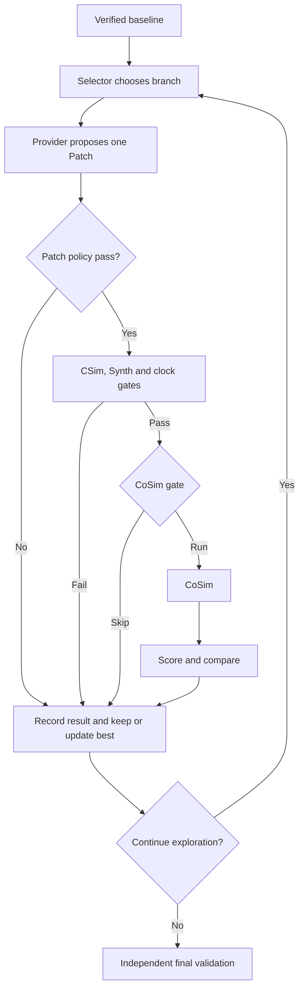

# V2 逐轮团队复盘报告

> 发布说明：这是用于团队复盘的核心 Markdown 副本。`runs/`、Vitis/XSIM 工程、原始 JSON 和日志未提交；文中的 Evidence 链接仅在本地保留对应运行目录时可打开，不代表 GitHub 已包含生产运行环境。
>
> 本报告由持久化证据确定性生成；Proposal Provider（LLM 或明确标注的本地规则）只提出 Patch，CSim/Synth/CoSim 均由 Harness 编排。
> 信任边界：本文件是 run 外部复盘产物，不在源 run Manifest 内；源证据已先验验签，报告自身需单独保存哈希。

## 30 秒结论

- 状态 / 停止原因：`DONE` / `NO_IMPROVEMENT_LIMIT`
- Baseline / Best / Final：`candidate_000` → `candidate_000` → `candidate_000`
- 探索轮数 / 连续无改善：`1` / `1`
- Synth worst-case latency（cycles）baseline → final closure / speedup：`1027` → `1027` / `1`
- CoSim max latency（cycles）baseline → final closure / speedup：`1025` → `1025` / `1`
- official public proxy baseline → final：`2.2125` → `2.2125`（公开评分代理仅是搜索信号，不是官方最终分）
- 排序角色：official public proxy 为第一排序键，`PPA tie-break` 仅在代理分相同；本地信号都不替代官方 hidden scorer。
- Token input / output / cached-subset / total：`0` / `0` / `0` / `0`
- Credits：`55`；阶段守恒：`true`
- CoSim：Ledger 调用 `2` 次；gate 跳过 `1` 次；节省 `20` credits
- Gate 能力：`official_proxy_gate_v1`；证据完整性：`MANIFEST_VERIFIED`

### 三个关键发现

- [RULE_DECISION] 本 run 是 V2 optimize：baseline 必须先验证，V2 不负责自动修复。
- [TOOL_MEASUREMENT] Round 1: Provider 预期已与 Vitis 实测并列；存在 Synth metrics。
- [MACHINE_DECISION] 1 轮探索中 0 轮晋升；其余分支保留 incumbent。

### 下一步

- P2：停止是连续无改善保护；复盘 Selector 和评分粒度。

## 职责与任务预判

- 当前阶段：`V2 optimize`；进入条件是 baseline 已通过本地严格验证。
- Task：`dotProduct_optimize`；type=`optimize`；difficulty=`3`；requires_cosim=`false`
- Task provenance：`NOT_PERSISTED_IN_RUN`。若为 `NOT_PERSISTED_IN_RUN`，仅凭 task_id 不能证明它是官方题，需在 run 外核对题库哈希。
- Target：part=`xcu55c-fsvh2892-2L-e`；clock=`5` ns。
- 预算：task=`40`；local=`75`；label=`LOCAL_STRICT_BUDGET_OVERRIDE`。
- Workflow identity：v2_result=`V2_CANDIDATE_PPA`；run_config=`V0_DETERMINISTIC`。`V0_DETERMINISTIC` 在这里表示复用的 baseline executor，不是整体 V2 终态身份。
- 完整性：既有 Manifest 已在读取任何 run-local 证据前验证

## V2 主控制流



纯文本：`baseline -> selector -> Provider -> Patch -> CSim -> Synth/clock -> CoSim gate -> optional CoSim -> compare -> promote/reject -> repeat -> final closure`

## Baseline 数据流

| 工具 | Harness 调用原因 | 状态 | 耗时(s) | Credits | 指标/诊断 |
|---|---|---|---:|---:|---|
| csim | 建立 public 功能基线 | EXECUTED_PASS | 4.0835 | 1 | pass |
| synth | 建立 latency、II、clock 和 resource 基线 | EXECUTED_PASS | 12.4711 | 4 | pass |
| cosim | 执行本地严格 baseline RTL 验证 | EXECUTED_PASS | 29.3868 | 20 | {"latency":{"average":1025,"max":1025,"min":1025},"status":"Pass"} |

Baseline metrics：`{"available_resources":{"BRAM_18K":4032,"DSP":9024,"FF":2607360,"LUT":1303680,"URAM":960},"estimated_clock_period_ns":3.17,"interval":{"max":1025,"min":1025},"latency":{"average":1027,"best":1027,"worst":1027},"resources":{"BRAM_18K":0,"DSP":2,"FF":93,"LUT":156,"URAM":0},"utilization_percent":{"BRAM_18K":0.0,"DSP":0.022,"FF":0.004,"LUT":0.012,"URAM":0.0}}`

说明：这里的 `latency` 与 `interval.max` 来自 Synth；`interval.max` 是 top-level transaction interval，不等于某个循环的 `PipelineII`。CoSim latency 单独来自 RTL 仿真结果。

## 全局轮次时间线

| Round | Parent → Candidate | Why/Class | CSim / Synth / CoSim | Gate | Decision | Token | Credits | Best after |
|---:|---|---|---|---|---|---:|---:|---|
| 1 | candidate_000 → candidate_001 | maximum interval is 1025 / LOOP_PIPELINE | EXECUTED_PASS / EXECUTED_PASS / SKIPPED_BY_GATE | OFFICIAL_SCORE_NOT_BETTER | REJECTED_NOT_BETTER | 0 | 5 | candidate_000 |

## 逐轮详细卡片

### Round 1 — REJECTED_NOT_BETTER — best `candidate_000` → `candidate_000`

#### Why / branch

- 进入原因：verified baseline starts exploration
- Selector：class=`LOOP_PIPELINE`；bottleneck=`maximum interval is 1025`。这是规则判断，不是已证明的物理根因。
- 同 metrics 已尝试 / 失败 / 可选：`[]` / `[]` / `["LOOP_PIPELINE","LOOP_UNROLL","MEMORY_LAYOUT","LOOP_RESTRUCTURE"]`
- 分支出口 / 下一 parent：`SKIPPED_COSIM_NOT_BETTER` / `candidate_000`

#### Provider claim（若 Provider 是 LLM，则为模型声明；不是 Vitis 实测）

- Provider / model / revision：`deterministic-local-smoke` / `offline-rule` / `v1`
- Hypothesis：The dot-product loop is not explicitly pipelined.
- Expected effect：Request an initiation interval of one cycle.
- Risk / declared class：The accumulator recurrence may prevent Vitis from meeting II=1. / `LOOP_PIPELINE`
- Token input/output/cached-subset/total：`0`/`0`/`0`/`0`；Provider 耗时 `0` s。

#### Actual Patch

- 状态 / 文件 / hunks / changed lines：`APPLIED` / `["dotProduct.cpp"]` / `1` / `1`
- 新增/删除 pragma：`["#pragma HLS PIPELINE II=1"]` / `[]`
- 声明与观察：`DECLARED_CLASS_MATCHES_OBSERVED_DIRECTIVE`

#### Harness tools（由 Harness 编排，不是 Provider 直接调用）

| Stage | 调用/跳过原因 | 状态 | Diagnostic | 耗时(s) | Credits |
|---|---|---|---|---:|---:|
| csim | 合法 Patch 后执行成本最低的 public 功能回归门 | EXECUTED_PASS | pass | 4.13207 | 1 |
| synth | CSim PASS 后检查可综合性、时钟和性能指标 | EXECUTED_PASS | pass | 12.4651 | 4 |
| cosim | 未调用：CoSim gate 判定 ineligible（OFFICIAL_SCORE_NOT_BETTER） | SKIPPED_BY_GATE | NOT_RUN | 0 | 0 |

#### Gate、实测、比较与转移

- CoSim：state=`SKIPPED_BY_GATE`；capability=`official_proxy_gate_v1`；eligible=`false`；reason=`OFFICIAL_SCORE_NOT_BETTER`。
- Gate proxy Candidate/Best：`2.2125` / `2.2125`；PPA Candidate/Best：`1` / `1`。
- Gate 注记：provisional gate-only estimate; for requires_cosim tasks it assumes CoSim PASS solely to decide whether to run CoSim
- Vitis Synth measured delta（其中 interval_max 是 top-level transaction interval，不是 loop PipelineII）：`{"clock_period_ns":{"after":3.17,"before":3.17,"delta":0.0},"interval_max":{"after":1025.0,"before":1025.0,"delta":0.0},"latency_worst":{"after":1027.0,"before":1027.0,"delta":0.0}}`
- Score / comparison：`{"cached_input_tokens":0,"candidate_id":"candidate_001","components":{"bram":1.0,"dsp":1.0,"ff":1.0,"ii":1.0,"latency":1.0,"lut":1.0,"uram":1.0},"credits_used":5,"hard_constraints_passed":false,"hard_failures":["VERIFICATION_TIER"],"input_tokens":0,"official_score":2.2125,"official_score_source":"PUBLIC_VALIDATION_PROXY_V1","output_tokens":0,"ppa_cost":null,"tokens_used":0,"verification_tier":3}` / `{"candidate_key":[-3,1,[0,-2.2125],[1,0.0],0,5,"candidate_001"],"incumbent_key":[-4,0,[0,-2.2125],[0,1.0],0,25,"candidate_000"],"reason":"VERIFICATION_TIER","strictly_better":false,"winner":"candidate_000"}`
- Decision / rejection / no-improvement：`REJECTED_NOT_BETTER` / `OFFICIAL_SCORE_NOT_BETTER` / `1`
- 本轮 Credits / action elapsed sum：`5` / `16.5971` s（action sum 不是 wall time）。
- Lesson：代理分/PPA gate 未改善，Harness 主动跳过了一次 CoSim。
- Next：保留 incumbent，并选择尚未尝试的优化类。

Evidence：[actions/2dafbb80152d9d6fd1c439263c48c5c44aa4b1f7d921f4bc459dc2dbbf38d0b3/result.json](../../runs/v2-real-official-dotproduct-20260718-retry1/actions/2dafbb80152d9d6fd1c439263c48c5c44aa4b1f7d921f4bc459dc2dbbf38d0b3/result.json), [actions/55bd72a2c650a9bfaefd7aca0a204bf375d9d78d0ed088e9159449fb6f719572/result.json](../../runs/v2-real-official-dotproduct-20260718-retry1/actions/55bd72a2c650a9bfaefd7aca0a204bf375d9d78d0ed088e9159449fb6f719572/result.json), [candidates/candidate_001/patch.diff](../../runs/v2-real-official-dotproduct-20260718-retry1/candidates/candidate_001/patch.diff), [comparisons/candidate_001.json](../../runs/v2-real-official-dotproduct-20260718-retry1/comparisons/candidate_001.json), [cosim_gates/candidate_001.json](../../runs/v2-real-official-dotproduct-20260718-retry1/cosim_gates/candidate_001.json), [llm_actions/55a5abde39f9cdbc728e670ecad5a1d5cb94f6d154b8a249bc83f8f6cda2f80f/request.json](../../runs/v2-real-official-dotproduct-20260718-retry1/llm_actions/55a5abde39f9cdbc728e670ecad5a1d5cb94f6d154b8a249bc83f8f6cda2f80f/request.json), [llm_actions/55a5abde39f9cdbc728e670ecad5a1d5cb94f6d154b8a249bc83f8f6cda2f80f/result.json](../../runs/v2-real-official-dotproduct-20260718-retry1/llm_actions/55a5abde39f9cdbc728e670ecad5a1d5cb94f6d154b8a249bc83f8f6cda2f80f/result.json), [optimization_rounds/round_001.json](../../runs/v2-real-official-dotproduct-20260718-retry1/optimization_rounds/round_001.json), [scores/candidate_001.json](../../runs/v2-real-official-dotproduct-20260718-retry1/scores/candidate_001.json), [scores/candidate_001.pre_cosim.json](../../runs/v2-real-official-dotproduct-20260718-retry1/scores/candidate_001.pre_cosim.json)

## Candidate / attempt tree

```text
└─ candidate_000 [FINAL]
   └─ candidate_001 [REJECTED_NOT_BETTER] reason=OFFICIAL_SCORE_NOT_BETTER
```

Registry 是 Candidate 最终动态状态的权威来源；`candidate.json` 仅是物化快照。没有 Candidate 的 Provider/Patch failure 仍显示为 attempt stub。

## CoSim 专项复盘

- 能力：`official_proxy_gate_v1`
- 每轮状态：`["SKIPPED_BY_GATE"]`
- 探索执行 / gate 跳过 / 未到达：`0` / `1` / `0`
- 只有 `SKIPPED_BY_GATE` 计 gate savings：`20` credits。

## Final closure 与 fallback

| Attempt | Scope | Candidate | Status | Stop | CSim / Synth / CoSim | CoSim measurement | Credits |
|---:|---|---|---|---|---|---|---:|
| 1 | final | candidate_000 | DONE | CANDIDATE_VERIFIED | EXECUTED_PASS / EXECUTED_PASS / EXECUTED_PASS | {"latency":{"average":1025,"max":1025,"min":1025},"status":"Pass"} | 25 |

- Final closure Synth metrics：`{"available_resources":{"BRAM_18K":4032,"DSP":9024,"FF":2607360,"LUT":1303680,"URAM":960},"estimated_clock_period_ns":3.17,"interval":{"max":1025,"min":1025},"latency":{"average":1027,"best":1027,"worst":1027},"resources":{"BRAM_18K":0,"DSP":2,"FF":93,"LUT":156,"URAM":0},"utilization_percent":{"BRAM_18K":0.0,"DSP":0.022,"FF":0.004,"LUT":0.012,"URAM":0.0}}`
- Final closure CoSim measurement：`{"latency":{"average":1025,"max":1025,"min":1025},"status":"Pass"}`
- Selected Candidate exploration metrics（用于当时选择）：`{"available_resources":{"BRAM_18K":4032,"DSP":9024,"FF":2607360,"LUT":1303680,"URAM":960},"estimated_clock_period_ns":3.17,"interval":{"max":1025,"min":1025},"latency":{"average":1027,"best":1027,"worst":1027},"resources":{"BRAM_18K":0,"DSP":2,"FF":93,"LUT":156,"URAM":0},"utilization_percent":{"BRAM_18K":0.0,"DSP":0.022,"FF":0.004,"LUT":0.012,"URAM":0.0}}`
- Selected Candidate score（探索阶段持久化证据）：`{"cached_input_tokens":0,"candidate_id":"candidate_000","components":{"bram":1.0,"dsp":1.0,"ff":1.0,"ii":1.0,"latency":1.0,"lut":1.0,"uram":1.0},"credits_used":25,"hard_constraints_passed":true,"hard_failures":[],"input_tokens":0,"official_score":2.2125,"official_score_source":"PUBLIC_VALIDATION_PROXY_V1","output_tokens":0,"ppa_cost":1.0,"tokens_used":0,"verification_tier":4}`
- Final closure 是独立重验；上面的 final latency 取 closure Synth，不能用探索期缓存指标冒充。

Fallback：`N/A`

## 预算与数据流守恒

| Phase | Credits |
|---|---:|
| Baseline | 25 |
| Rounds | 5 |
| Final | 25 |
| Fallback | 0 |
| **分解合计** | **55** |
| **Ledger** | **55** |

- 守恒：`true`；mismatches=`[]`。
- Action elapsed sum / run wall-clock range：`108.956` / `109.209` s。

## 预测与实测偏差

| Round | Provider expected effect | Vitis Synth measured delta | 是否有实测 |
|---:|---|---|---|
| 1 | Request an initiation interval of one cycle. | {"clock_period_ns":{"after":3.17,"before":3.17,"delta":0.0},"interval_max":{"after":1025.0,"before":1025.0,"delta":0.0},"latency_worst":{"after":1027.0,"before":1027.0,"delta":0.0}} | true |

## 团队下一步建议

- [REPORT_INFERENCE] P2：停止是连续无改善保护；复盘 Selector 和评分粒度。

## 当前 V2 与官方参考的简短差异

- Agent 只看 public 输入；官方 hidden grader 在 Agent 运行后独立执行。
- `public_proxy_v1` 只是搜索信号，不是官方最终分。
- 官方 grader 仅在 `requires_cosim=true` 时执行 hidden CoSim；本地 V2 对所有 final 执行 public CoSim。
- 本地 baseline/final 完整验证计入 Ledger；官方 hidden grading 在 Agent 预算外。
- 历史 `ppa_gate_v1` 或 `legacy_ungated` run 按持久化能力显示，不用当前默认配置改写历史。
- 当前 run 未持久化题目来源标签；official/local 身份需在 run 外以题库文件哈希核验。
- `run_config.workflow=V0_DETERMINISTIC` 是共享 baseline executor 的历史命名；终态以 `v2_result.workflow=V2_CANDIDATE_PPA` 为准。
- Manifest 顶层 provider/model 可能跟随 final Candidate；逐轮 Provider 身份以绑定到 Ledger 的 request/result 为准。
- run 外离线报告不属于源 Manifest；源证据完整性与报告文件自身哈希是两条独立信任链。

## 审计附录：Prompt、Patch 与证据

### Round 1 Prompt（已脱敏）

````json
{
  "action_id": "55a5abde39f9cdbc728e670ecad5a1d5cb94f6d154b8a249bc83f8f6cda2f80f",
  "code_ranges": [
    {
      "end_line": 11,
      "file": "dotProduct.cpp",
      "start_line": 1
    }
  ],
  "context": {
    "allowed_optimization_class": "LOOP_PIPELINE",
    "baseline_metrics": {
      "available_resources": {
        "BRAM_18K": 4032,
        "DSP": 9024,
        "FF": 2607360,
        "LUT": 1303680,
        "URAM": 960
      },
      "estimated_clock_period_ns": 3.17,
      "interval": {
        "max": 1025,
        "min": 1025
      },
      "latency": {
        "average": 1027,
        "best": 1027,
        "worst": 1027
      },
      "resources": {
        "BRAM_18K": 0,
        "DSP": 2,
        "FF": 93,
        "LUT": 156,
        "URAM": 0
      },
      "utilization_percent": {
        "BRAM_18K": 0.0,
        "DSP": 0.022,
        "FF": 0.004,
        "LUT": 0.012,
        "URAM": 0.0
      }
    },
    "bottleneck": "maximum interval is 1025",
    "clock_ns": 5.0,
    "current_clock_constraint": {
      "estimated_period_ns": 3.17,
      "maximum_period_ns": 5.0,
      "minimum_frequency_mhz": 200.0,
      "passed": true
    },
    "current_metrics": {
      "available_resources": {
        "BRAM_18K": 4032,
        "DSP": 9024,
        "FF": 2607360,
        "LUT": 1303680,
        "URAM": 960
      },
      "estimated_clock_period_ns": 3.17,
      "interval": {
        "max": 1025,
        "min": 1025
      },
      "latency": {
        "average": 1027,
        "best": 1027,
        "worst": 1027
      },
      "resources": {
        "BRAM_18K": 0,
        "DSP": 2,
        "FF": 93,
        "LUT": 156,
        "URAM": 0
      },
      "utilization_percent": {
        "BRAM_18K": 0.0,
        "DSP": 0.022,
        "FF": 0.004,
        "LUT": 0.012,
        "URAM": 0.0
      }
    },
    "current_official_score": 2.2125,
    "current_validation": {
      "cosim": {
        "action_id": "c8c3148d1a2b26bf86e197a02077c2f73c62fe1690e76a9561d8ce44f6034800",
        "backend_fingerprint": "llm4hls_agent.vitis.VitisBackend:v0.4",
        "cached": false,
        "code_hash": "1bca40f5d5cffe6db31aac1e84ed18ee756059ce67de8ef6d33dec578e1ca05c",
        "effective_timeout_seconds": 1800.0,
        "ok": true,
        "phase": "pass",
        "result_ref": "actions/c8c3148d1a2b26bf86e197a02077c2f73c62fe1690e76a9561d8ce44f6034800/result.json",
        "status": "PASS",
        "task_fingerprint": "31fa58a00a7a2c184834908997f367081d07662a931d511afbb42af4d477ca8e",
        "tool_config_hash": "a6c1807a5cce8529bbbc8cd742a1a33c81d4630fac25de5a2205e97175a32cdc"
      },
      "csim": {
        "action_id": "1082b6c495f1b00a4a4489159239da28f6a54a22fab06ac31bb1f9a9724f36d2",
        "backend_fingerprint": "llm4hls_agent.vitis.VitisBackend:v0.4",
        "cached": false,
        "code_hash": "1bca40f5d5cffe6db31aac1e84ed18ee756059ce67de8ef6d33dec578e1ca05c",
        "effective_timeout_seconds": 300.0,
        "ok": true,
        "phase": "pass",
        "result_ref": "actions/1082b6c495f1b00a4a4489159239da28f6a54a22fab06ac31bb1f9a9724f36d2/result.json",
        "status": "PASS",
        "task_fingerprint": "31fa58a00a7a2c184834908997f367081d07662a931d511afbb42af4d477ca8e",
        "tool_config_hash": "ed191e39cff28147bfb6718d9c1383a4cba95c2a5fbfc65d44ed2d008db25417"
      },
      "synth": {
        "action_id": "3168921fe6d7772bb2d69ecfbeb1254bc5c83db98edc77d36e1c0a9186f46e7c",
        "backend_fingerprint": "llm4hls_agent.vitis.VitisBackend:v0.4",
        "cached": false,
        "code_hash": "1bca40f5d5cffe6db31aac1e84ed18ee756059ce67de8ef6d33dec578e1ca05c",
        "effective_timeout_seconds": 1800.0,
        "ok": true,
        "phase": "pass",
        "result_ref": "actions/3168921fe6d7772bb2d69ecfbeb1254bc5c83db98edc77d36e1c0a9186f46e7c/result.json",
        "status": "PASS",
        "task_fingerprint": "31fa58a00a7a2c184834908997f367081d07662a931d511afbb42af4d477ca8e",
        "tool_config_hash": "0639eb636fd8bd5e18e78612c4247b5a1b1bd48593c485e4e2c328329c15246a"
      }
    },
    "difficulty": 3,
    "evidence": [],
    "failed_actions": [],
    "final_reserve_credits": 25,
    "hls_rules": [
      "Apply PIPELINE only to the selected bottleneck loop.",
      "Preserve the loop bounds, interfaces, and arithmetic semantics."
    ],
    "kernel_name": "dotProduct.cpp",
    "official_acceleration_cap": 8.0,
    "official_score_enabled": true,
    "parent_candidate_id": "candidate_000",
    "part": "xcu55c-fsvh2892-2L-e",
    "remaining_credits": 50,
    "remaining_tokens": 32768,
    "round_index": 1,
    "source_excerpt": "#include \"dotProduct.h\"\n\n// Baseline: functionally correct but unoptimized (no HLS pragmas).\nFeatureType\ndotProduct(FeatureType param[NUM_FEATURES], DataType feature[NUM_FEATURES]) {\n    FeatureType result = 0;\n    for (int i = 0; i < NUM_FEATURES; i++) {\n        result += param[i] * feature[i];\n    }\n    return result;\n}\n",
    "task_id": "dotProduct_optimize",
    "top": "dotProduct"
  },
  "context_mode": "MINIMAL",
  "excluded_categories": [
    "complete repository",
    "complete logs",
    "testbench",
    "hidden/reference content",
    "unrelated source",
    "machine absolute paths",
    "API keys and sensitive configuration"
  ],
  "hls_rules": [
    "Apply PIPELINE only to the selected bottleneck loop.",
    "Preserve the loop bounds, interfaces, and arithmetic semantics."
  ],
  "provider_fingerprint": "deterministic-local-smoke:offline-rule:v1",
  "provider_request": {
    "http_body": {
      "allowed_optimization_class": "LOOP_PIPELINE",
      "audit_only": true,
      "max_tokens": 1,
      "mode": "offline-rule",
      "round_index": 1,
      "task_id": "dotProduct_optimize"
    },
    "model": "offline-rule",
    "network_request": false,
    "provider": "deterministic-local-smoke",
    "transport": "offline"
  },
  "purpose": "ppa_optimization",
  "schema_version": 1,
  "sent_files": [
    "dotProduct.cpp"
  ]
}
````

### Round 1 Patch

````diff
--- a/dotProduct.cpp
+++ b/dotProduct.cpp
@@ -5,6 +5,7 @@
 dotProduct(FeatureType param[NUM_FEATURES], DataType feature[NUM_FEATURES]) {
     FeatureType result = 0;
     for (int i = 0; i < NUM_FEATURES; i++) {
+#pragma HLS PIPELINE II=1
         result += param[i] * feature[i];
     }
     return result;

````

### Evidence index

- [actions/1082b6c495f1b00a4a4489159239da28f6a54a22fab06ac31bb1f9a9724f36d2/result.json](../../runs/v2-real-official-dotproduct-20260718-retry1/actions/1082b6c495f1b00a4a4489159239da28f6a54a22fab06ac31bb1f9a9724f36d2/result.json)
- [actions/2dafbb80152d9d6fd1c439263c48c5c44aa4b1f7d921f4bc459dc2dbbf38d0b3/result.json](../../runs/v2-real-official-dotproduct-20260718-retry1/actions/2dafbb80152d9d6fd1c439263c48c5c44aa4b1f7d921f4bc459dc2dbbf38d0b3/result.json)
- [actions/3168921fe6d7772bb2d69ecfbeb1254bc5c83db98edc77d36e1c0a9186f46e7c/result.json](../../runs/v2-real-official-dotproduct-20260718-retry1/actions/3168921fe6d7772bb2d69ecfbeb1254bc5c83db98edc77d36e1c0a9186f46e7c/result.json)
- [actions/48956577e0ffdf46e17f77117b6dff97c0a5d02109ca5b4f3a03d33dc86f35f4/result.json](../../runs/v2-real-official-dotproduct-20260718-retry1/actions/48956577e0ffdf46e17f77117b6dff97c0a5d02109ca5b4f3a03d33dc86f35f4/result.json)
- [actions/55bd72a2c650a9bfaefd7aca0a204bf375d9d78d0ed088e9159449fb6f719572/result.json](../../runs/v2-real-official-dotproduct-20260718-retry1/actions/55bd72a2c650a9bfaefd7aca0a204bf375d9d78d0ed088e9159449fb6f719572/result.json)
- [actions/a4737bb92f073df7295a3573d62616897b1818a7e0ce169fbfb66d592b951d50/result.json](../../runs/v2-real-official-dotproduct-20260718-retry1/actions/a4737bb92f073df7295a3573d62616897b1818a7e0ce169fbfb66d592b951d50/result.json)
- [actions/c8c3148d1a2b26bf86e197a02077c2f73c62fe1690e76a9561d8ce44f6034800/result.json](../../runs/v2-real-official-dotproduct-20260718-retry1/actions/c8c3148d1a2b26bf86e197a02077c2f73c62fe1690e76a9561d8ce44f6034800/result.json)
- [actions/e00956525065e8861f98674d8b0f5bfe7c38bd7950e08b17401d6d89cfcb9d38/result.json](../../runs/v2-real-official-dotproduct-20260718-retry1/actions/e00956525065e8861f98674d8b0f5bfe7c38bd7950e08b17401d6d89cfcb9d38/result.json)
- [budget_ledger.jsonl](../../runs/v2-real-official-dotproduct-20260718-retry1/budget_ledger.jsonl)
- [candidate_registry.json](../../runs/v2-real-official-dotproduct-20260718-retry1/candidate_registry.json)
- [candidates/candidate_001/patch.diff](../../runs/v2-real-official-dotproduct-20260718-retry1/candidates/candidate_001/patch.diff)
- [comparisons/candidate_001.json](../../runs/v2-real-official-dotproduct-20260718-retry1/comparisons/candidate_001.json)
- [cosim_gates/candidate_001.json](../../runs/v2-real-official-dotproduct-20260718-retry1/cosim_gates/candidate_001.json)
- [llm_actions/55a5abde39f9cdbc728e670ecad5a1d5cb94f6d154b8a249bc83f8f6cda2f80f/request.json](../../runs/v2-real-official-dotproduct-20260718-retry1/llm_actions/55a5abde39f9cdbc728e670ecad5a1d5cb94f6d154b8a249bc83f8f6cda2f80f/request.json)
- [llm_actions/55a5abde39f9cdbc728e670ecad5a1d5cb94f6d154b8a249bc83f8f6cda2f80f/result.json](../../runs/v2-real-official-dotproduct-20260718-retry1/llm_actions/55a5abde39f9cdbc728e670ecad5a1d5cb94f6d154b8a249bc83f8f6cda2f80f/result.json)
- [optimization_config.json](../../runs/v2-real-official-dotproduct-20260718-retry1/optimization_config.json)
- [optimization_rounds/round_001.json](../../runs/v2-real-official-dotproduct-20260718-retry1/optimization_rounds/round_001.json)
- [run_config.json](../../runs/v2-real-official-dotproduct-20260718-retry1/run_config.json)
- [scores/candidate_000.json](../../runs/v2-real-official-dotproduct-20260718-retry1/scores/candidate_000.json)
- [scores/candidate_001.json](../../runs/v2-real-official-dotproduct-20260718-retry1/scores/candidate_001.json)
- [scores/candidate_001.pre_cosim.json](../../runs/v2-real-official-dotproduct-20260718-retry1/scores/candidate_001.pre_cosim.json)
- [task_spec.json](../../runs/v2-real-official-dotproduct-20260718-retry1/task_spec.json)
- [trace.jsonl](../../runs/v2-real-official-dotproduct-20260718-retry1/trace.jsonl)
- [v2_result.json](../../runs/v2-real-official-dotproduct-20260718-retry1/v2_result.json)
- [workflow_result.json](../../runs/v2-real-official-dotproduct-20260718-retry1/workflow_result.json)

Integrity：`{"legacy_limitations":false,"manifest_note":"既有 Manifest 已在读取任何 run-local 证据前验证","manifest_sha256":"6ba462d4db388e2b1cdb716ccafe61310164d3cb69911d07146c2133a1692a17","mode":"offline","state":"MANIFEST_VERIFIED"}`
